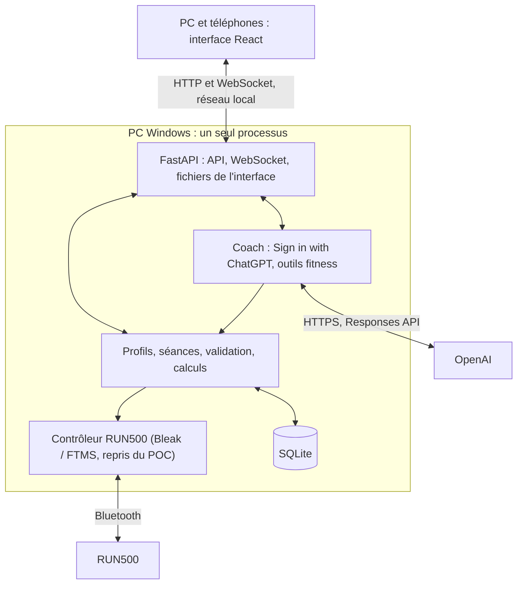

# Fitness App : plan de construction de la V1, brique par brique

4 octobre 2026. Ce plan remplace le précédent découpage en étapes et maquettes. **On construit l’application réelle, une brique après l’autre.** Chaque brique livre une fonction utilisable de bout en bout : interface, API et données. Code professionnel, contrôles ciblés, push direct, puis amélioration à l'usage selon [AGENTS.md](AGENTS.md). Aucune maquette, aucune donnée inventée.

## Suivi

Une seule brique en cours dans le périmètre demandé. Les cases indiquent les fonctions livrées sur `main` ; la suite ne nécessite plus de validation humaine systématique.

- [x] **Brique 0 · Design** : direction visuelle sombre, téléphone et PC, validée le 4 octobre 2026 ([DESIGN.md](DESIGN.md)).
- [x] **Brique 1 · Socle** : l’app s’ouvre sur le PC et le téléphone, servie par le PC, sans donnée de démonstration.
- [x] **Brique 2 · Profils** : base SQLite, profils créés, renommés et supprimés, choix du profil.
- [x] **Brique 3 · Séances manuelles** : créer, modifier, dupliquer, supprimer et retrouver ses séances ; choix pour Aujourd’hui par profil.
- [x] **Brique 4 · Connexion ChatGPT** : connexion sur le PC, compte et permission du forfait vérifiés, modèles du compte, coffre Windows et reprise de session. Limites des essais détaillées ci-dessous.
- [x] **Brique 5 · Coach** : conversations persistantes, lecture des données existantes et mémoire contrôlée ; réponses réelles vérifiées, cache automatique préparé sans gain observé lors des essais courts.
- [ ] **Brique 6 · Séances par ChatGPT** : ChatGPT conçoit ou ajuste une séance, validée et enregistrée dans la bibliothèque.
- [ ] **Brique 7 · Tapis dans l’app** : contrôleur du POC intégré, connexion et état du tapis en direct (simulation d’abord).
- [ ] **Brique 8 · Exécuter une séance** : démarrer, suivre, mettre en pause, reprendre, arrêter (simulation).
- [ ] **Brique 9 · Enregistrer et revoir** : mesures conservées, bilan réel, ressenti.
- [ ] **Brique 10 · RUN500 réel** : réception matérielle progressive du parcours et des pertes.
- [ ] **Brique 11 · Historique et semaine** : historique, objectifs, Aujourd’hui alimenté par les vraies séances.
- [ ] **Brique 12 · Coach informé** : ChatGPT lit tout l’historique du profil et cite ses sources.
- [ ] **Brique 13 · Planning avec ChatGPT** : séances datées, semaine proposée par ChatGPT puis acceptée.
- [ ] **Brique 14 · Graphiques avancés** : comparaison, calendrier, distributions, tendances, qualité.
- [ ] **Brique 15 · Données** : exports, imports FIT/TCX, sauvegarde et restauration.
- [ ] **Brique 16 · Usage quotidien Windows** : lanceur, démarrage simple, hors ligne, performances.
- [ ] **Brique 17 · Réception finale** : parcours complet sur les vrais appareils.

## 1. Méthode

1. **Une brique = une fonction réelle.** À la fin, Arnaud peut l’utiliser lui-même dans l’app. Si ce n’est pas utilisable, ce n’est pas terminé.
2. **Pas de maquette.** L’interface de `frontend/` est la base visuelle définitive. La brique 1 retire toutes les données de démonstration. La navigation n’affiche que les écrans réellement construits ; chaque brique ajoute le sien en repartant de son écran de référence (commit `b9afbc0`, `frontend/src/features/`, et [captures](docs/preuves/v1/brique-00/2026-10-04/INDEX.md)).
3. **Petit et complet plutôt que large et partiel.** Une brique ne commence pas le travail de la suivante.
4. **Commits directs sur `main`**, avec ce qui a changé, le contrôle utile effectué et les limites ([AGENTS.md](AGENTS.md)).
5. **Livrer puis améliorer.** Cocher les critères implémentés à la livraison, sans essai demandé à Arnaud ni commit de validation séparé. Corriger ensuite les problèmes rencontrés dans l'usage réel.
6. **Contrôles proportionnés.** Appliquer les règles d'[AGENTS.md](AGENTS.md), sans campagne de tests ou captures systématiques. Les calculs, les données et la sécurité du tapis gardent leurs contrôles ciblés.
7. **Le POC reste utilisable** pour le diagnostic jusqu'à la réception matérielle de la brique 10.
8. **Sécurité du tapis.** Aucun mouvement sans présence confirmée. Aucune reprise ni répétition automatique de commande. Un résultat incertain n’est jamais présenté comme une réussite. Le STOP physique et la clé restent la protection de dernier recours.
9. **Simulation n’est pas maquette.** Le mode simulation du contrôleur existant sert à développer sans tapis. Il est signalé en permanence et ses données restent séparées des vraies séances.

### Gabarit d’une brique

- **Livré** : ce que l’utilisateur peut faire à la fin, en une phrase.
- **Travail** : la liste courte des tâches.
- **Fait quand** : critères de livraison, cochés quand la fonction est implémentée et publiée.
- **Pas dans cette brique** : ce qui est explicitement reporté.

## 2. Point de départ

| Sujet | État au 4 octobre 2026 |
|---|---|
| Design | Validé. Jetons, composants iOS, écrans et graphiques SVG dans `frontend/` (Vite, React 19, TypeScript, Tailwind 4) |
| Contrôleur | `poc/` : Python, FastAPI, Bleak, FTMS. Connexion et commandes de base reçues sur le RUN500 réel, à 1–2,5 km/h et 0–1 % |
| Limites logicielles | Manuel jusqu’à 16 km/h ; programmes jusqu’à 4 km/h et 3 %, 1 à 3 blocs de 5 à 60 s |
| Non reçu | Séance longue, clé physique, coupure BLE/PC, vitesses élevées |
| Cardio | Champ reçu à zéro uniquement : indisponible |
| Base, profils, IA, historique | Absents |

Sources : [base factuelle RUN500](docs/BASE_FACTUELLE_CAHIER_DES_CHARGES_RUN500.md), [réception du POC](docs/RECEPTION_RUN500.md), [faisabilité](docs/FAISABILITE_RUN500.md), [contrôleur](poc/controller.py), [FTMS](poc/ftms.py).

## 3. Architecture



| Élément | Choix |
|---|---|
| Interface | `frontend/` existant, compilé par Vite et servi par FastAPI. Node sert uniquement à construire. |
| Serveur | FastAPI et Uvicorn, un seul processus propriétaire du Bluetooth. Pas de `--reload` ni de workers multiples. |
| Métier | Services Python indépendants des routes, partagés par l’interface, le coach et les imports |
| Stockage | SQLite, SQLAlchemy, migrations Alembic, dans `%LOCALAPPDATA%\FitnessApp` (réel et simulation séparés) |
| Direct | WebSocket : état complet à la connexion, puis événements numérotés |
| ChatGPT | Sign in with ChatGPT (OAuth PKCE), Responses API en streaming, outils en fonctions locales |
| Graphiques | Composants SVG actuels ; ECharts seulement si la brique 14 le justifie (zoom, volume) |

```text
backend/
  app.py         démarrage, routes, fichiers statiques
  api/           routes HTTP et WebSocket
  storage/       modèles, migrations, sauvegardes
  training/      profils, séances, validation, exécution
  device/        contrôleur et FTMS repris du POC, sans réécriture du protocole
  recording/     mesures, événements, provenance
  coach/         connexion ChatGPT, conversation, outils
frontend/        interface (existante)
poc/             console de diagnostic (inchangée)
```

## 4. ChatGPT : ce qui est vérifié

Documentation officielle relue le 4 octobre 2026 : [présentation](https://developers.openai.com/siwc/token-sharing-open-source), [éligibilité](https://developers.openai.com/siwc/quickstart), [connexion](https://developers.openai.com/siwc/token-sharing-open-source/sign-in), [comptes et sessions](https://developers.openai.com/siwc/token-sharing-open-source/profiles-and-sessions), [modèles et requêtes](https://developers.openai.com/siwc/token-sharing-open-source/models-and-inference), [erreurs](https://developers.openai.com/siwc/token-sharing-open-source/errors-and-recovery), [interface](https://developers.openai.com/siwc/ui-ux-guidelines), [limitations](https://developers.openai.com/siwc/token-sharing-open-source/preview-limitations).

- **Éligibilité.** Le flux documenté couvre les applications open source et hébergées localement ; FitnessApp est hébergée sur le PC. Les applications payantes ou hébergées à distance passent par un formulaire. La documentation cite les comptes Plus et Pro éligibles, sous réserve du compte, de l’espace et des politiques applicables : un abonnement actif seul ne garantit pas l’accès. Préversion. Le parcours réel FitnessApp a atteint le consentement OpenAI, puis reçu une identité validée, les permissions du forfait et le catalogue du compte. Aucun appel d’inférence n’a été exécuté dans la brique 4.
- **Connexion.** OAuth avec PKCE S256, dans le navigateur système du PC. Émetteur et endpoints chargés depuis la découverte officielle OpenAI et limités à son domaine HTTPS. Retour FitnessApp sur `http://127.0.0.1:<port>/callback` ; seul le port peut changer entre tentatives, pas le chemin. **La connexion initiale se fait depuis le PC, via l’adresse locale de FitnessApp.** Les téléphones passent par le serveur du PC ; aucun jeton ne leur est envoyé.
- **Enregistrement.** La première connexion utilise `client_id=dynamic_agent_client` avec `agent_name_hint` et `ext_agent_host_id`, un identifiant opaque et stable du PC, choisi avant la première connexion. L’app conserve ensuite le `client_id` attribué (`oaiapp_…`).
- **Portées.** `openid profile email offline_access resource.invoke chatgpt.tokens.use.direct`, ressource `https://api.openai.com/v1`. Sans `chatgpt.tokens.use.direct` accordée, le forfait n’est pas utilisable.
- **Jetons.** PyJWT vérifie la signature RS256/JWKS, l’émetteur, l’audience, les dates, le sujet, le nonce et `azp`/`at_hash` lorsqu’ils sont présents. Le coffre `chatgpt/connection.dpapi`, hors du dépôt et de SQLite, est chiffré par DPAPI pour l’utilisateur Windows, protégé par ACL et remplacé atomiquement. Aucun jeton dans Git, les journaux, les exports ou les réponses au frontend. Seul le `id_token_hint` prévu par OpenAI peut être transmis directement au navigateur système pour une réautorisation ; aucune URL d’autorisation n’est renvoyée à l’interface. Rafraîchissements sérialisés, verrou entre processus, conservation des jetons sur panne temporaire et retrait sur erreur terminale.
- **Déconnexion.** Révocation du renouvellement via l’endpoint de découverte, puis effacement des trois jetons. Un échec de révocation distante est affiché même après la déconnexion locale. Le client attribué et l’identifiant d’installation restent disponibles ; les inscriptions de comptes/espaces sont séparées même avec le même e-mail. Un refus du partage du forfait conserve l’identité, avec une action explicite pour redemander cette permission (`prompt=consent`, sans paramètre expérimental).
- **Modèles.** `GET /v1/models` ; afficher `display_name` pour `visibility: "list"`, envoyer le `slug`. Aucun modèle codé en dur.
- **Requêtes.** `POST /v1/responses` avec `store: false` et `stream: true`. Le contexte utile est reconstruit depuis la base locale ; historique récent borné, échanges anciens accessibles par recherche et pagination. Aucun `previous_response_id` HTTP. Une réponse n’est complète qu’après `response.completed`.
- **Outils.** Fonctions personnalisées regroupées dans un espace de noms (`fitness`), et recherche web selon le compte. Non disponibles : MCP hébergé, recherche de fichiers, Code Interpreter, génération d’images.
- **Paramètres interdits.** `temperature`, `top_p`, `max_output_tokens`, `metadata`, `user`, `truncation`, `background`, `conversation` et les autres listés dans les limitations.
- **Erreurs à afficher.** `subscription_sharing_usage_limit_exceeded`, `subscription_sharing_usage_unavailable`, refus de consentement, expiration et révocation. Aucune bascule silencieuse vers une facturation API.

Règles du coach :

- Le coach voit uniquement le profil actif. Il ne peut pas changer de profil par lui-même.
- Il passe par les services métier, sans accès SQL libre, aux fichiers Windows ni au Bluetooth.
- Une séance proposée par ChatGPT passe par **la même validation** que l’éditeur manuel. Elle est enregistrée avec l’auteur « ChatGPT », sa version et la conversation d’origine.
- Le coach ne démarre jamais le tapis.

## 5. Données : règles permanentes

1. Conserver toutes les mesures reçues, brutes et décodées, avec horodatage UTC, source et âge. Une valeur absente reste absente ; un zéro de cardio invalide n’est jamais un pouls.
2. Séance réalisée : profil et programme figés au démarrage, événements (pauses, reprises, arrêts, interruptions), commandes avec réponse ou résultat inconnu.
3. Aucune interpolation à travers une coupure. La couverture est calculée et affichée.
4. Les calculs (moyennes, distance, allure) sont faits côté Python, versionnés, et identiques dans le bilan, les graphiques, les exports et les outils du coach.
5. Simulation, essais matériels et entraînements sont des catégories distinctes jusqu’aux exports et au coach.
6. Une erreur de stockage est visible et enregistrée ; aucune perte silencieuse.
7. Sauvegarde cohérente avec l’API de sauvegarde SQLite, pas une copie du fichier ouvert ([SQLite backup](https://www.sqlite.org/backup.html)).
8. Toute donnée propre à un profil (séances, conversations, mesures, ressentis, plannings) référence `profiles.id` avec `ON DELETE CASCADE`. Supprimer un profil, après confirmation, supprime toutes ses données ; aucune donnée ne passe d’un profil à l’autre.

## 6. Les briques

### Brique 1 · Socle

**État :** validée le 4 octobre 2026 par Arnaud ([preuves](docs/preuves/v1/brique-01/2026-10-04/INDEX.md)).

Audit complémentaire sur Windows le 4 octobre 2026 : lancement par double-clic, relance sans reconstruction, accès par l’IP réseau et états de panne vérifiés ; corrections et mesures dans [l’audit Windows](docs/preuves/v1/brique-01/2026-10-04/AUDIT_WINDOWS.md). L’essai sur téléphone physique n’a pas de preuve versionnée.

**Livré :** l’app s’ouvre sur le PC et le téléphone, servie par le PC, avec le vrai design et aucune donnée inventée.

**Travail :**
1. Créer `backend/` (FastAPI) qui sert le build de `frontend/` et expose `GET /api/health` (version, mode, dossier de données).
2. Un lanceur `start-app.ps1` : prépare `.venv`, construit l’interface si besoin, démarre sur un port distinct du POC, option `-Reseau` pour le téléphone.
3. Supprimer `frontend/src/data/demo.ts`, la simulation de séance et les paramètres `?scenario=`.
4. Navigation limitée aux écrans construits. Aujourd’hui affiche l’état vide réel.
5. Proxy de développement Vite vers FastAPI.

**Fait quand :**
- [x] `start-app.ps1` ouvre l’app sur le PC ; `-Reseau` l’ouvre sur le téléphone via l’IP Wi-Fi.
- [x] Aucune valeur de démonstration n’apparaît dans l’interface.
- [x] Le POC démarre toujours sur son port, sans modification.

**Pas dans cette brique :** base de données, profils, tapis.

### Brique 2 · Profils

**État :** livrée et poussée le 4 octobre 2026 ([contrôles déjà réalisés](docs/preuves/v1/brique-02/2026-10-04/INDEX.md)). Cases mises à jour selon la nouvelle méthode de livraison ; Windows et téléphone physique ne sont pas couverts par ces contrôles.

**Livré :** choisir son profil (Arnaud et Ophélie au départ) ; créer, renommer et supprimer des profils, chacun avec ses propres données ; le choix est retenu sur chaque appareil.

**Travail :**
1. SQLite, SQLAlchemy et Alembic dans `%LOCALAPPDATA%\FitnessApp\` (bases réelle et simulation séparées).
2. Table des profils : nom unique, objectif hebdomadaire, préférence km/h ou min/km. Arnaud et Ophélie sont créés au premier lancement, dans une base sans profil.
3. API des profils (lire, créer, modifier, supprimer) ; sélecteur réel (feuille Profil, barre latérale), mémorisé par appareil.
4. Écran Réglages minimal : nom, objectif et unité du profil, suppression confirmée, dossier de données, version.
5. Complément demandé par Arnaud le 4 octobre 2026 : création, renommage et suppression. Il reste toujours au moins un profil ; l’identifiant d’un profil ne change jamais.

**Fait quand :**
- [x] Le profil choisi survit au rechargement et au redémarrage du serveur.
- [x] Une migration Alembic crée la base depuis zéro ; un test le vérifie.
- [x] Les appareils partagent la liste des profils du serveur ; un profil supprimé disparaît avec ses données (test). Les autres appareils actualisent la liste au rechargement.


**Pas dans cette brique :** authentification (le profil n’en est pas une), objectifs détaillés.

### Brique 3 · Séances manuelles

**État :** livrée le 4 octobre 2026. Migration additive `0003`, bibliothèque et éditeur reliés au serveur, anciennes versions consultables. Les modifications concurrentes d’une même version sont refusées pour préserver le travail enregistré.

**Livré :** créer, modifier, dupliquer, supprimer et retrouver ses séances ; en choisir une pour Aujourd’hui.

**Travail :**
1. Modèle de séance : blocs (durée, vitesse, pente), répétitions, version, auteur (humain ou ChatGPT), profil.
2. Validation unique côté Python : bornes de vitesse et de pente, durée maximale de 60 min, 120 segments maximum après expansion. L’interface affiche les erreurs renvoyées par le serveur.
3. Écrans Séances et Éditeur branchés sur l’API. Une modification crée une nouvelle version et conserve les anciennes.
4. Aujourd’hui : carte « Prochaine séance » choisie par l’utilisateur, sinon état vide.

**Fait quand :**
- [x] Une séance créée sur le téléphone apparaît sur le PC (bibliothèque commune en base, actualisée à l’ouverture et au retour sur l’application).
- [x] Une séance invalide ne peut pas être enregistrée, même par appel direct à l’API (test).
- [x] Les tests couvrent l’expansion des répétitions et les bornes.

**Règles livrées :** vitesse 1–16 km/h, **pente 0–10 %** (précision d’Arnaud), blocs de 30 à 3 600 secondes, 60 minutes et 120 segments maximum répétitions comprises. Expansion, durée et distance prévues calculées exclusivement en Python. Les versions conservent leur auteur et son nom au moment de l’écriture. Aujourd’hui utilise la dernière version de la séance choisie ; supprimer cette séance efface sa sélection et ses versions, supprimer un profil efface ses séances. Les autres profils sont préservés. Le modèle prévoit la provenance ChatGPT, mais seule la création humaine est exposée ici.

**Contrôles :** build frontend, tests ciblés API/calculs/migrations/profils, vérification Chrome sur PC et viewport téléphone avec une base de contrôle isolée. Pas d’essai sur téléphone physique ni sur le tapis. Les bornes de conception ci-dessus ne modifient pas les protections d’exécution du POC.

**Complément calories (4 octobre 2026) :** poids par profil en base (migration 0004), effaçable ; calories actives et totales estimées selon les équations ACSM, calculées en Python après expansion des répétitions. Affichage bibliothèque, détail, aperçu de l'éditeur et Aujourd'hui ; dénivelé équivalent prévu. Choix marche/course automatique selon la vitesse, anciennes versions compatibles. Le détail précise les hypothèses et les vitesses hors des plages usuelles du calcul. Pas de calories sans poids, pas de collecte d'âge/taille inutilisés, ni de promesse de mesure physiologique. Méthode, sources, migration et limites : [estimation des calories](docs/ESTIMATION_CALORIES.md). Les prévisions utilisent le poids actuel, y compris pour les anciennes versions ; aucun bilan de séance réalisée n'est créé.

Contrôles de ce complément : build et 46 tests ciblés réussis (calculs, API, profils, migrations). Chrome sur base isolée : saisie décimale du poids, refus d'une valeur invalide, bibliothèque, détail PC/téléphone, changement de déplacement avec recalcul et enregistrement, changement de profil ; aucune erreur console observée. Le serveur déjà lancé doit être redémarré pour charger le nouveau backend et migrer sa base. Pas de mesure calorimétrique ni d'essai sur tapis.

**Simplification demandée (4 octobre 2026) :** suppression du sélecteur Déplacement et des mentions Auto dans les blocs. Calcul automatique côté Python, y compris pour les anciens choix manuels, sans réécriture des versions. Contrôles : build, tests ciblés énergie/séances et vérification de l’éditeur dans Chrome.

**Amélioration du graphique (4 octobre 2026) :** vitesse en barres vertes/grises (km/h) et inclinaison en escalier violet (%) sur deux zones temporelles alignées, avec échelles distinctes. Dans la bibliothèque, Aujourd’hui et l’éditeur, survol ou toucher d’un segment affiche son type, son intervalle, sa durée et ses deux consignes. Le toucher conserve la sélection ; boutons précédent/suivant et flèches du clavier donnent accès aux segments courts, Échap efface la sélection. Build et vérification Chrome du survol, du clavier et des événements tactiles en viewport téléphone ; pas de réception sur téléphone physique.

**Lisibilité vitesse et pente :** à la demande d’Arnaud, échelles complètes fixes à **0–16 km/h** et **0–10 %**, sans plafond automatique. Deux vraies zones de tracé (176/144 px, 144/128 px en largeur réduite), vitesse graduée tous les 4 km/h, pente violette avec aire plus contrastée et valeurs par segment lorsqu’il y a assez de place. Contrôles : build et rendu Chrome PC/téléphone sur la séance existante, sélection d’un segment sans modification des données.

**Pas dans cette brique :** démarrage sur le tapis, ChatGPT.

### Brique 4 · Connexion ChatGPT

**État :** livrée le 4 octobre 2026. Service `backend/coach`, API `/api/chatgpt`, section ChatGPT des Réglages. Aucun changement de schéma, de profil, de séance, de version, de sélection sportive ou de lanceur Windows.

**Livré :** « Continuer avec ChatGPT » ouvre le navigateur système du PC. Après accord, les Réglages affichent le compte et son catalogue réel, permettent de choisir un modèle, d’actualiser la liste, de retrouver une inscription et de se déconnecter. Aucun modèle imposé. Le téléphone affiche le compte et les modèles ; la gestion de la connexion reste sur le PC.

**Travail :**
1. Générer et conserver `ext_agent_host_id` avant toute connexion.
2. Flux PKCE complet (§ 4) : serveur de retour sur `127.0.0.1`, `state` et `nonce`, échange du code, validation du jeton d’identité, vérification de `chatgpt.tokens.use.direct`.
3. Stockage protégé des jetons, rafraîchissement, déconnexion.
4. Réglages > ChatGPT : e-mail, état, modèle choisi (liste de `/v1/models`), Se déconnecter. Sur le téléphone : « Connexion depuis le PC ».
5. États visibles : chargement, connexion en cours et annulable, refus, permission manquante, expiration, révocation, réseau, catalogue vide et coffre indisponible. Une tentative dure cinq minutes ; doublons, mauvais retours et rejeux ne peuvent pas remplacer une connexion valide.

**Fait quand :**
- [x] Connexion réussie avec le vrai compte d’Arnaud ; identité et permissions vérifiées ; client attribué conservé ; cinq modèles reçus d’OpenAI.
- [x] Aucune exposition des jetons au frontend ni aux journaux applicatifs ; fichiers locaux chiffrés, indépendants des données exportables et absents de Git (tests et contrôle du diff).
- [x] Reprise sans sélection de compte après relance de l’application ; rafraîchissement réel réussi avec remplacement du jeton de renouvellement et nouvelle lecture du catalogue. Le redémarrage complet de Windows n’a pas été essayé.

**Contrôles automatiques :** build frontend ; 22 tests ciblés SIWC avec signatures RSA, coffre DPAPI réel et fournisseur de test (PKCE/state/nonce, claims et signature, callback local, refus, expiration, rejeu, client/identité échangés, permissions, plusieurs inscriptions, verrou, rotation après relance, révocation, panne réseau, absence de répétition sur refus durable, catalogue vide, écriture atomique et absence de fuite). Les 46 contrôles existants backend/profils/séances/énergie ont également passé. Aucun faux fournisseur ni modèle de test dans l’application.

**Contrôles réels :** Chrome via MCP, compte connecté, catalogue du compte, format PC et viewport téléphone de 390 px via l’IP réseau ; reprise visible sur le serveur habituel 4330 après relance. Aucune erreur console pendant ces parcours ; l’arrêt volontaire de l’instance de contrôle a produit l’avertissement réseau attendu. Empreinte logique SQLite identique avant/après, intégrité `ok`. La session créée lors du contrôle a été transférée uniquement entre les coffres de cette même installation FitnessApp ; la copie temporaire a été retirée.

**Limites :** pas d’essai sur téléphone physique ni de redémarrage complet de Windows. Déconnexion/révocation, refus et incidents couverts automatiquement ; le compte réel est laissé connecté. Les hints de réautorisation sont vérifiés par tests, sans nouvel essai interactif après déconnexion. Aucun appel Responses, aucune consommation d’inférence, aucune action sur le tapis. L’application habituelle a été relancée et la session retrouvée ; une nouvelle relance depuis le lanceur reste nécessaire pour charger le dernier correctif qui suspend les répétitions sur refus durable d’OpenAI.

**Pas dans cette brique :** conversation.

### Brique 5 · Coach

**Périmètre réconcilié le 5 octobre 2026 :** la lecture de toutes les données utiles déjà présentes et la continuité des échanges font partie de cette brique. La génération/modification structurée des séances reste en brique 6 ; l'exploitation des activités réalisées reste en brique 12.

**Fonctions implémentées :** entrée Coach, création/recherche/reprise de conversations par profil, réponse progressive, interruption explicite, conservation des réponses échouées ou incomplètes, saisie conservée, mémoire consultable/modifiable/supprimable et préférences proposées soumises au bouton Mémoriser. Les séances consultées ouvrent leur version exacte.

**Données réellement accessibles :** profil actif (nom, objectif hebdomadaire, poids, unité, dates), mode réel/simulation et unités communes, séance choisie pour Aujourd'hui, bibliothèque complète et versions datées avec origine/auteur, blocs et répétitions, estimations du service métier avec le poids actuel, anciennes conversations et mémoire confirmée. La date locale est fournie. Fatigue, résultats, progression et activités réalisées ne sont jamais déduits d'une séance préparée. Aucun historique réel n'existe encore.

**Outils serveur :** `get_profile`, `list_workouts`, `get_workout`, `list_versions`, `search_conversations`, `read_conversation`, `read_message`, `search_memories`. Recherche textuelle, pages bornées, total et suite explicites ; les longs échanges se consultent par extraits. `propose_memory` ne modifie aucune préférence : citation exacte du message actuel et confirmation humaine obligatoire. Le profil choisi dans l'interface est validé et figé côté serveur pour le flux ; aucun argument de profil n'est accepté du modèle. Comme les autres écrans du projet, le choix de profil sur un appareil n'est pas une authentification entre personnes.

**Persistance et erreurs :** migration additive `0005`, conversations et paires message/réponse avec états `running`, `completed`, `interrupted`, `failed`. Clé d'envoi idempotente et une seule réponse en cours par profil, y compris entre écrans. Enregistrement du texte avant affichage ; après redémarrage, les flux restés ouverts sont marqués interrompus. Changement de profil ou fermeture du parcours : abandon du flux propriétaire ; changement de compte/déconnexion ChatGPT : arrêt des flux. Réseau et inférence asynchrones, aucun verrou du coffre pendant le streaming. Aucun modèle de remplacement, API payante de secours, commande sportive ou accès arbitraire. Le HTML et les images du modèle ne sont pas exécutés/chargés ; seuls les liens de séances effectivement lus par le serveur sont activés.

**Quota et cache :** documentation officielle [SIWC modèles/inférence](https://developers.openai.com/siwc/token-sharing-open-source/models-and-inference), [erreurs](https://developers.openai.com/siwc/token-sharing-open-source/errors-and-recovery), [limitations](https://developers.openai.com/siwc/token-sharing-open-source/preview-limitations) et [cache](https://developers.openai.com/api/docs/guides/prompt-caching) relue le 5 octobre. Instructions et outils stables, clé de cache opaque par profil, cache automatique du fournisseur. Dates des messages identiques dès le premier envoi et lors de leur reprise pour préserver le préfixe. Pas de `prompt_cache_retention` (non accepté par SIWC), ni de `prompt_cache_options` ou `prompt_cache_breakpoint` : ces deux options de l’API générale ont été rejetées réellement avec HTTP 400 `invalid_parameter` le 5 octobre. Aucun nouvel essai automatique pour contourner un refus. Au plus six échanges modèle/outils par demande, contexte récent limité à six réponses et 12 000 caractères sérialisés, détails sans doubler les blocs par leur expansion, recherches ciblées et réponses courtes. Aucune inférence de fond ni répétition automatique après ouverture du flux ; seul un rejet d'identité avant le premier événement peut déclencher un unique renouvellement puis nouvel essai. L'interface affiche requêtes, tokens d'entrée/sortie et tokens réellement en cache tels que rapportés par OpenAI. Une mesure manquante reste inconnue. Ces compteurs ne prouvent ni le quota restant ni une économie chiffrée sur le forfait ChatGPT.

**Fait quand :**
- [x] Conversations, réponses partielles et mémoire persistent localement par profil ; migration et reprise après interruption couvertes automatiquement.
- [x] Outils de lecture détaillée, versions, recherche et pagination ; chiffres identiques au service de séances ; aucun outil d'écriture sportive.
- [x] Isolation profil, envoi concurrent/idempotent, arrêt, déconnexion, erreurs après début de flux, absence de secrets et cache couverts par tests ciblés.
- [x] Réponse réelle fondée sur les données et détail de séance vérifiés avec le compte connecté, puis reprise dans Chrome.
- [x] Streaming réel au viewport téléphone vérifié (distinct d'un téléphone physique).

**Contrôles automatiques :** build frontend avec TypeScript ; 83 tests ciblés (19 coach, 22 connexion, 42 backend/profils/séances), sans appel OpenAI dans ces tests. Isolation, mémoire contrôlée, migrations, données conservées, doublons/concurrence, interruptions, déconnexion, erreurs de flux, secrets et préfixe stable couverts. Le flux collecte aussi les éléments `response.output_item.done` : le terminal SIWC peut donner les compteurs sans répéter les appels d’outils.

**Contrôles réels, 5 octobre 2026 :** serveur habituel 4330 relancé par Arnaud, schéma `0005`, code backend chargé et build réellement servi vérifiés. GPT-5.6-Luna choisi par Arnaud, compte existant conservé. Deux réponses réussies dans Chrome via MCP : détail de « Test » (six blocs, 17 min, 1,733 km, 116,2 kcal actives / 142,7 totales au poids actuel), valeurs comparées à l’API ; lien ouvrant exactement la version 1 ; reconnaissance explicite de l’absence d’activités réalisées. Réponse partielle observée en cours puis état terminé. Reprise de la même conversation via l’adresse réseau et réponse courte à un second message, sans nouvelle lecture de bibliothèque. Format PC et viewport 390 × 844, aucun débordement horizontal. Changement de profil : échange et brouillon d’Arnaud absents chez Ophélie puis retrouvés au retour ; mémoire d’Ophélie vide, isolation d’une mémoire remplie couverte automatiquement. Aucune erreur console pendant les parcours réussis ; seuls avertissements réseau lors des arrêts volontaires du serveur. Aucun essai sur téléphone physique.

**Usage réellement mesuré :** sept tentatives HTTP au total, dont deux refus sur les options de cache incompatibles, un premier flux ayant révélé la collecte manquante des outils, puis quatre requêtes pour les deux réponses réussies (trois pour chercher/lire/expliquer la séance, une pour poursuivre). Cinq retours de compteurs : 10 602 tokens d’entrée et 494 de sortie ; compteurs inconnus pour les deux refus. OpenAI a signalé **0 token en cache** sur ces essais : aucun gain effectif de cache ni économie de forfait n’est revendiqué. Préfixe stable, contexte borné, lectures ciblées et absence de répétition restent actifs ; aucun remplissage artificiel du prompt ni inférence de chauffe. Les essais échoués restent clairement marqués dans la conversation locale. La dernière correction backend a été chargée ; aucun redémarrage supplémentaire nécessaire à cette livraison. Le design concurrent publié dans `d9cd073` a été intégré sans écraser ses changements : bouton Mémoire et saisie adaptés à la capsule commune, build puis liens de version et affichage Chrome revérifiés, sans nouvel appel OpenAI.

**Pas dans cette brique :** génération ou modification de séance, enregistrement d'une séance proposée, planning, notifications, tâche autonome, historique d'activités et commandes au tapis.

### Brique 6 · Séances par ChatGPT

**Livré :** « Crée-moi une séance de 30 minutes avec des côtes » produit une carte de séance. Enregistrer l’ajoute à la bibliothèque. Depuis l’Éditeur, « Ajuster avec ChatGPT » propose une nouvelle version, affichée en différences.

**Travail :**
1. Réutiliser `list_workouts` et `get_workout` livrés en brique 5 ; ajouter uniquement les outils `validate_workout` et `propose_workout`.
2. `propose_workout` passe par la validation de la brique 3. En cas d’erreur, ChatGPT reçoit les erreurs exactes et corrige.
3. Carte de proposition (design existant) : profil, durée, distance, blocs ; Enregistrer, Modifier, Ignorer.
4. Enregistrement idempotent : un double clic ne crée pas deux séances. Auteur « ChatGPT », lien vers la conversation.
5. Ajustement d’une séance existante : nouvelle version, différences affichées avant d’accepter.

**Fait quand :**
- [ ] Trois demandes réelles différentes produisent des séances valides, enregistrées et modifiables.
- [ ] Une proposition hors limites est refusée puis corrigée par ChatGPT, sans intervention.
- [ ] La séance enregistrée affiche son auteur et son origine.

**Pas dans cette brique :** exécution sur le tapis, planning.

### Brique 7 · Tapis dans l’app

**Livré :** Réglages > Tapis permet de rechercher, connecter et voir l’état du RUN500 (ou du simulateur), avec capacités et mesures en direct.

**Travail :**
1. Déplacer `controller.py` et `ftms.py` dans `backend/device/` sans réécrire le protocole ; le POC continue de les utiliser ou garde sa copie.
2. Un seul propriétaire du Bluetooth dans le processus ; boucle asynchrone persistante.
3. WebSocket de l’état du tapis : connexion, capacités, mesures avec âge.
4. Simulation signalée en permanence, base de simulation séparée.
5. Reprendre les 20 tests critiques du POC sur le code déplacé.

**Fait quand :**
- [ ] En simulation : connexion, mesures en direct sur le téléphone, déconnexion visible.
- [ ] Sur le vrai RUN500, en lecture seule : connexion et capacités lues, aucun mouvement.
- [ ] Les 20 tests passent.

**Pas dans cette brique :** démarrage de séance.

### Brique 8 · Exécuter une séance

**Livré :** depuis Aujourd’hui ou Séances, Commencer, confirmer la clé et la bande, puis suivre la séance dans Direct, avec Pause, Reprendre et Arrêter. En simulation.

**Travail :**
1. Moteur de séance côté PC : blocs, transitions, durée active, fin de programme. Profil et séance figés au démarrage.
2. Règles du POC conservées : démarrage au minimum puis consigne, attente de la réponse à chaque commande, aucune répétition automatique, verrouillage sur résultat inconnu, arrêt si l’écran propriétaire disparaît.
3. Pause et reprise au même point, avec confirmation de présence.
4. Direct branché sur le WebSocket : chiffres, bloc, suite, profil réalisé, courbes, états (mesures anciennes, déconnecté, commande inconnue).
5. Activité en direct réduite (capsule et barre latérale).
6. Périmètre de vitesse et de pente borné au périmètre matériel reçu. Une séance qui le dépasse est refusée au démarrage, avec la limite affichée.

**Fait quand :**
- [ ] Une séance de 30 min complète en simulation, avec 2 pauses, sur téléphone et PC simultanément.
- [ ] Les tests couvrent les transitions, la pause, l’arrêt pendant une commande et le résultat inconnu.
- [ ] Fermer l’écran propriétaire déclenche l’arrêt prévu.

**Pas dans cette brique :** conservation durable de la séance, matériel réel en mouvement.

### Brique 9 · Enregistrer et revoir

**Livré :** à la fin d’une séance, le bilan réel s’affiche et reste consultable ; on peut saisir son ressenti.

**Travail :**
1. Enregistrement des mesures par lots, des événements et des commandes, hors de la boucle Bluetooth.
2. Reprise après arrêt brutal du processus : la séance est marquée interrompue, avec les données conservées.
3. Calculs versionnés : durées, distance du compteur, vitesse et pente moyennes, couverture.
4. Écran Bilan : chiffres, vitesse et cible, pente, blocs prévus et mesurés, événements, données, ressenti 1 à 10.

**Fait quand :**
- [ ] Un arrêt forcé du serveur en pleine séance laisse une séance interrompue et lisible.
- [ ] Les chiffres du bilan sont égaux à ceux recalculés par les tests.

**Pas dans cette brique :** historique complet, comparaisons.

### Brique 10 · RUN500 réel

**Livré :** les séances fonctionnent sur le vrai tapis, dans un périmètre reçu et documenté.

**Travail :** protocole progressif, avec présence humaine et autorisation à chaque palier.
1. Séance courte à 1–2,5 km/h : démarrage, transitions, pause, reprise, arrêt.
2. Séance de 30 min à basse vitesse.
3. Pertes : clé retirée, Bluetooth coupé, téléphone verrouillé, veille du PC, arrêt du processus.
4. Extension des vitesses et pentes palier par palier ; chaque palier reçu élargit les limites du moteur.

**Fait quand :**
- [ ] Chaque palier a sa preuve (commande, réponse, mesure, observation humaine).
- [ ] Les limites du moteur correspondent exactement au périmètre reçu.

**Pas dans cette brique :** nouvelles fonctions.

### Brique 11 · Historique et semaine

**Livré :** Historique liste les vraies séances par mois ; Aujourd’hui affiche la semaine (anneau, minutes, distance) et l’objectif du profil.

**Travail :** liste, filtres, recherche ; objectifs modifiables par profil ; Aujourd’hui alimenté par les données réelles.

**Fait quand :**
- [ ] Les totaux de la semaine et du mois sont exacts sur un jeu de test de plusieurs semaines.

### Brique 12 · Coach informé

**Livré :** ChatGPT analyse l’historique du profil (« Est-ce que je progresse sur ce programme ? ») et cite les séances utilisées, ouvrables d’un toucher.

**Travail :** compléter les lectures déjà livrées en brique 5 par les activités réellement enregistrées : outils `list_sessions`, `get_session`, `get_session_samples` (par tranches), `get_feedback`, `get_progress`, `compare_sessions`, avec pagination, couverture et troncature signalée ; mêmes calculs que le bilan. Ne pas reconstruire les conversations, la mémoire et les lectures de bibliothèque.

**Fait quand :**
- [ ] Le coach retrouve une séance ancienne et cite des valeurs identiques au bilan.
- [ ] Aucun outil ne renvoie de données de l’autre profil (test).

### Brique 13 · Planning avec ChatGPT

**Livré :** planifier des séances par date ; demander à ChatGPT une semaine d’entraînement, la relire, l’accepter ; Aujourd’hui affiche la séance du jour.

**Travail :** séances planifiées ; outils `get_schedule` et `propose_schedule` ; acceptation partielle ou totale ; replanification d’une séance manquée.

**Fait quand :**
- [ ] Une semaine proposée par ChatGPT est acceptée et apparaît jour par jour dans Aujourd’hui.

### Brique 14 · Graphiques avancés

**Livré :** comparer 2 ou 3 séances, calendrier de pratique, temps par plage de vitesse et de pente, évolution du ressenti, qualité des données.

**Travail :** G04 à G10 de [DESIGN.md](DESIGN.md) § 7, calculs côté Python, choix SVG ou ECharts selon le volume mesuré.

**Fait quand :**
- [ ] Un jeu de 200 séances d’une heure reste fluide (détail chargé en moins d’une seconde).

### Brique 15 · Données

**Livré :** exporter une séance ou tout l’historique (CSV, JSON), importer des fichiers FIT/TCX, sauvegarder et restaurer la base.

**Fait quand :**
- [ ] Une restauration sur une base vide retrouve toutes les séances à l’identique.
- [ ] Un fichier importé deux fois ne crée pas de doublon.

### Brique 16 · Usage quotidien Windows

**Livré :** un double-clic lance l’app ; elle fonctionne sans Internet, sauf le coach.

**Travail :** runtime Python embarqué, interface compilée, raccourci, mise à jour qui préserve les données, mesures de performance.

**Complément demandé le 4 octobre 2026 :** [lanceur Windows Rust/Tauri](launcher/README.md) livré séparément : démarrer, arrêter, ouvrir l'application, état réel et journal. Le double-clic utilise l'exécutable local et conserve le mode console. L'arrêt propre, les processus enfants et les données ont des vérifications ciblées. Le lanceur peut aussi arrêter un serveur Fitness lancé en console, après vérification du projet et de l'instance par un canal local authentifié ; il conserve ce serveur à la fermeture de la fenêtre. Une ancienne version demande une relance initiale. Le runtime Python embarqué et l'installateur autonome restent à faire ; la brique 16 complète reste donc ouverte. Ce complément ne modifie pas le périmètre des séances développé en parallèle.

### Brique 17 · Réception finale

**Livré :** le parcours complet (préparer avec ChatGPT, courir, revoir, ajuster) est reçu sur le PC, un iPhone et un Android, sur le vrai tapis.

**Fait quand :**
- [ ] Toutes les briques sont livrées et les limites restantes sont documentées.
- [ ] Le tapis ne redémarre jamais après un incident ou une reconnexion.
- [ ] Bilan, graphiques, exports et coach donnent les mêmes chiffres.
- [ ] Une panne Internet n’empêche ni la consultation ni l’exécution d’une séance enregistrée.

## 7. Hors V1

Accès depuis Internet, séances pilotées par le cardio, synchronisation Garmin Connect, VO₂max ou scores physiologiques, application native.
