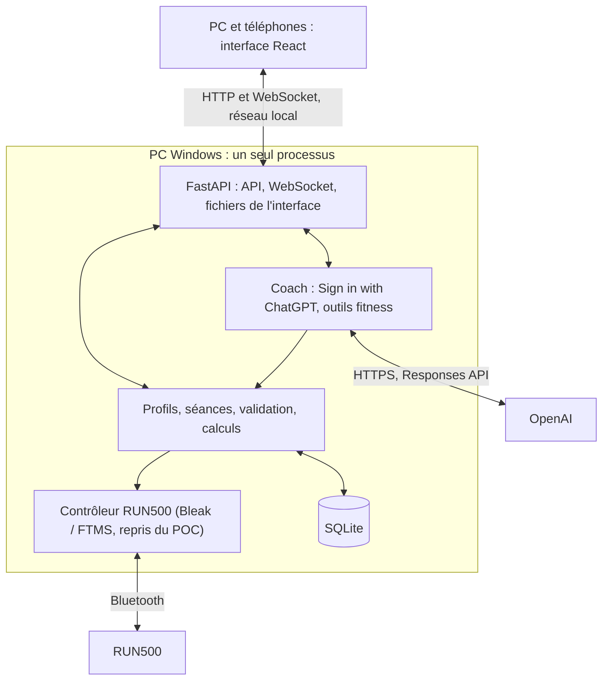

# Fitness App : plan de construction de la V1, brique par brique

4 octobre 2026. Ce plan remplace le précédent découpage en étapes et maquettes. **On construit l’application réelle, une brique après l’autre.** Chaque brique livre une fonction utilisable de bout en bout : interface, API, données et tests. Aucune maquette, aucune donnée inventée.

## Suivi

Une seule brique en cours. La suivante démarre uniquement après validation d’Arnaud.

- [x] **Brique 0 · Design** : direction visuelle sombre, téléphone et PC, validée le 4 octobre 2026 ([DESIGN.md](DESIGN.md)).
- [ ] **Brique 1 · Socle** : l’app s’ouvre sur le PC et le téléphone, servie par le PC, sans donnée de démonstration.
- [ ] **Brique 2 · Profils** : base SQLite, Arnaud et Ophélie, choix du profil.
- [ ] **Brique 3 · Séances manuelles** : créer, modifier, enregistrer et retrouver ses séances.
- [ ] **Brique 4 · Connexion ChatGPT** : Sign in with ChatGPT sur le PC, compte et forfait vérifiés.
- [ ] **Brique 5 · Coach** : conversation réelle avec ChatGPT, en streaming, enregistrée par profil.
- [ ] **Brique 6 · Séances par ChatGPT** : ChatGPT conçoit ou ajuste une séance, validée et enregistrée dans la bibliothèque.
- [ ] **Brique 7 · Tapis dans l’app** : contrôleur du POC intégré, connexion et état du tapis en direct (simulation d’abord).
- [ ] **Brique 8 · Exécuter une séance** : démarrer, suivre, mettre en pause, reprendre, arrêter (simulation).
- [ ] **Brique 9 · Enregistrer et revoir** : mesures conservées, bilan réel, ressenti.
- [ ] **Brique 10 · RUN500 réel** : réception matérielle progressive du parcours et des pertes.
- [ ] **Brique 11 · Historique et semaine** : historique, objectifs, Aujourd’hui alimenté par les vraies séances.
- [ ] **Brique 12 · Coach informé** : ChatGPT lit tout l’historique du profil et cite ses sources.
- [ ] **Brique 13 · Planning avec ChatGPT** : séances datées, semaine proposée par ChatGPT puis acceptée.
- [ ] **Brique 14 · Graphiques avancés** : comparaison, calendrier, distributions, tendances, qualité.
- [ ] **Brique 15 · Données** : exports, imports FIT/TCX, sauvegarde et restauration.
- [ ] **Brique 16 · Usage quotidien Windows** : lanceur, démarrage simple, hors ligne, performances.
- [ ] **Brique 17 · Réception finale** : parcours complet sur les vrais appareils.

## 1. Méthode

1. **Une brique = une fonction réelle.** À la fin, Arnaud peut l’utiliser lui-même dans l’app. Si ce n’est pas utilisable, ce n’est pas terminé.
2. **Pas de maquette.** L’interface de `frontend/` est la base visuelle définitive. La brique 1 retire toutes les données de démonstration. La navigation n’affiche que les écrans réellement construits ; chaque brique ajoute le sien.
3. **Petit et complet plutôt que large et partiel.** Une brique ne commence pas le travail de la suivante.
4. **Commits directs sur `main`**, avec ce qui a changé, comment le vérifier et les réserves ([AGENTS.md](AGENTS.md)).
5. **Validation humaine.** Arnaud essaie la brique, puis la case est cochée. Sans validation, on corrige, on n’enchaîne pas.
6. **Vérifications à chaque brique** : typecheck, build, tests des règles touchées, parcours réel dans Chrome (390 × 844 et 1440 × 900), absence d’erreur console. Captures de l’app réelle dans `docs/preuves/v1/brique-NN/AAAA-MM-JJ/`.
7. **Le POC reste intact** et utilisable pour le diagnostic tant que la brique 10 n’est pas validée.
8. **Sécurité du tapis.** Aucun mouvement sans présence confirmée. Aucune reprise ni répétition automatique de commande. Un résultat incertain n’est jamais présenté comme une réussite. Le STOP physique et la clé restent la protection de dernier recours.
9. **Simulation n’est pas maquette.** Le mode simulation du contrôleur existant sert à développer sans tapis. Il est signalé en permanence et ses données restent séparées des vraies séances.

### Gabarit d’une brique

- **Livré** : ce que l’utilisateur peut faire à la fin, en une phrase.
- **Travail** : la liste courte des tâches.
- **Fait quand** : critères vérifiables, cochés dans le plan après validation.
- **Pas dans cette brique** : ce qui est explicitement reporté.

## 2. Point de départ

| Sujet | État au 4 octobre 2026 |
|---|---|
| Design | Validé. Jetons, composants iOS, écrans et graphiques SVG dans `frontend/` (Vite, React 19, TypeScript, Tailwind 4) |
| Contrôleur | `poc/` : Python, FastAPI, Bleak, FTMS. Connexion et commandes de base reçues sur le RUN500 réel, à 1–2,5 km/h et 0–1 % |
| Limites logicielles | Manuel jusqu’à 16 km/h ; programmes jusqu’à 4 km/h et 3 %, 1 à 3 blocs de 5 à 60 s |
| Non reçu | Séance longue, clé physique, coupure BLE/PC, vitesses élevées |
| Cardio | Champ reçu à zéro uniquement : indisponible |
| Base, profils, IA, historique | Absents |

Sources : [base factuelle RUN500](docs/BASE_FACTUELLE_CAHIER_DES_CHARGES_RUN500.md), [réception du POC](docs/RECEPTION_RUN500.md), [faisabilité](docs/FAISABILITE_RUN500.md), [contrôleur](poc/controller.py), [FTMS](poc/ftms.py).

## 3. Architecture



| Élément | Choix |
|---|---|
| Interface | `frontend/` existant, compilé par Vite et servi par FastAPI. Node sert uniquement à construire. |
| Serveur | FastAPI et Uvicorn, un seul processus propriétaire du Bluetooth. Pas de `--reload` ni de workers multiples. |
| Métier | Services Python indépendants des routes, partagés par l’interface, le coach et les imports |
| Stockage | SQLite, SQLAlchemy, migrations Alembic, dans `%LOCALAPPDATA%\FitnessApp` (réel et simulation séparés) |
| Direct | WebSocket : état complet à la connexion, puis événements numérotés |
| ChatGPT | Sign in with ChatGPT (OAuth PKCE), Responses API en streaming, outils en fonctions locales |
| Graphiques | Composants SVG actuels ; ECharts seulement si la brique 14 le justifie (zoom, volume) |

```text
backend/
  app.py         démarrage, routes, fichiers statiques
  api/           routes HTTP et WebSocket
  storage/       modèles, migrations, sauvegardes
  training/      profils, séances, validation, exécution
  device/        contrôleur et FTMS repris du POC, sans réécriture du protocole
  recording/     mesures, événements, provenance
  coach/         connexion ChatGPT, conversation, outils
frontend/        interface (existante)
poc/             console de diagnostic (inchangée)
```

## 4. ChatGPT : ce qui est vérifié

Documentation officielle relue le 4 octobre 2026 : [présentation](https://developers.openai.com/siwc/token-sharing-open-source), [connexion](https://developers.openai.com/siwc/token-sharing-open-source/sign-in), [modèles et requêtes](https://developers.openai.com/siwc/token-sharing-open-source/models-and-inference), [limitations](https://developers.openai.com/siwc/token-sharing-open-source/preview-limitations).

- **Éligibilité.** Les applications open source et hébergées localement peuvent l’utiliser directement. Les applications payantes ou hébergées à distance passent par un formulaire. L’utilisateur doit avoir un forfait ChatGPT actif. Fonction en préversion.
- **Connexion.** OAuth 2.0 avec PKCE, dans le navigateur du PC. Le retour se fait uniquement sur `http://127.0.0.1:<port>/callback`. **La connexion se fait donc depuis le PC.** Les téléphones utilisent ensuite le coach à travers le serveur du PC ; les jetons ne quittent jamais le PC.
- **Enregistrement.** La première connexion utilise `client_id=dynamic_agent_client` avec `agent_name_hint` et `ext_agent_host_id`, un identifiant opaque et stable du PC, choisi avant la première connexion. L’app conserve ensuite le `client_id` attribué (`oaiapp_…`).
- **Portées.** `openid profile email offline_access resource.invoke chatgpt.tokens.use.direct`, ressource `https://api.openai.com/v1`. Sans `chatgpt.tokens.use.direct` accordée, le forfait n’est pas utilisable.
- **Jetons.** Jeton d’identité validé (signature JWKS, émetteur `https://auth.openai.com`, audience, expiration, nonce). Jetons stockés sur le PC uniquement, avec accès réservé à l’utilisateur Windows, écriture atomique, jamais dans Git, les journaux, les exports ni le navigateur. Rafraîchissement géré par l’app.
- **Modèles.** `GET /v1/models` ; afficher `display_name` pour `visibility: "list"`, envoyer le `slug`. Aucun modèle codé en dur.
- **Requêtes.** `POST /v1/responses` avec `store: false` et `stream: true`. Le contexte complet est renvoyé à chaque requête depuis la base locale. Une réponse n’est valide qu’après `response.completed`.
- **Outils.** Fonctions personnalisées regroupées dans un espace de noms (`fitness`), et recherche web selon le compte. Non disponibles : MCP hébergé, recherche de fichiers, Code Interpreter, génération d’images.
- **Paramètres interdits.** `temperature`, `top_p`, `max_output_tokens`, `metadata`, `user`, `truncation`, `background`, `conversation` et les autres listés dans les limitations.
- **Erreurs à afficher.** `subscription_sharing_usage_limit_exceeded`, `subscription_sharing_usage_unavailable`, refus de consentement, expiration et révocation. Aucune bascule silencieuse vers une facturation API.

Règles du coach :

- Le coach voit uniquement le profil actif. Il ne peut pas changer de profil par lui-même.
- Il passe par les services métier, sans accès SQL libre, aux fichiers Windows ni au Bluetooth.
- Une séance proposée par ChatGPT passe par **la même validation** que l’éditeur manuel. Elle est enregistrée avec l’auteur « ChatGPT », sa version et la conversation d’origine.
- Le coach ne démarre jamais le tapis.

## 5. Données : règles permanentes

1. Conserver toutes les mesures reçues, brutes et décodées, avec horodatage UTC, source et âge. Une valeur absente reste absente ; un zéro de cardio invalide n’est jamais un pouls.
2. Séance réalisée : profil et programme figés au démarrage, événements (pauses, reprises, arrêts, interruptions), commandes avec réponse ou résultat inconnu.
3. Aucune interpolation à travers une coupure. La couverture est calculée et affichée.
4. Les calculs (moyennes, distance, allure) sont faits côté Python, versionnés, et identiques dans le bilan, les graphiques, les exports et les outils du coach.
5. Simulation, essais matériels et entraînements sont des catégories distinctes jusqu’aux exports et au coach.
6. Une erreur de stockage est visible et enregistrée ; aucune perte silencieuse.
7. Sauvegarde cohérente avec l’API de sauvegarde SQLite, pas une copie du fichier ouvert ([SQLite backup](https://www.sqlite.org/backup.html)).

## 6. Les briques

### Brique 1 · Socle

**Livré :** l’app s’ouvre sur le PC et le téléphone, servie par le PC, avec le vrai design et aucune donnée inventée.

**Travail :**
1. Créer `backend/` (FastAPI) qui sert le build de `frontend/` et expose `GET /api/health` (version, mode, dossier de données).
2. Un lanceur `start-app.ps1` : prépare `.venv`, construit l’interface si besoin, démarre sur un port distinct du POC, option `-Reseau` pour le téléphone.
3. Supprimer `frontend/src/data/demo.ts`, la simulation de séance et les paramètres `?scenario=`.
4. Navigation limitée aux écrans construits. Aujourd’hui affiche l’état vide réel.
5. Proxy de développement Vite vers FastAPI.

**Fait quand :**
- [ ] `start-app.ps1` ouvre l’app sur le PC ; `-Reseau` l’ouvre sur le téléphone via l’IP Wi-Fi.
- [ ] Aucune valeur de démonstration n’apparaît dans l’interface.
- [ ] Le POC démarre toujours sur son port, sans modification.

**Pas dans cette brique :** base de données, profils, tapis.

### Brique 2 · Profils

**Livré :** choisir Arnaud ou Ophélie ; le choix est retenu sur chaque appareil.

**Travail :**
1. SQLite, SQLAlchemy et Alembic dans `%LOCALAPPDATA%\FitnessApp\` (bases réelle et simulation séparées).
2. Table des profils : nom, objectif hebdomadaire, préférence km/h ou min/km. Arnaud et Ophélie sont créés au premier lancement.
3. API des profils ; sélecteur réel (feuille Profil, barre latérale), mémorisé par appareil.
4. Écran Réglages minimal : profils, dossier de données, version.

**Fait quand :**
- [ ] Le profil choisi survit au rechargement et au redémarrage du serveur.
- [ ] Une migration Alembic crée la base depuis zéro ; un test le vérifie.

**Pas dans cette brique :** authentification (le profil n’en est pas une), objectifs détaillés.

### Brique 3 · Séances manuelles

**Livré :** créer, modifier, dupliquer, supprimer et retrouver ses séances ; en choisir une pour Aujourd’hui.

**Travail :**
1. Modèle de séance : blocs (durée, vitesse, pente), répétitions, version, auteur (humain ou ChatGPT), profil.
2. Validation unique côté Python : bornes de vitesse et de pente, durée maximale de 60 min, 120 segments maximum après expansion. L’interface affiche les erreurs renvoyées par le serveur.
3. Écrans Séances et Éditeur branchés sur l’API. Une modification crée une nouvelle version et conserve les anciennes.
4. Aujourd’hui : carte « Prochaine séance » choisie par l’utilisateur, sinon état vide.

**Fait quand :**
- [ ] Une séance créée sur le téléphone apparaît sur le PC.
- [ ] Une séance invalide ne peut pas être enregistrée, même par appel direct à l’API (test).
- [ ] Les tests couvrent l’expansion des répétitions et les bornes.

**Pas dans cette brique :** démarrage sur le tapis, ChatGPT.

### Brique 4 · Connexion ChatGPT

**Livré :** dans Réglages, « Se connecter avec ChatGPT » ouvre le navigateur du PC ; après accord, l’app affiche le compte connecté et les modèles disponibles.

**Travail :**
1. Générer et conserver `ext_agent_host_id` avant toute connexion.
2. Flux PKCE complet (§ 4) : serveur de retour sur `127.0.0.1`, `state` et `nonce`, échange du code, validation du jeton d’identité, vérification de `chatgpt.tokens.use.direct`.
3. Stockage protégé des jetons, rafraîchissement, déconnexion.
4. Réglages > ChatGPT : e-mail, état, modèle choisi (liste de `/v1/models`), Se déconnecter. Sur le téléphone : « Connexion depuis le PC ».
5. États visibles : refus, portée manquante, expiration, révocation, réseau.

**Fait quand :**
- [ ] Connexion réussie avec le vrai compte d’Arnaud ; client attribué conservé ; reconnexion sans resélectionner le compte.
- [ ] Les jetons n’apparaissent dans aucun journal, export, réponse HTTP ni dans Git (test).
- [ ] Après redémarrage du PC, la session est rétablie par rafraîchissement.

**Pas dans cette brique :** conversation.

### Brique 5 · Coach

**Livré :** l’onglet Coach permet de discuter avec ChatGPT ; les réponses arrivent en direct et la conversation est conservée par profil.

**Travail :**
1. Conversations et messages en base, par profil.
2. Requête Responses en streaming relayée au navigateur ; contexte reconstruit depuis la base à chaque message.
3. Instructions système du coach : rôle, profil actif, unités, règles de sécurité (§ 4).
4. Contexte initial : profil et liste des séances de la bibliothèque.
5. Erreurs affichées dans l’écran : limite d’usage, indisponible, non connecté, réponse interrompue (marquée incomplète, jamais présentée comme finale).

**Fait quand :**
- [ ] Une vraie réponse s’affiche progressivement sur le téléphone.
- [ ] Changer de profil ouvre une autre conversation ; aucun message ne passe d’un profil à l’autre (test).
- [ ] Un flux coupé est marqué incomplet.

**Pas dans cette brique :** création de séance, lecture de l’historique.

### Brique 6 · Séances par ChatGPT

**Livré :** « Crée-moi une séance de 30 minutes avec des côtes » produit une carte de séance. Enregistrer l’ajoute à la bibliothèque. Depuis l’Éditeur, « Ajuster avec ChatGPT » propose une nouvelle version, affichée en différences.

**Travail :**
1. Outils `fitness` : `list_workouts`, `get_workout`, `validate_workout`, `propose_workout`.
2. `propose_workout` passe par la validation de la brique 3. En cas d’erreur, ChatGPT reçoit les erreurs exactes et corrige.
3. Carte de proposition (design existant) : profil, durée, distance, blocs ; Enregistrer, Modifier, Ignorer.
4. Enregistrement idempotent : un double clic ne crée pas deux séances. Auteur « ChatGPT », lien vers la conversation.
5. Ajustement d’une séance existante : nouvelle version, différences affichées avant d’accepter.

**Fait quand :**
- [ ] Trois demandes réelles différentes produisent des séances valides, enregistrées et modifiables.
- [ ] Une proposition hors limites est refusée puis corrigée par ChatGPT, sans intervention.
- [ ] La séance enregistrée affiche son auteur et son origine.

**Pas dans cette brique :** exécution sur le tapis, planning.

### Brique 7 · Tapis dans l’app

**Livré :** Réglages > Tapis permet de rechercher, connecter et voir l’état du RUN500 (ou du simulateur), avec capacités et mesures en direct.

**Travail :**
1. Déplacer `controller.py` et `ftms.py` dans `backend/device/` sans réécrire le protocole ; le POC continue de les utiliser ou garde sa copie.
2. Un seul propriétaire du Bluetooth dans le processus ; boucle asynchrone persistante.
3. WebSocket de l’état du tapis : connexion, capacités, mesures avec âge.
4. Simulation signalée en permanence, base de simulation séparée.
5. Reprendre les 20 tests critiques du POC sur le code déplacé.

**Fait quand :**
- [ ] En simulation : connexion, mesures en direct sur le téléphone, déconnexion visible.
- [ ] Sur le vrai RUN500, en lecture seule : connexion et capacités lues, aucun mouvement.
- [ ] Les 20 tests passent.

**Pas dans cette brique :** démarrage de séance.

### Brique 8 · Exécuter une séance

**Livré :** depuis Aujourd’hui ou Séances, Commencer, confirmer la clé et la bande, puis suivre la séance dans Direct, avec Pause, Reprendre et Arrêter. En simulation.

**Travail :**
1. Moteur de séance côté PC : blocs, transitions, durée active, fin de programme. Profil et séance figés au démarrage.
2. Règles du POC conservées : démarrage au minimum puis consigne, attente de la réponse à chaque commande, aucune répétition automatique, verrouillage sur résultat inconnu, arrêt si l’écran propriétaire disparaît.
3. Pause et reprise au même point, avec confirmation de présence.
4. Direct branché sur le WebSocket : chiffres, bloc, suite, profil réalisé, courbes, états (mesures anciennes, déconnecté, commande inconnue).
5. Activité en direct réduite (capsule et barre latérale).
6. Périmètre de vitesse et de pente borné au périmètre matériel reçu. Une séance qui le dépasse est refusée au démarrage, avec la limite affichée.

**Fait quand :**
- [ ] Une séance de 30 min complète en simulation, avec 2 pauses, sur téléphone et PC simultanément.
- [ ] Les tests couvrent les transitions, la pause, l’arrêt pendant une commande et le résultat inconnu.
- [ ] Fermer l’écran propriétaire déclenche l’arrêt prévu.

**Pas dans cette brique :** conservation durable de la séance, matériel réel en mouvement.

### Brique 9 · Enregistrer et revoir

**Livré :** à la fin d’une séance, le bilan réel s’affiche et reste consultable ; on peut saisir son ressenti.

**Travail :**
1. Enregistrement des mesures par lots, des événements et des commandes, hors de la boucle Bluetooth.
2. Reprise après arrêt brutal du processus : la séance est marquée interrompue, avec les données conservées.
3. Calculs versionnés : durées, distance du compteur, vitesse et pente moyennes, couverture.
4. Écran Bilan : chiffres, vitesse et cible, pente, blocs prévus et mesurés, événements, données, ressenti 1 à 10.

**Fait quand :**
- [ ] Un arrêt forcé du serveur en pleine séance laisse une séance interrompue et lisible.
- [ ] Les chiffres du bilan sont égaux à ceux recalculés par les tests.

**Pas dans cette brique :** historique complet, comparaisons.

### Brique 10 · RUN500 réel

**Livré :** les séances fonctionnent sur le vrai tapis, dans un périmètre reçu et documenté.

**Travail :** protocole progressif, avec présence humaine et autorisation à chaque palier.
1. Séance courte à 1–2,5 km/h : démarrage, transitions, pause, reprise, arrêt.
2. Séance de 30 min à basse vitesse.
3. Pertes : clé retirée, Bluetooth coupé, téléphone verrouillé, veille du PC, arrêt du processus.
4. Extension des vitesses et pentes palier par palier ; chaque palier reçu élargit les limites du moteur.

**Fait quand :**
- [ ] Chaque palier a sa preuve (commande, réponse, mesure, observation humaine).
- [ ] Les limites du moteur correspondent exactement au périmètre reçu.

**Pas dans cette brique :** nouvelles fonctions.

### Brique 11 · Historique et semaine

**Livré :** Historique liste les vraies séances par mois ; Aujourd’hui affiche la semaine (anneau, minutes, distance) et l’objectif du profil.

**Travail :** liste, filtres, recherche ; objectifs modifiables par profil ; Aujourd’hui alimenté par les données réelles.

**Fait quand :**
- [ ] Les totaux de la semaine et du mois sont exacts sur un jeu de test de plusieurs semaines.

### Brique 12 · Coach informé

**Livré :** ChatGPT analyse l’historique du profil (« Est-ce que je progresse sur ce programme ? ») et cite les séances utilisées, ouvrables d’un toucher.

**Travail :** outils `list_sessions`, `get_session`, `get_session_samples` (par tranches), `get_feedback`, `get_progress`, `compare_sessions`, avec pagination, couverture et troncature signalée ; mêmes calculs que le bilan.

**Fait quand :**
- [ ] Le coach retrouve une séance ancienne et cite des valeurs identiques au bilan.
- [ ] Aucun outil ne renvoie de données de l’autre profil (test).

### Brique 13 · Planning avec ChatGPT

**Livré :** planifier des séances par date ; demander à ChatGPT une semaine d’entraînement, la relire, l’accepter ; Aujourd’hui affiche la séance du jour.

**Travail :** séances planifiées ; outils `get_schedule` et `propose_schedule` ; acceptation partielle ou totale ; replanification d’une séance manquée.

**Fait quand :**
- [ ] Une semaine proposée par ChatGPT est acceptée et apparaît jour par jour dans Aujourd’hui.

### Brique 14 · Graphiques avancés

**Livré :** comparer 2 ou 3 séances, calendrier de pratique, temps par plage de vitesse et de pente, évolution du ressenti, qualité des données.

**Travail :** G04 à G10 de [DESIGN.md](DESIGN.md) § 7, calculs côté Python, choix SVG ou ECharts selon le volume mesuré.

**Fait quand :**
- [ ] Un jeu de 200 séances d’une heure reste fluide (détail chargé en moins d’une seconde).

### Brique 15 · Données

**Livré :** exporter une séance ou tout l’historique (CSV, JSON), importer des fichiers FIT/TCX, sauvegarder et restaurer la base.

**Fait quand :**
- [ ] Une restauration sur une base vide retrouve toutes les séances à l’identique.
- [ ] Un fichier importé deux fois ne crée pas de doublon.

### Brique 16 · Usage quotidien Windows

**Livré :** un double-clic lance l’app ; elle fonctionne sans Internet, sauf le coach.

**Travail :** runtime Python embarqué, interface compilée, raccourci, mise à jour qui préserve les données, mesures de performance.

### Brique 17 · Réception finale

**Livré :** le parcours complet (préparer avec ChatGPT, courir, revoir, ajuster) est reçu sur le PC, un iPhone et un Android, sur le vrai tapis.

**Fait quand :**
- [ ] Toutes les briques sont validées et leurs réserves sont closes ou acceptées par écrit.
- [ ] Le tapis ne redémarre jamais après un incident ou une reconnexion.
- [ ] Bilan, graphiques, exports et coach donnent les mêmes chiffres.
- [ ] Une panne Internet n’empêche ni la consultation ni l’exécution d’une séance enregistrée.

## 7. Hors V1

Accès depuis Internet, séances pilotées par le cardio, synchronisation Garmin Connect, VO₂max ou scores physiologiques, application native.
