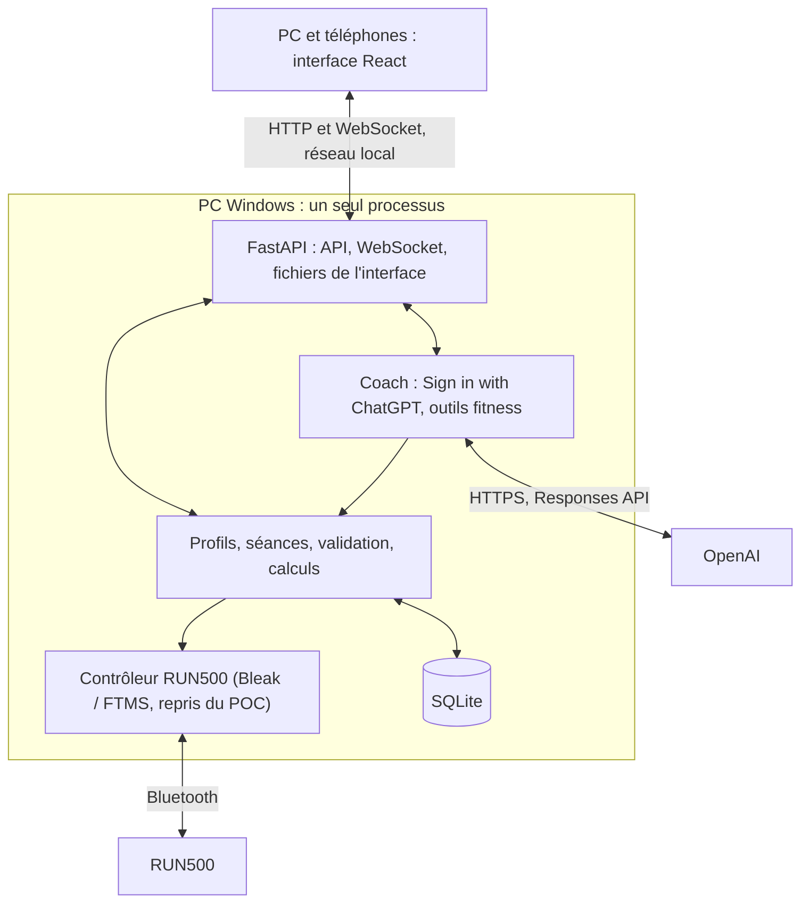

# Fitness App : plan de construction de la V1, brique par brique

4 octobre 2026. Ce plan remplace le précédent découpage en étapes et maquettes. **On construit l’application réelle, une brique après l’autre.** Chaque brique livre une fonction utilisable de bout en bout : interface, API et données. Code professionnel, contrôles ciblés, push direct, puis amélioration à l'usage selon [AGENTS.md](AGENTS.md). Aucune maquette, aucune donnée inventée.

## Suivi

Une seule brique en cours dans le périmètre demandé. Les cases indiquent les fonctions livrées sur `main` ; la suite ne nécessite plus de validation humaine systématique.

- [x] **Brique 0 · Design** : direction visuelle sombre, téléphone et PC, validée le 4 octobre 2026 ([DESIGN.md](DESIGN.md)).
- [x] **Brique 1 · Socle** : l’app s’ouvre sur le PC et le téléphone, servie par le PC, sans donnée de démonstration.
- [x] **Brique 2 · Profils** : base SQLite, profils créés, renommés et supprimés, choix du profil.
- [x] **Brique 3 · Séances manuelles** : créer, modifier, dupliquer, supprimer et retrouver ses séances ; choix pour Aujourd’hui par profil.
- [x] **Brique 4 · Connexion ChatGPT** : connexion sur le PC, compte et permission du forfait vérifiés, modèles du compte, coffre Windows et reprise de session. Limites des essais détaillées ci-dessous.
- [x] **Brique 5 · Coach** : conversations persistantes, lecture des données existantes et mémoire contrôlée ; réponses réelles vérifiées, cache automatique préparé sans gain observé lors des essais courts.
- [x] **Brique 6 · Catalogue et séances personnalisées** : six formats, trois niveaux, copies personnelles ; création et ajustement ChatGPT validés, persistants et acceptés explicitement.
- [ ] **Brique 7 · Tapis dans l’app** : logiciel livré, connexion en lecture seule et état en direct vérifiés en simulation ; essai RUN500 et téléphone physique restant à faire.
- [x] **Brique 8 · Exécuter une séance** : moteur réel et simulé, Direct, pause/reprise et arrêt ; simulation vérifiée, réception physique de l’application encore ouverte.
- [x] **Brique 9 · Enregistrer et revoir** : mesures conservées, bilan réel, ressenti.
- [ ] **Brique 10 · RUN500 réel** : réception matérielle progressive du parcours et des pertes.
- [ ] **Brique 11 · Historique et semaine** : historique, objectifs, Aujourd’hui alimenté par les vraies séances.
- [ ] **Brique 12 · Coach informé** : ChatGPT lit tout l’historique du profil et cite ses sources.
- [ ] **Brique 13 · Planning avec ChatGPT** : séances datées, semaine proposée par ChatGPT puis acceptée.
- [ ] **Brique 14 · Graphiques avancés** : comparaison, calendrier, distributions, tendances, qualité.
- [ ] **Brique 15 · Données** : exports, imports FIT/TCX, sauvegarde et restauration.
- [ ] **Brique 16 · Usage quotidien Windows** : lanceur, démarrage simple, hors ligne, performances.
- [ ] **Brique 17 · Réception finale** : parcours complet sur les vrais appareils.

## 1. Méthode

1. **Une brique = une fonction réelle.** À la fin, Arnaud peut l’utiliser lui-même dans l’app. Si ce n’est pas utilisable, ce n’est pas terminé.
2. **Pas de maquette.** L’interface de `frontend/` est la base visuelle définitive. La brique 1 retire toutes les données de démonstration. La navigation n’affiche que les écrans réellement construits ; chaque brique ajoute le sien en repartant de son écran de référence (commit `b9afbc0`, `frontend/src/features/`, et [captures](docs/preuves/v1/brique-00/2026-10-04/INDEX.md)).
3. **Petit et complet plutôt que large et partiel.** Une brique ne commence pas le travail de la suivante.
4. **Commits directs sur `main`**, avec ce qui a changé, le contrôle utile effectué et les limites ([AGENTS.md](AGENTS.md)).
5. **Livrer puis améliorer.** Cocher les critères implémentés à la livraison, sans essai demandé à Arnaud ni commit de validation séparé. Corriger ensuite les problèmes rencontrés dans l'usage réel.
6. **Contrôles proportionnés.** Appliquer les règles d'[AGENTS.md](AGENTS.md), sans campagne de tests ou captures systématiques. Les calculs, les données et la sécurité du tapis gardent leurs contrôles ciblés.
7. **Le POC reste utilisable** pour le diagnostic jusqu'à la réception matérielle de la brique 10.
8. **Sécurité du tapis.** Aucun mouvement sans présence confirmée. Aucune reprise ni répétition automatique de commande. Un résultat incertain n’est jamais présenté comme une réussite. Le STOP physique et la clé restent la protection de dernier recours.
9. **Simulation n’est pas maquette.** Le mode simulation du contrôleur existant sert à développer sans tapis. Il est signalé en permanence et ses données restent séparées des vraies séances.

### Gabarit d’une brique

- **Livré** : ce que l’utilisateur peut faire à la fin, en une phrase.
- **Travail** : la liste courte des tâches.
- **Fait quand** : critères de livraison, cochés quand la fonction est implémentée et publiée.
- **Pas dans cette brique** : ce qui est explicitement reporté.

## 2. Point de départ

| Sujet | État au 4 octobre 2026 |
|---|---|
| Design | Validé. Jetons, composants iOS, écrans et graphiques SVG dans `frontend/` (Vite, React 19, TypeScript, Tailwind 4) |
| Contrôleur | `poc/` : Python, FastAPI, Bleak, FTMS. Connexion et commandes de base reçues sur le RUN500 réel, à 1–2,5 km/h et 0–1 % |
| Limites logicielles | Manuel jusqu’à 16 km/h ; programmes jusqu’à 4 km/h et 3 %, 1 à 3 blocs de 5 à 60 s |
| Non reçu | Séance longue, clé physique, coupure BLE/PC, vitesses élevées |
| Cardio | Champ reçu à zéro uniquement : indisponible |
| Base, profils, IA, historique | Absents |

Sources : [base factuelle RUN500](docs/BASE_FACTUELLE_CAHIER_DES_CHARGES_RUN500.md), [réception du POC](docs/RECEPTION_RUN500.md), [faisabilité](docs/FAISABILITE_RUN500.md), [contrôleur](poc/controller.py), [FTMS](poc/ftms.py).

## 3. Architecture



| Élément | Choix |
|---|---|
| Interface | `frontend/` existant, compilé par Vite et servi par FastAPI. Node sert uniquement à construire. |
| Serveur | FastAPI et Uvicorn, un seul processus propriétaire du Bluetooth. Pas de `--reload` ni de workers multiples. |
| Métier | Services Python indépendants des routes, partagés par l’interface, le coach et les imports |
| Stockage | SQLite, SQLAlchemy, migrations Alembic, dans `%LOCALAPPDATA%\FitnessApp` (réel et simulation séparés) |
| Direct | WebSocket : état complet à la connexion, puis événements numérotés |
| ChatGPT | Sign in with ChatGPT (OAuth PKCE), Responses API en streaming, outils en fonctions locales |
| Graphiques | Composants SVG actuels ; ECharts seulement si la brique 14 le justifie (zoom, volume) |

```text
backend/
  app.py         démarrage, routes, fichiers statiques
  api/           routes HTTP et WebSocket
  storage/       modèles, migrations, sauvegardes
  training/      profils, séances, validation, exécution
  device/        contrôleur et FTMS repris du POC, sans réécriture du protocole
  recording/     mesures, événements, provenance
  coach/         connexion ChatGPT, conversation, outils
frontend/        interface (existante)
poc/             console de diagnostic (inchangée)
```

## 4. ChatGPT : ce qui est vérifié

Documentation officielle relue le 4 octobre 2026 : [présentation](https://developers.openai.com/siwc/token-sharing-open-source), [éligibilité](https://developers.openai.com/siwc/quickstart), [connexion](https://developers.openai.com/siwc/token-sharing-open-source/sign-in), [comptes et sessions](https://developers.openai.com/siwc/token-sharing-open-source/profiles-and-sessions), [modèles et requêtes](https://developers.openai.com/siwc/token-sharing-open-source/models-and-inference), [erreurs](https://developers.openai.com/siwc/token-sharing-open-source/errors-and-recovery), [interface](https://developers.openai.com/siwc/ui-ux-guidelines), [limitations](https://developers.openai.com/siwc/token-sharing-open-source/preview-limitations).

- **Éligibilité.** Le flux documenté couvre les applications open source et hébergées localement ; FitnessApp est hébergée sur le PC. Les applications payantes ou hébergées à distance passent par un formulaire. La documentation cite les comptes Plus et Pro éligibles, sous réserve du compte, de l’espace et des politiques applicables : un abonnement actif seul ne garantit pas l’accès. Préversion. Le parcours réel FitnessApp a atteint le consentement OpenAI, puis reçu une identité validée, les permissions du forfait et le catalogue du compte. Aucun appel d’inférence n’a été exécuté dans la brique 4.
- **Connexion.** OAuth avec PKCE S256, dans le navigateur système du PC. Émetteur et endpoints chargés depuis la découverte officielle OpenAI et limités à son domaine HTTPS. Retour FitnessApp sur `http://127.0.0.1:<port>/callback` ; seul le port peut changer entre tentatives, pas le chemin. **La connexion initiale se fait depuis le PC, via l’adresse locale de FitnessApp.** Les téléphones passent par le serveur du PC ; aucun jeton ne leur est envoyé.
- **Enregistrement.** La première connexion utilise `client_id=dynamic_agent_client` avec `agent_name_hint` et `ext_agent_host_id`, un identifiant opaque et stable du PC, choisi avant la première connexion. L’app conserve ensuite le `client_id` attribué (`oaiapp_…`).
- **Portées.** `openid profile email offline_access resource.invoke chatgpt.tokens.use.direct`, ressource `https://api.openai.com/v1`. Sans `chatgpt.tokens.use.direct` accordée, le forfait n’est pas utilisable.
- **Jetons.** PyJWT vérifie la signature RS256/JWKS, l’émetteur, l’audience, les dates, le sujet, le nonce et `azp`/`at_hash` lorsqu’ils sont présents. Le coffre `chatgpt/connection.dpapi`, hors du dépôt et de SQLite, est chiffré par DPAPI pour l’utilisateur Windows, protégé par ACL et remplacé atomiquement. Aucun jeton dans Git, les journaux, les exports ou les réponses au frontend. Seul le `id_token_hint` prévu par OpenAI peut être transmis directement au navigateur système pour une réautorisation ; aucune URL d’autorisation n’est renvoyée à l’interface. Rafraîchissements sérialisés, verrou entre processus, conservation des jetons sur panne temporaire et retrait sur erreur terminale.
- **Déconnexion.** Révocation du renouvellement via l’endpoint de découverte, puis effacement des trois jetons. Un échec de révocation distante est affiché même après la déconnexion locale. Le client attribué et l’identifiant d’installation restent disponibles ; les inscriptions de comptes/espaces sont séparées même avec le même e-mail. Un refus du partage du forfait conserve l’identité, avec une action explicite pour redemander cette permission (`prompt=consent`, sans paramètre expérimental).
- **Modèles.** `GET /v1/models` ; afficher `display_name` pour `visibility: "list"`, envoyer le `slug`. Aucun modèle codé en dur.
- **Requêtes.** `POST /v1/responses` avec `store: false` et `stream: true`. Le contexte utile est reconstruit depuis la base locale ; historique récent borné, échanges anciens accessibles par recherche et pagination. Aucun `previous_response_id` HTTP. Une réponse n’est complète qu’après `response.completed`.
- **Outils.** Fonctions personnalisées regroupées dans un espace de noms (`fitness`), et recherche web selon le compte. Non disponibles : MCP hébergé, recherche de fichiers, Code Interpreter, génération d’images.
- **Paramètres interdits.** `temperature`, `top_p`, `max_output_tokens`, `metadata`, `user`, `truncation`, `background`, `conversation` et les autres listés dans les limitations.
- **Erreurs à afficher.** `subscription_sharing_usage_limit_exceeded`, `subscription_sharing_usage_unavailable`, refus de consentement, expiration et révocation. Aucune bascule silencieuse vers une facturation API.

Règles du coach :

- Le coach voit uniquement le profil actif. Il ne peut pas changer de profil par lui-même.
- Il passe par les services métier, sans accès SQL libre, aux fichiers Windows ni au Bluetooth.
- Une séance proposée par ChatGPT passe par **la même validation** que l’éditeur manuel. Elle est enregistrée avec l’auteur « ChatGPT », sa version et la conversation d’origine.
- Le coach ne démarre jamais le tapis.

## 5. Données : règles permanentes

1. Conserver toutes les mesures reçues, brutes et décodées, avec horodatage UTC, source et âge. Une valeur absente reste absente ; un zéro de cardio invalide n’est jamais un pouls.
2. Séance réalisée : profil et programme figés au démarrage, événements (pauses, reprises, arrêts, interruptions), commandes avec réponse ou résultat inconnu.
3. Aucune interpolation à travers une coupure. La couverture est calculée et affichée.
4. Les calculs (moyennes, distance, allure) sont faits côté Python, versionnés, et identiques dans le bilan, les graphiques, les exports et les outils du coach.
5. Simulation, essais matériels et entraînements sont des catégories distinctes jusqu’aux exports et au coach.
6. Une erreur de stockage est visible et enregistrée ; aucune perte silencieuse.
7. Sauvegarde cohérente avec l’API de sauvegarde SQLite, pas une copie du fichier ouvert ([SQLite backup](https://www.sqlite.org/backup.html)).
8. Toute donnée propre à un profil (séances, conversations, mesures, ressentis, plannings) référence `profiles.id` avec `ON DELETE CASCADE`. Supprimer un profil, après confirmation, supprime toutes ses données ; aucune donnée ne passe d’un profil à l’autre.

## 6. Les briques

### Brique 1 · Socle

**État :** validée le 4 octobre 2026 par Arnaud ([preuves](docs/preuves/v1/brique-01/2026-10-04/INDEX.md)).

Audit complémentaire sur Windows le 4 octobre 2026 : lancement par double-clic, relance sans reconstruction, accès par l’IP réseau et états de panne vérifiés ; corrections et mesures dans [l’audit Windows](docs/preuves/v1/brique-01/2026-10-04/AUDIT_WINDOWS.md). L’essai sur téléphone physique n’a pas de preuve versionnée.

**Livré :** l’app s’ouvre sur le PC et le téléphone, servie par le PC, avec le vrai design et aucune donnée inventée.

**Travail :**
1. Créer `backend/` (FastAPI) qui sert le build de `frontend/` et expose `GET /api/health` (version, mode, dossier de données).
2. Un lanceur `start-app.ps1` : prépare `.venv`, construit l’interface si besoin, démarre sur un port distinct du POC, option `-Reseau` pour le téléphone.
3. Supprimer `frontend/src/data/demo.ts`, la simulation de séance et les paramètres `?scenario=`.
4. Navigation limitée aux écrans construits. Aujourd’hui affiche l’état vide réel.
5. Proxy de développement Vite vers FastAPI.

**Fait quand :**
- [x] `start-app.ps1` ouvre l’app sur le PC ; `-Reseau` l’ouvre sur le téléphone via l’IP Wi-Fi.
- [x] Aucune valeur de démonstration n’apparaît dans l’interface.
- [x] Le POC démarre toujours sur son port, sans modification.

**Pas dans cette brique :** base de données, profils, tapis.

### Brique 2 · Profils

**État :** livrée et poussée le 4 octobre 2026 ([contrôles déjà réalisés](docs/preuves/v1/brique-02/2026-10-04/INDEX.md)). Cases mises à jour selon la nouvelle méthode de livraison ; Windows et téléphone physique ne sont pas couverts par ces contrôles.

**Livré :** choisir son profil (Arnaud et Ophélie au départ) ; créer, renommer et supprimer des profils, chacun avec ses propres données ; le choix est retenu sur chaque appareil.

**Travail :**
1. SQLite, SQLAlchemy et Alembic dans `%LOCALAPPDATA%\FitnessApp\` (bases réelle et simulation séparées).
2. Table des profils : nom unique, objectif hebdomadaire, préférence km/h ou min/km. Arnaud et Ophélie sont créés au premier lancement, dans une base sans profil.
3. API des profils (lire, créer, modifier, supprimer) ; sélecteur réel (feuille Profil, barre latérale), mémorisé par appareil.
4. Écran Réglages minimal : nom, objectif et unité du profil, suppression confirmée, dossier de données, version.
5. Complément demandé par Arnaud le 4 octobre 2026 : création, renommage et suppression. Il reste toujours au moins un profil ; l’identifiant d’un profil ne change jamais.

**Fait quand :**
- [x] Le profil choisi survit au rechargement et au redémarrage du serveur.
- [x] Une migration Alembic crée la base depuis zéro ; un test le vérifie.
- [x] Les appareils partagent la liste des profils du serveur ; un profil supprimé disparaît avec ses données (test). Les autres appareils actualisent la liste au rechargement.


**Pas dans cette brique :** authentification (le profil n’en est pas une), objectifs détaillés.

### Brique 3 · Séances manuelles

**État :** livrée le 4 octobre 2026. Migration additive `0003`, bibliothèque et éditeur reliés au serveur, anciennes versions consultables. Les modifications concurrentes d’une même version sont refusées pour préserver le travail enregistré.

**Livré :** créer, modifier, dupliquer, supprimer et retrouver ses séances ; en choisir une pour Aujourd’hui.

**Travail :**
1. Modèle de séance : blocs (durée, vitesse, pente), répétitions, version, auteur (humain ou ChatGPT), profil.
2. Validation unique côté Python : bornes de vitesse et de pente, blocs de 30 à 3 600 s, 120 segments maximum après expansion. Depuis le 7 octobre, la durée totale peut dépasser une heure pour l’adaptation calorique. L’interface affiche les erreurs renvoyées par le serveur.
3. Écrans Séances et Éditeur branchés sur l’API. Une modification crée une nouvelle version et conserve les anciennes.
4. Aujourd’hui : carte « Prochaine séance » choisie par l’utilisateur, sinon état vide.

**Fait quand :**
- [x] Une séance créée sur le téléphone apparaît sur le PC (bibliothèque commune en base, actualisée à l’ouverture et au retour sur l’application).
- [x] Une séance invalide ne peut pas être enregistrée, même par appel direct à l’API (test).
- [x] Les tests couvrent l’expansion des répétitions et les bornes.

**Règles livrées :** vitesse 1–16 km/h, **pente 0–10 %** (précision d’Arnaud), blocs de 30 à 3 600 secondes, 60 minutes et 120 segments maximum répétitions comprises. Expansion, durée et distance prévues calculées exclusivement en Python. Les versions conservent leur auteur et son nom au moment de l’écriture. Aujourd’hui utilise la dernière version de la séance choisie ; supprimer cette séance efface sa sélection et ses versions, supprimer un profil efface ses séances. Les autres profils sont préservés. Le modèle prévoit la provenance ChatGPT, mais seule la création humaine est exposée ici.

**Contrôles :** build frontend, tests ciblés API/calculs/migrations/profils, vérification Chrome sur PC et viewport téléphone avec une base de contrôle isolée. Pas d’essai sur téléphone physique ni sur le tapis. Les bornes de conception ci-dessus ne modifient pas les protections d’exécution du POC.

**Complément calories (4 octobre 2026) :** poids par profil en base (migration 0004), effaçable ; calories actives et totales estimées selon les équations ACSM, calculées en Python après expansion des répétitions. Affichage bibliothèque, détail, aperçu de l'éditeur et Aujourd'hui ; dénivelé équivalent prévu. Choix marche/course automatique selon la vitesse, anciennes versions compatibles. Le détail précise les hypothèses et les vitesses hors des plages usuelles du calcul. Pas de calories sans poids, pas de collecte d'âge/taille inutilisés, ni de promesse de mesure physiologique. Méthode, sources, migration et limites : [estimation des calories](docs/ESTIMATION_CALORIES.md). Les prévisions utilisent le poids actuel, y compris pour les anciennes versions ; aucun bilan de séance réalisée n'est créé.

Contrôles de ce complément : build et 46 tests ciblés réussis (calculs, API, profils, migrations). Chrome sur base isolée : saisie décimale du poids, refus d'une valeur invalide, bibliothèque, détail PC/téléphone, changement de déplacement avec recalcul et enregistrement, changement de profil ; aucune erreur console observée. Le serveur déjà lancé doit être redémarré pour charger le nouveau backend et migrer sa base. Pas de mesure calorimétrique ni d'essai sur tapis.

**Simplification demandée (4 octobre 2026) :** suppression du sélecteur Déplacement et des mentions Auto dans les blocs. Calcul automatique côté Python, y compris pour les anciens choix manuels, sans réécriture des versions. Contrôles : build, tests ciblés énergie/séances et vérification de l’éditeur dans Chrome.

**Amélioration du graphique (4 octobre 2026) :** vitesse en barres vertes/grises (km/h) et inclinaison en escalier violet (%) sur deux zones temporelles alignées, avec échelles distinctes. Dans la bibliothèque, Aujourd’hui et l’éditeur, survol ou toucher d’un segment affiche son type, son intervalle, sa durée et ses deux consignes. Le toucher conserve la sélection ; boutons précédent/suivant et flèches du clavier donnent accès aux segments courts, Échap efface la sélection. Build et vérification Chrome du survol, du clavier et des événements tactiles en viewport téléphone ; pas de réception sur téléphone physique.

**Lisibilité vitesse et pente :** à la demande d’Arnaud, échelles complètes fixes à **0–16 km/h** et **0–10 %**, sans plafond automatique. Deux vraies zones de tracé (176/144 px, 144/128 px en largeur réduite), vitesse graduée tous les 4 km/h, pente violette avec aire plus contrastée et valeurs par segment lorsqu’il y a assez de place. Contrôles : build et rendu Chrome PC/téléphone sur la séance existante, sélection d’un segment sans modification des données.

**Pas dans cette brique :** démarrage sur le tapis, ChatGPT.

### Brique 4 · Connexion ChatGPT

**État :** livrée le 4 octobre 2026. Service `backend/coach`, API `/api/chatgpt`, section ChatGPT des Réglages. Aucun changement de schéma, de profil, de séance, de version, de sélection sportive ou de lanceur Windows.

**Livré :** « Continuer avec ChatGPT » ouvre le navigateur système du PC. Après accord, les Réglages affichent le compte et son catalogue réel, permettent de choisir un modèle, d’actualiser la liste, de retrouver une inscription et de se déconnecter. Aucun modèle imposé. Le téléphone affiche le compte et les modèles ; la gestion de la connexion reste sur le PC.

**Travail :**
1. Générer et conserver `ext_agent_host_id` avant toute connexion.
2. Flux PKCE complet (§ 4) : serveur de retour sur `127.0.0.1`, `state` et `nonce`, échange du code, validation du jeton d’identité, vérification de `chatgpt.tokens.use.direct`.
3. Stockage protégé des jetons, rafraîchissement, déconnexion.
4. Réglages > ChatGPT : e-mail, état, modèle choisi (liste de `/v1/models`), Se déconnecter. Sur le téléphone : « Connexion depuis le PC ».
5. États visibles : chargement, connexion en cours et annulable, refus, permission manquante, expiration, révocation, réseau, catalogue vide et coffre indisponible. Une tentative dure cinq minutes ; doublons, mauvais retours et rejeux ne peuvent pas remplacer une connexion valide.

**Fait quand :**
- [x] Connexion réussie avec le vrai compte d’Arnaud ; identité et permissions vérifiées ; client attribué conservé ; cinq modèles reçus d’OpenAI.
- [x] Aucune exposition des jetons au frontend ni aux journaux applicatifs ; fichiers locaux chiffrés, indépendants des données exportables et absents de Git (tests et contrôle du diff).
- [x] Reprise sans sélection de compte après relance de l’application ; rafraîchissement réel réussi avec remplacement du jeton de renouvellement et nouvelle lecture du catalogue. Le redémarrage complet de Windows n’a pas été essayé.

**Contrôles automatiques :** build frontend ; 22 tests ciblés SIWC avec signatures RSA, coffre DPAPI réel et fournisseur de test (PKCE/state/nonce, claims et signature, callback local, refus, expiration, rejeu, client/identité échangés, permissions, plusieurs inscriptions, verrou, rotation après relance, révocation, panne réseau, absence de répétition sur refus durable, catalogue vide, écriture atomique et absence de fuite). Les 46 contrôles existants backend/profils/séances/énergie ont également passé. Aucun faux fournisseur ni modèle de test dans l’application.

**Contrôles réels :** Chrome via MCP, compte connecté, catalogue du compte, format PC et viewport téléphone de 390 px via l’IP réseau ; reprise visible sur le serveur habituel 4330 après relance. Aucune erreur console pendant ces parcours ; l’arrêt volontaire de l’instance de contrôle a produit l’avertissement réseau attendu. Empreinte logique SQLite identique avant/après, intégrité `ok`. La session créée lors du contrôle a été transférée uniquement entre les coffres de cette même installation FitnessApp ; la copie temporaire a été retirée.

**Limites :** pas d’essai sur téléphone physique ni de redémarrage complet de Windows. Déconnexion/révocation, refus et incidents couverts automatiquement ; le compte réel est laissé connecté. Les hints de réautorisation sont vérifiés par tests, sans nouvel essai interactif après déconnexion. Aucun appel Responses, aucune consommation d’inférence, aucune action sur le tapis. L’application habituelle a été relancée et la session retrouvée ; une nouvelle relance depuis le lanceur reste nécessaire pour charger le dernier correctif qui suspend les répétitions sur refus durable d’OpenAI.

**Pas dans cette brique :** conversation.

### Brique 5 · Coach

**Périmètre réconcilié le 5 octobre 2026 :** la lecture de toutes les données utiles déjà présentes et la continuité des échanges font partie de cette brique. La génération/modification structurée des séances reste en brique 6 ; l'exploitation des activités réalisées reste en brique 12.

**Fonctions implémentées :** entrée Coach, création/recherche/reprise de conversations par profil, réponse progressive, interruption explicite, conservation des réponses échouées ou incomplètes, saisie conservée, mémoire consultable/modifiable/supprimable et préférences proposées soumises au bouton Mémoriser. Les séances consultées ouvrent leur version exacte.

**Données réellement accessibles :** profil actif (nom, objectif hebdomadaire, poids, unité, dates), mode réel/simulation et unités communes, séance choisie pour Aujourd'hui, bibliothèque complète et versions datées avec origine/auteur, blocs et répétitions, estimations du service métier avec le poids actuel, anciennes conversations et mémoire confirmée. La date locale est fournie. Fatigue, résultats, progression et activités réalisées ne sont jamais déduits d'une séance préparée. Aucun historique réel n'existe encore.

**Outils serveur :** `get_profile`, `list_workouts`, `get_workout`, `list_versions`, `search_conversations`, `read_conversation`, `read_message`, `search_memories`. Recherche textuelle, pages bornées, total et suite explicites ; les longs échanges se consultent par extraits. `propose_memory` ne modifie aucune préférence : citation exacte du message actuel et confirmation humaine obligatoire. Le profil choisi dans l'interface est validé et figé côté serveur pour le flux ; aucun argument de profil n'est accepté du modèle. Comme les autres écrans du projet, le choix de profil sur un appareil n'est pas une authentification entre personnes.

**Persistance et erreurs :** migration additive `0005`, conversations et paires message/réponse avec états `running`, `completed`, `interrupted`, `failed`. Clé d'envoi idempotente et une seule réponse en cours par profil, y compris entre écrans. Enregistrement du texte avant affichage ; après redémarrage, les flux restés ouverts sont marqués interrompus. Changement de profil ou fermeture du parcours : abandon du flux propriétaire ; changement de compte/déconnexion ChatGPT : arrêt des flux. Réseau et inférence asynchrones, aucun verrou du coffre pendant le streaming. Aucun modèle de remplacement, API payante de secours, commande sportive ou accès arbitraire. Le HTML et les images du modèle ne sont pas exécutés/chargés ; seuls les liens de séances effectivement lus par le serveur sont activés.

**Quota et cache :** documentation officielle [SIWC modèles/inférence](https://developers.openai.com/siwc/token-sharing-open-source/models-and-inference), [erreurs](https://developers.openai.com/siwc/token-sharing-open-source/errors-and-recovery), [limitations](https://developers.openai.com/siwc/token-sharing-open-source/preview-limitations) et [cache](https://developers.openai.com/api/docs/guides/prompt-caching) relue le 5 octobre. Instructions et outils stables, clé de cache opaque par profil, cache automatique du fournisseur. Dates des messages identiques dès le premier envoi et lors de leur reprise pour préserver le préfixe. Pas de `prompt_cache_retention` (non accepté par SIWC), ni de `prompt_cache_options` ou `prompt_cache_breakpoint` : ces deux options de l’API générale ont été rejetées réellement avec HTTP 400 `invalid_parameter` le 5 octobre. Aucun nouvel essai automatique pour contourner un refus. Au plus six échanges modèle/outils par demande, contexte récent borné à 24 réponses et 40 000 caractères sérialisés, messages utilisateur complets et quatre réponses récentes conservées jusqu’à 6 000 caractères chacune, pages antérieures explicitement accessibles (chaque réponse reprise avec le rappel compact des séances proposées : blocs, objectif, niveau, statut ; correctif du 5 octobre après un suivi « pourquoi ce rythme ? » où le coach, privé de sa carte, avait expliqué une autre séance de la bibliothèque), détails sans doubler les blocs par leur expansion, recherches ciblées et réponses courtes. Aucune inférence de fond ni répétition automatique après ouverture du flux ; seul un rejet d'identité avant le premier événement peut déclencher un unique renouvellement puis nouvel essai. L'interface affiche requêtes, tokens d'entrée/sortie et tokens réellement en cache tels que rapportés par OpenAI. Une mesure manquante reste inconnue. Ces compteurs ne prouvent ni le quota restant ni une économie chiffrée sur le forfait ChatGPT.

**Amélioration du coach du 5 octobre 2026 :** mêmes connexion SIWC et modèle choisi, réflexion `high` pour les arbitrages de séance ; latence et consommation peuvent augmenter. Réponses directes, questions limitées aux informations réellement bloquantes, réponses au questionnaire exploitées dès le tour suivant. `preview_catalog` réutilise les formats et le calcul métier existants sans enregistrer. `validate_workout` et `propose_workout` contrôlent le minimum calorique déclaré dans `min_active_kcal` avec le poids actuel, et imposent 5 min d’échauffement initial et de retour au calme final ; cible impossible ou poids manquant restent explicites. Aucun changement de coffre, de modèle ni de commande tapis. Contrôles : 31 tests ciblés et build réussis ; reproduction avant/après d’une allure oubliée après dix échanges. Chrome, profil de vérification et compte SIWC réels : questions interactives, réponses libres, proposition de 45 min à 8 km/h avec 412,7 kcal actives estimées, puis refus explicite de promettre 350 kcal dans 20 min avec les mêmes plafonds, sans nouvelle carte. Trois réponses terminées sans erreur ; aucune erreur console nouvelle pendant ces échanges (avertissements antérieurs dus aux relances du serveur). Source du coach chargée après redémarrage ; aucune séance de cet essai enregistrée ni exécutée. Les activités réalisées restent indisponibles.

**Fait quand :**
- [x] Conversations, réponses partielles et mémoire persistent localement par profil ; migration et reprise après interruption couvertes automatiquement.
- [x] Outils de lecture détaillée, versions, recherche et pagination ; chiffres identiques au service de séances ; aucun outil d'écriture sportive.
- [x] Isolation profil, envoi concurrent/idempotent, arrêt, déconnexion, erreurs après début de flux, absence de secrets et cache couverts par tests ciblés.
- [x] Réponse réelle fondée sur les données et détail de séance vérifiés avec le compte connecté, puis reprise dans Chrome.
- [x] Streaming réel au viewport téléphone vérifié (distinct d'un téléphone physique).

**Contrôles automatiques :** build frontend avec TypeScript ; 83 tests ciblés (19 coach, 22 connexion, 42 backend/profils/séances), sans appel OpenAI dans ces tests. Isolation, mémoire contrôlée, migrations, données conservées, doublons/concurrence, interruptions, déconnexion, erreurs de flux, secrets et préfixe stable couverts. Le flux collecte aussi les éléments `response.output_item.done` : le terminal SIWC peut donner les compteurs sans répéter les appels d’outils.

**Contrôles réels, 5 octobre 2026 :** serveur habituel 4330 relancé par Arnaud, schéma `0005`, code backend chargé et build réellement servi vérifiés. GPT-5.6-Luna choisi par Arnaud, compte existant conservé. Deux réponses réussies dans Chrome via MCP : détail de « Test » (six blocs, 17 min, 1,733 km, 116,2 kcal actives / 142,7 totales au poids actuel), valeurs comparées à l’API ; lien ouvrant exactement la version 1 ; reconnaissance explicite de l’absence d’activités réalisées. Réponse partielle observée en cours puis état terminé. Reprise de la même conversation via l’adresse réseau et réponse courte à un second message, sans nouvelle lecture de bibliothèque. Format PC et viewport 390 × 844, aucun débordement horizontal. Changement de profil : échange et brouillon d’Arnaud absents chez Ophélie puis retrouvés au retour ; mémoire d’Ophélie vide, isolation d’une mémoire remplie couverte automatiquement. Aucune erreur console pendant les parcours réussis ; seuls avertissements réseau lors des arrêts volontaires du serveur. Aucun essai sur téléphone physique.

**Usage réellement mesuré :** sept tentatives HTTP au total, dont deux refus sur les options de cache incompatibles, un premier flux ayant révélé la collecte manquante des outils, puis quatre requêtes pour les deux réponses réussies (trois pour chercher/lire/expliquer la séance, une pour poursuivre). Cinq retours de compteurs : 10 602 tokens d’entrée et 494 de sortie ; compteurs inconnus pour les deux refus. OpenAI a signalé **0 token en cache** sur ces essais : aucun gain effectif de cache ni économie de forfait n’est revendiqué. Préfixe stable, contexte borné, lectures ciblées et absence de répétition restent actifs ; aucun remplissage artificiel du prompt ni inférence de chauffe. Les essais échoués restent clairement marqués dans la conversation locale. La dernière correction backend a été chargée ; aucun redémarrage supplémentaire nécessaire à cette livraison. Le design concurrent publié dans `d9cd073` a été intégré sans écraser ses changements : bouton Mémoire et saisie adaptés à la capsule commune, build puis liens de version et affichage Chrome revérifiés, sans nouvel appel OpenAI.

**Archivage et interface (5 octobre 2026) :** migration additive `0006` (`archived_at` facultatif). Archiver retire une conversation de la liste « Récentes » sans rien supprimer ; elle reste lisible depuis « Archivées » et par les outils du coach ; écrire dedans ou Désarchiver la ramène. Refusé pendant une réponse en cours. Liste façon Messages (recherche iOS avec effacement, segmenté Récentes/Archivées, date relative, bouton d'archivage par ligne, annulation pendant 6 s), saisie qui s'agrandit (Entrée envoie au clavier physique, Maj+Entrée va à la ligne), bulles et sources en capsules. Test `test_archive_hides_without_losing_exchanges` ; vérifié en simulation dans Chromium, téléphone et PC, sans nouvel appel OpenAI.

**Pas dans cette brique :** génération ou modification de séance, enregistrement d'une séance proposée, planning, notifications, tâche autonome, historique d'activités et commandes au tapis.

### Brique 6 · Catalogue et séances personnalisées avec ChatGPT

**Livré :** Séances propose Découvrir et Mes séances. Dans Découvrir, choisir en amont une durée ou des calories actives visées adapte les programmes et leurs prévisions à la saisie et au niveau. Un modèle du catalogue devient une copie personnelle modifiable. Depuis Coach ou Séances, une demande libre produit une carte structurée ; depuis une séance ou son éditeur, Ajuster avec ChatGPT propose une nouvelle version avec comparaison avant acceptation.

**Périmètre livré :**
1. Catalogue Python sans IA : Dépense calorique, Jambes et fessiers — marche inclinée, Endurance ; deux formats par objectif, trois variantes explicites Facile/Intermédiaire/Soutenu, avec échauffement et retour au calme. Le niveau décrit les consignes, pas les capacités de la personne.
2. Recherche et filtres objectif/niveau dans Mes séances ; création manuelle, modification, duplication, suppression, versions et sélection distincte pour Aujourd’hui conservées. Les anciennes séances gardent un objectif et un niveau inconnus jusqu’à une saisie explicite.
3. Outils validate_workout et propose_workout : validation métier Python partagée, bornes de conception inchangées, somme des blocs comparée à la durée totale annoncée ; erreurs précises renvoyées au modèle dans les six échanges existants. Aucun calcul de calories JavaScript.
4. Carte persistante : explication, objectif/niveau, prévisions backend, aperçu et blocs ; Enregistrer, Modifier, Ignorer. Un texte seul n’enregistre jamais une séance. Les URL des conversations permettent de retrouver les propositions après rechargement.
5. Acceptation sous verrou SQLite, idempotente même en concurrence ; propriétaire et version de départ contrôlés. Un ajustement crée une nouvelle version de la même séance ou signale le conflit. Une retouche manuelle est attribuée au profil ; une proposition acceptée sans retouche à ChatGPT. La provenance conserve le lien vers la conversation.
6. Migration additive 0007 : métadonnées facultatives, snapshot de la séance transmise et table des propositions. Profils, séances, versions, sélections, conversations et mémoire conservés. Aucun ajout automatique du catalogue aux profils.
7. Cible exclusive durée (15–60 min) ou calories actives, difficulté choisie avant le format et réglable dans l’aperçu. Calcul Python partagé, recalcul après 200 ms de saisie ; réponses anciennes écartées et ajout impossible pendant le recalcul. Vitesses, pentes et rapport effort/récupération préservés ; durées centrales réparties à la seconde, blocs de 30 s minimum, échauffement/retour au calme de 5 min chacun. Depuis le 7 octobre, la cible calorique peut allonger la durée au-delà de 60 min pour atteindre le minimum estimé demandé. Poids absent, cible sous le minimum du format ou construction trop longue : explication, sans forcer le résultat. L’ajout recalcule et conserve la cible dans la provenance sans modifier les séances existantes.
8. Construction revue avec [principes et sources](docs/CONSTRUCTION_PROGRAMMES.md) : but propre à chacun des six formats, début/fin progressifs, récupération et durée par passage bornée. Les variantes plafonnées complètent en marche facile ; les variantes cardio/endurance Soutenu couvrent toute la durée centrale en course ou en alternance prévue, sans supplément de marche. Cardio continu Soutenu court à 9 km/h, Cardio en alternance Soutenu alterne 10 km/h / footing à 8,1 km/h, Allure régulière Soutenu court à 10 km/h jusqu’à 50 min centrales. Course et marche facile limite la course à 8 passages d’au plus 1 min, avec le rapport 1:00/1:30 inspiré du début NHS ; le niveau Soutenu conserve uniquement ses récupérations entre passages. La marche inclinée reste en marche à chaque niveau. La répartition réelle de l’effort apparaît avant les prévisions ; Pourquoi ce programme ? expose construction, adaptation, effort et sources. Les copies gardent une révision du catalogue ; les anciennes versions restent intactes. Le Coach respecte la demande de course, sans promesse de validation scientifique ni prescription pour athlète de haut niveau.

**Fait quand :**
- [x] Les dix-huit variantes sont valides et l’aperçu change réellement avec le niveau ; une copie ajoutée et modifiée ne change pas le catalogue.
- [x] Trois demandes réelles différentes donnent des séances valides, enregistrées et modifiables : marche calorique 20 min, endurance 30 min, marche inclinée 25 min, avec le modèle déjà choisi gpt-5.6-luna.
- [x] Ajustement réel 25 → 20 min : comparaison des segments, durée, vitesses, pentes et prévisions ; version 2 acceptée, version 1 conservée.
- [x] Les refus de validation et leur correction sont contrôlés par les tests ciblés du flux (transport simulé), ainsi que l’échec restant invalide. Les requêtes répétées, les acceptations concurrentes et les conflits de version ne créent pas de doublons.
- [x] Origine et auteur réels affichés ; isolation des profils, conservation de la migration et calories inconnues sans poids contrôlées.
- [x] Build frontend et 74 tests ciblés réussis ; parcours Chrome sur PC et viewport téléphone : découvrir, niveau, ajouter, modifier, Aujourd’hui, filtres, propositions, rechargement, édition et ajustement.
- [x] Complément durée/calories : durée exacte et structure des dix-huit variantes, objectif calorique/poids/bornes, validation API et copie fidèle contrôlés par trois tests critiques supplémentaires. Build et tests séances/énergie/propositions réussis ; Chrome : 25 min, 150 kcal, changement de niveau, cible impossible, saisie vide, ajout et rechargement, formats PC et viewport téléphone.
- [x] Révision de construction : alternances de 15 à 60 min gardant leur ordre, consignes, plafond de durée par passage et rapport effort/récupération ; calories et copie contrôlées. Régression 30/60 min facile et conservation des séances enregistrées ; build et tests ciblés réussis. Chrome : méthode et sources, segments 1:00/1:30, adaptation calorique et aperçu de marche inclinée.
- [x] Catalogue commun Arnaud/Ophélie repensé par objectif : mise en route/fin progressives, plafonds de volume de course et de côte selon le format et le niveau, complément en marche facile après le plafond. Dose réelle exposée avant ajout ; cible calorique construite avec les mêmes règles. Durées exactes, seuils des plafonds et estimation croissante à chaque seconde des dix-huit variantes contrôlés ; 46 tests ciblés et build réussis. Chrome PC/390 px : objectif, 30/60 min, difficulté, 150 kcal, répartition et ajout de Vagues de pente Soutenu 30 min au profil de vérification, persistance et copie conforme après rechargement ; aucune erreur console. Serveur et ressources du build vérifiés ; aucune migration ni réécriture des versions personnelles.

**Vérification locale du 5 octobre 2026 :** serveur 4330 redémarré avec le code de cette brique, schéma 0007 et ressources du build contrôlés. Une sauvegarde SQLite a précédé la migration ; comparaison des sept tables préexistantes, intégrité et clés étrangères conformes. Les essais réels sont dans le seul profil « Vérification brique 6 », conservé séparément des données personnelles. Un premier essai d’endurance annonçait 30 min avec 35 min de blocs : proposition ignorée, ajout du contrôle de durée, puis génération correcte de 30 min. Les trois créations retenues et l’ajustement ont chacun terminé sans erreur.

**Correction du niveau Soutenu :** 38 tests ciblés (propositions, énergie, coach) et build réussis. Régression dédiée : course continue sur tout le temps central à 15/30/60 min, récupération en footing pour le cardio alterné, aucune marche supplémentaire en cardio/endurance Soutenu, copies fidèles par durée/calories, marche inclinée conservée. Le contrôle par seconde des dix-huit variantes protège toujours la recherche calorique. Chrome PC : 20/50 min de course centrale pour 30/60 min d’Allure régulière Soutenu, cardio en alternance à 10/8,1 km/h et recalcul 400 kcal ; console sans erreur. Serveur redémarré, API et ressources réellement servies vérifiées. Aucune migration, aucune modification automatique des copies existantes, aucun nouvel appel ChatGPT réel pour cette correction.

**Adaptation calorique du 7 octobre :** retrait du blocage d’une heure pour les cibles en calories et l’enregistrement des séances correspondantes. Le calcul cherche une durée atteignant la cible estimée avec le poids actuel, sans augmenter le niveau ni changer les consignes. Les récupérations et volumes ciblés des formats restent conservés ; cardio/endurance Soutenu couvre tout le temps central. Blocs longs répartis sans changer leurs consignes ; 120 segments au plus. Interface et contrat Coach alignés ; copies personnelles déjà enregistrées préservées, aucune migration. Compilation de l’interface réussie. Tests existants adaptés aux nouvelles règles mais non exécutés ; aucune recette navigateur relancée à la demande d’Arnaud.

**Accompagnement du Coach (5 octobre) :** instructions réorganisées par sections (rôle, ton, capacités du tapis, accompagnement, construction, suivi, données, règles strictes). Avant une séance, au plus un tour de 1 à 3 questions à choix simples sur ce qui manque vraiment (objectif, temps, niveau réel, gêne), affichées en cases interactives par l’outil `ask_questions` (2 à 5 réponses courtes validées par le serveur, « Autre » libre, envoi groupé en un message ; questions conservées avec la réponse, migration 0008 sans recopie, et rappelées au modèle), puis raisonnement objectif → structure → dose → vitesses/pentes, validation et proposition. Capacités du RUN500 rappelées : 1–16 km/h par pas de 0,1 (0 = arrêt, jamais un bloc), pente 0–10 % par pas de 0,5, changements non instantanés (efforts rapides de préférence de 45 s à 2 min), blocs de 30 s à 60 min, 60 min et 120 segments au total. Repères d’intensité approximatifs (allure 10 km ≈ 85–90 % de VMA, efforts courts 95–110 %). Suivi : demander le ressenti (1 à 10, souffle, gêne) et ajuster une variable principale, proportionnellement à l’écart avec la cible ; ton chaleureux et motivant. Essais réels du 5 octobre (gpt-5.6-luna, code publié, base temporaire, profils fictifs Arnaud et Ophélie) : questions groupées puis séance prudente avec gêne au genou, question de suivi sur la séance proposée, progression après ressenti, demande hors bornes (18 km/h, 20 s) ramenée au faisable, mémoire proposée, marche inclinée « fais au mieux » avec hypothèses annoncées, jour de fatigue sans culpabilisation. Ces essais ont corrigé une progression d’abord trop timide puis trop forte (deux variables à la vitesse maximale) et l’oubli du pas de pente. Limites : sans historique d’activités, le suivi repose sur ce que la personne raconte ; aucun rappel automatique ; réponses du modèle non déterministes.

**Limites :** les essais de refus/correction automatique utilisent un transport simulé, contrairement aux créations et à l’ajustement réellement effectués avec ChatGPT. Le viewport téléphone de Chrome ne prouve pas Safari/iPhone ou Android physique. Le catalogue reste utilisable sans ChatGPT ; ses estimations ne garantissent aucune dépense ni perte de poids. L’adaptation en temps réel concerne la préparation, pas l’effort en cours (brique 8). Les principes sont sourcés, les chiffres exacts sont des choix FitnessApp ; ni prescription personnelle ni progression reçue sur plusieurs semaines. Les consignes sont des programmes de conception, sans autorisation de mouvement du tapis.

**Finition de l’interface (5 octobre 2026) :** Découvrir commence par des capsules de réglage (cible, difficulté) et d’objectif, ce qui fait apparaître les formats dès le premier écran du téléphone. L’aperçu présente les réglages en liste groupée, une répartition de l’effort en barre, des segments groupés et un bouton Ajouter toujours visible. Les menus déroulants iOS remplacent les sélecteurs natifs (filtres, éditeur, versions), le détail de séance place l’action principale en tête, et la proposition ChatGPT surligne les seules valeurs modifiées. Aucune modification d’API ni de données. Contrôles : build, Chrome en simulation isolée sur PC et téléphone 375/390 px (Découvrir, cible, aperçu, ajout, Mes séances et filtres, détail, éditeur et menu au clavier). La carte de proposition n’a pas été revue avec une vraie réponse ChatGPT.

**Pas dans cette brique :** Bluetooth, exécution sur le tapis, historique d’activités, planning.

### Brique 7 · Tapis dans l’app

**Livré :** Réglages > Tapis permet de rechercher, connecter et voir l’état du RUN500 (ou du simulateur), avec capacités et mesures en direct.

**Travail :**
1. `controller.py` et `ftms.py` déplacés dans `backend/device/`, avec imports de compatibilité du POC : une seule implémentation et protections de diagnostic conservées.
2. Un contrôleur en lecture seule par serveur, sur sa boucle asynchrone persistante, fermé à l'arrêt. Verrou système partagé avec le POC et les autres instances réelles ; une fermeture Bluetooth non confirmée conserve le verrou.
3. API `/api/device/scan`, `/connect`, `/disconnect`, `/state` et WebSocket `/events` : état complet initial, identifiant du serveur et événements numérotés, capacités et mesures avec âge individuel. Opérations concurrentes refusées ; pertes et lectures partielles explicites. Reconnexion de l'observation uniquement, jamais du tapis.
4. Réglages > Tapis réutilise la feuille, les listes et les mesures existantes. Recherche, connexion, déconnexion, indisponibilité et ancienneté visibles ; cardio 0/255 ou absent affiché `--`. Simulation dans le titre fixe de la feuille, données et journaux séparés du réel.
5. Aucune écriture de commande FTMS ni abonnement au Control Point en lecture seule ; activation, commandes et programmes bloqués dans le contrôleur. Aucune route du POC exposée dans l'application, aucun outil tapis ajouté au Coach. `websockets` déclaré pour le transport d'Uvicorn ; aucune dépendance frontend ajoutée.

**Fait quand :**
- [x] En simulation : recherche, connexion, capacités, événements WebSocket renouvelés et déconnexion vérifiés dans Chrome sur PC et viewport téléphone 390 × 844 ; absence de débordement horizontal.
- [x] Rechargement de l'écran connecté : état courant retrouvé sans nouvelle connexion au tapis. Arrêt/redémarrage propre du serveur de simulation : mesures indisponibles, puis état retrouvé sans reconnexion automatique du simulateur.
- [ ] Sur le vrai RUN500, en lecture seule : connexion et capacités lues, aucun mouvement.
- [ ] Parcours sur téléphone physique : non essayé pendant cette brique.
- [x] Inventaire actuel : 20 tests critiques du POC réussis sur le contrôleur partagé ; 9 tests brique 7 (zéro commande, fermeture/annulation, fermeture incertaine après échec de connexion, capacités partielles, concurrence, fraîcheur/cardio, exclusion interprocessus, état WebSocket et refus d'entrées/origines/routes), plus 7 tests du serveur réussis.
- [x] Build frontend réussi, API et fichiers JS/CSS réellement servis conformes au build ; console Chrome sans erreur pendant le parcours normal. Messages d'indisponibilité et erreurs réseau attendus lors de l'arrêt volontaire du serveur de vérification.

**Livraison logicielle du 5 octobre 2026 :** vérification de simulation sur le port isolé 4331, avec dossier de données extérieur distinct. Serveur habituel 4330 relancé proprement, API et ressources du build vérifiées ; les neuf tables SQLite et le coffre ChatGPT sont identiques avant/après, intégrité et clés étrangères conformes. Aucun accès au Bluetooth réel ni mouvement, aucun script de réception lancé. Profils, séances, versions, conversations, mémoire, coffre ChatGPT et sources du lanceur préservés ; aucune migration. La case globale reste ouverte pour les deux essais physiques ci-dessus. Les capacités simulées restent celles du simulateur du POC (minimum 0,5 km/h), sans les présenter comme une lecture du RUN500.

**Finition de l’interface (5 octobre 2026) :** ligne Réglages avec état coloré, feuille ouverte sur l’appareil (nom, état, lecture seule), capacités avec plages et pas, Déconnecter en ligne de liste. Vérifiée en simulation isolée (recherche, connexion, mesures, déconnexion) ; le contrôleur et l’API ne changent pas.

**Pas dans cette brique :** démarrage de séance.

### Brique 8 · Exécuter une séance

**Livré :** depuis Aujourd’hui ou la fiche d’une séance, Commencer, confirmer la clé et la bande, compte à rebours annulable, puis Direct, Pause, Reprendre au même point et Arrêter. Le même moteur utilise le RUN500 réel ou le simulateur, selon le mode du serveur. Le chemin réel est implémenté dès cette brique ; la brique 10 reçoit le parcours sur le matériel.

**Travail :**
1. Horloge et transitions sur le PC ; profil, version et blocs figés. Programmes de l’application jusqu’à 120 segments, avec durée totale éventuellement supérieure à une heure pour une cible calorique, sans reprendre les limites de durée du diagnostic.
2. Passage explicite au contrôle : abonnement aux réponses du Control Point, acquisition du contrôle, vitesse minimale, Start, mouvement observé, puis consignes. Commandes sérialisées, sans répétition ; Pause/STOP attendent l’échange déjà envoyé. Arrêt confirmé seulement après réponse acceptée, stabilisation et nouvelle mesure de zéro.
3. Autorisation absolue : durée prévue + 30 s par bloc + 15 min de pause cumulée + 15 s. Aucun renouvellement par heartbeat. L’écran propriétaire envoie son contact toutes les 3 s ; après 12 s de silence, le PC demande STOP. Un observateur ne renouvelle pas cette présence. Réduire et naviguer conservent le propriétaire ; recharger devient un nouvel observateur, sans reprise automatique.
4. Pause demandée : temps actif figé, point conservé. Reprise réservée au propriétaire avec les deux nouvelles confirmations et préconditions revérifiées. Les pauses confirmées et la remise en mouvement sont exclues du temps actif ; les transitions entre blocs pendant l’effort y restent incluses.
5. Direct plein écran : vitesse dominante et durée jaune ; commandes de 68 px ancrées sur téléphone, deux colonnes sur PC. Capsule mobile et activité latérale, graphiques SVG synchronisés (1 min / 5 min / séance), curseur daté souris/toucher/clavier, trous pour mesures indisponibles, buffers bornés. Valeur absente distincte de zéro ; aucun panneau cardio vide.
6. Réel et simulation : **1–16 km/h et 0–10 %**, restreints aux plages/pas effectivement lus. Plafonds initiaux de 2,5 km/h / 1 % retirés le 7 octobre sur demande d’Arnaud. Programme incompatible refusé avec le bloc et la plage, sans correction silencieuse ; une plage inconnue bloque le démarrage. Les plafonds 4 km/h/3 % et l’autorisation de 10 min du POC restent distincts.
7. Ajustement en direct demandé le 5 octobre : boutons − / + de vitesse et de pente ; décalage commun au bloc actuel et aux suivants, conservé après pause/reprise. Séance enregistrée et durées intactes. Propriétaire seul ; tous les blocs restants validés avant application, sans écrêtage ni file de commandes. Pause/STOP prioritaires pendant l’ajustement.

**Vérifications du complément :** 29 tests ciblés réussis (20 moteur/API, 9 tapis) et build TypeScript/Vite. Chrome en simulation : +0,5 km/h et +1 % appliqués au bloc actuel, conservés après Pause/Reprendre et observés au passage suivant (3 km/h / 2 %), puis STOP confirmé. Nouveau démarrage sans ancien décalage. Typographie corrigée : la virgule de 2,5 ne recouvre plus le libellé ; 16,0 km/h et 60′00″ tiennent à 360 × 640, 390 × 844, 900 × 768 et 1366 × 768. Boutons de réglage de 44 px ; les deux lignes restent accessibles sur le petit écran. Données d’essai séparées ; aucune commande matérielle réelle. Serveur 4330 et JS/CSS du build vérifiés ; tables existantes et coffre ChatGPT conservés lors de la relance.

**Fait quand :**
- [x] Une séance de 30 min complète en simulation, avec 2 pauses, sur deux clients Chrome distincts : PC 1366 × 768 et téléphone 390 × 844. 1 800 s actives, 322,44 s de pauses, 2 140,58 s d’observation réelle sans accélération, 2 133 trames ; même état final sur les deux écrans, STOP confirmé avec vitesse nulle.
- [x] 52 tests ciblés réussis (16 moteur/API, 9 tapis, 20 POC, 7 serveur) ; le transport BLE de test exerce le chemin réel, y compris abonnement, refus, STOP en cours d’échange, timeout, réponse STOP sans effet, récupération passive, limites, opérations concurrentes et autorisation.
- [x] Dernière version servie : fermeture du propriétaire en mouvement, observateur encore ouvert → STOP confirmé à zéro ; aucune reprise automatique après redémarrage du serveur. Annulation du compte à rebours → aucune commande, connexion restée en lecture seule, aucun mouvement.
- [x] `npm run build` réussi (TypeScript inclus).
- [x] Chrome : 360 × 640, 390 × 844, PC 1366 × 768 et seuil 899/900 px, sans débordement ; Direct actif, pause, capsule/sidebar, allure, confirmations et Échap/focus, curseur commun clavier/toucher. Coupure ciblée d’un observateur : mesures `--`, durée dernière reçue et commandes désactivées aux mêmes positions ; les deux clients de l’essai long restent connectés. Consoles du parcours normal sans erreur/alerte.

**Limites :** le verrouillage ou la suspension du téléphone peuvent arrêter ses heartbeats. Si le PC et le Bluetooth restent utilisables, le PC demande STOP après 12 s ; une perte du PC/BLE laisse l’arrêt matériel non garanti. Résultat incertain : STOP physique, déconnexion/reconnexion passive, mesures fraîches à zéro, puis clôture de la séance interrompue, sans réarmement. Réglages > Tapis affiche honnêtement le contrôle actif et refuse la déconnexion pendant une séance. Détails et API dans [Exécution d’une séance](docs/EXECUTION_SEANCE.md).

**Correction du 7 octobre 2026 après usage sur téléphone :** « Revérifier » conserve les deux confirmations ; une nouvelle préparation ou reprise les remet à zéro. Le témoin vert du tapis exige un état PC récent ; une perte de contact annonce la reconnexion. Défaut reproduit puis correction vérifiée dans Chrome à 390 × 844, console sans erreur, build réussi. Le serveur est en mode réel ; le plafond initial qui bloquait Cardio continu à 3–4,5 km/h est retiré sur instruction d’Arnaud. Contrôles ciblés moteur/tapis : préparation et exécution 3 → 4,5 km/h / 2 %, arrêt confirmé, validation 16 km/h / 10 %, respect de capacités plus basses et refus de plage inconnue, avec transport BLE de test. Aucune commande matérielle envoyée. La coupure d’observation du téléphone n’a pas été reproduite ; les journaux indiquent une coupure Bluetooth le 6 octobre vers 19 h 29, sans établir sa cause. Les plages complètes sont autorisées mais la réception physique de l’application reste ouverte.

**Livraison logicielle du 5 octobre 2026 :** serveur habituel 4330 relancé, API d’exécution disponible, JS/CSS servis identiques au build ; neuf tables SQLite et coffre ChatGPT identiques avant/après, intégrité et clés étrangères conformes. Sources du lanceur, manifests et lockfiles inchangés, aucune migration ni recherche Bluetooth réelle. Vérification isolée sur 4331, données extérieures distinctes. La relance par script a rencontré un fichier npm verrouillé : dépendances restaurées par `npm ci` sans changement du lockfile, préparation et build ensuite réussis ; serveur lancé directement et toujours arrêtable par le canal local existant du lanceur.

**Pas dans cette brique :** conservation durable, bilan, historique, réception physique du nouveau parcours. Les commandes réelles sont disponibles ; aucun essai moteur RUN500 n’a été réalisé pour cette livraison.

### Brique 9 · Enregistrer et revoir

**Livré le 7 octobre 2026 :** après une fin ou un arrêt confirmé et la dernière transaction réussie, Direct ouvre le bilan à son URL stable `#/bilans/{id}`. Aujourd’hui → Bilans retrouve tous les bilans du profil ; la fiche de séance ouvre ceux de ce programme. Liste paginée de consultation, sans totaux ni comparaisons. Un arrêt incertain conserve le Direct et ses actions protectrices ; le bilan consulté expose explicitement l’absence de confirmation.

**Conservation :** migration additive `0009`, deux tables avec suppression en cascade du profil. Profil, poids, version du programme et paramètres de calcul figés ; suppression ou modification du programme sans effet sur le bilan. Mesures brutes/décodées UTC, source/qualité, échantillons à la seconde, transitions, pauses, reprises, ajustements, commandes et résultats. File bornée indépendante du Direct, transactions par lots sur un thread ; aucune écriture disque dans le callback FTMS. Repère durable avancé uniquement après commit, erreurs et pertes explicites, arrêt demandé en cas de stockage indisponible. Un processus interrompu laisse les données des derniers lots et une séance interrompue, sans reprise moteur. Réel et simulation restent dans leurs bases séparées.

**Calculs partagés :** Python versionné `recording-v1-acsm-v1`. Durées active/pause/murale distinctes ; distance exclusivement issue du compteur, partielle en cas de coupure ou remise à zéro. Moyennes pondérées par les secondes actives valides, valeur de gauche et deux extrémités fraîches espacées d’au plus 2 s ; aucune interpolation de coupure. Couverture calculée, absence distincte de zéro. Calories actives ≈ : méthode ACSM partagée, poids figé, seules secondes conjointement valides ; limites et couverture accessibles dans Données et calculs.

**Bilan :** durée dominante, mesures secondaires, état/date/nom, ressenti facultatif 1–10 sans sélection initiale, saisie et modification avec confirmation serveur et reprise explicite après échec. Téléphone compact ; PC à deux colonnes dès 900 px. Courbes SVG vitesse mesurée/consigne effectivement acceptée et pente liée, même curseur tactile/souris/clavier, pauses et événements, trous réels. Vue complète ou fenêtres de 5 min, tous les points conservés même au-delà du buffer Direct. Blocs initialement prévus, consignes appliquées et moyennes mesurées ; événements et qualité en détails développables.

**Fait quand :**
- [x] Un arrêt forcé du serveur en pleine séance laisse une séance interrompue et lisible ; intégrité et ressenti conservés après une seconde relance, sans connexion ni armement automatique.
- [x] Calculs pondérés, pauses, zéros, mesures manquantes, coupures/remises à zéro et séance de 3 h / 10 801 points contrôlés ; isolation API, ressentis stricts, suppression en cascade, programme figé et panne/saturation du stockage vérifiés.
- [x] Build TypeScript/Vite et 104 tests ciblés réussis ; les 30 contrôles enregistrement/exécution ont repassé après les derniers correctifs.
- [x] Chrome via MCP : parcours moteur simulé réel, pause/reprise/ajustement, arrivée au bilan, curseur souris/toucher/clavier, ressenti ajouté/modifié, panne réseau avec saisie conservée et réessai, rechargement et changement de profil. Deuxième séance complète et blocs vérifiés ; troisième séance coupée par arrêt brutal du processus, bilan interrompu retrouvé avec arrêt non confirmé visible et bloc non réalisé sans valeurs inventées. Formats 360 × 640, 390 × 844, 1366 × 768 et seuil 899/900 px inspectés et corrigés.

**Installation habituelle :** sauvegarde SQLite préalable, migration installée, huit tables existantes identiques, intégrité SQLite `ok`. Coffre identique au premier contrôle après migration ; son fichier chiffré a ensuite évolué pendant la maintenance normale de la connexion existante. Après publication, compte ChatGPT retrouvé connecté, coffre disponible, permissions actives et catalogue chargé sans erreur. Aucune modification du code du coffre, aucun jeton ni contenu privé publié. Relance au repos par le mécanisme du lanceur ; HTML, JS et CSS servis identiques au build final. Répertoire réel des bilans vide, aucune donnée simulée importée ; instance isolée arrêtée après contrôle. Aucun mouvement ni scan du RUN500 réel.

**Complément demandé :** Direct affiche aussi les calories actives ≈ estimées et la vitesse moyenne toujours en km/h. Même réduction Python que le bilan, cumulative et indépendante du buffer graphique ; poids figé, pauses exclues, couverture et limites accessibles dans les détails. Les données absentes restent `--` ; observation perdue : valeurs actuelles indisponibles. Aucun calcul calorique dans le navigateur.

**Contrôles du complément :** 13 tests ciblés enregistrement/énergie réussis, puis 9 contrôles calculs/conservation/énergie après finition. Égalité Direct/bilan sur 3 h et sur le moteur simulé ; pause de plus d’une minute sans modification des calories ni de la moyenne, reprise et fin automatique. Chrome 360 × 640, 390 × 844 et 1366 × 768 ; composition PC resserrée après observation de commandes coupées. Build final et ressources servies vérifiés, serveur réel relancé au repos.

**Limites :** les lots non encore commités lors d’un arrêt brutal ne sont pas garantis (repère durable visible). Pas d’essai sur téléphone physique ni de réception matérielle RUN500. Les avertissements réseau des arrêts volontaires et le 404 d’un bilan d’un autre profil sont attendus ; aucun succès de sauvegarde n’est annoncé sur ces refus. Historique complet, totaux hebdomadaires, comparaisons et lectures d’activités par le Coach restent dans les briques suivantes.

### Brique 10 · RUN500 réel

**Livré :** les séances fonctionnent sur le vrai tapis, dans un périmètre reçu et documenté.

**Travail :** réception du moteur déjà implémenté en brique 8, avec présence humaine. Les plages complètes annoncées sont autorisées depuis le 7 octobre ; les essais documentent leur fonctionnement physique sans servir de verrou logiciel.
1. Séance courte à 1–2,5 km/h : démarrage, transitions, pause, reprise, arrêt.
2. Séance de 30 min à basse vitesse.
3. Pertes : clé retirée, Bluetooth coupé, téléphone verrouillé, veille du PC, arrêt du processus.
4. Vérification progressive des vitesses et pentes dans les plages annoncées par le tapis.

**Fait quand :**
- [ ] Chaque palier a sa preuve (commande, réponse, mesure, observation humaine).
- [ ] Le fonctionnement physique est documenté dans les plages annoncées et autorisées ; les cas encore non essayés restent explicites.

**Pas dans cette brique :** nouvelles fonctions.

### Brique 11 · Historique et semaine

**Livré :** Historique liste les vraies séances par mois ; Aujourd’hui affiche la semaine (anneau, minutes, distance) et l’objectif du profil.

**Travail :** liste, filtres, recherche ; objectifs modifiables par profil ; Aujourd’hui alimenté par les données réelles.

**Fait quand :**
- [ ] Les totaux de la semaine et du mois sont exacts sur un jeu de test de plusieurs semaines.

### Brique 12 · Coach informé

**Livré :** ChatGPT analyse l’historique du profil (« Est-ce que je progresse sur ce programme ? ») et cite les séances utilisées, ouvrables d’un toucher.

**Travail :** compléter les lectures déjà livrées en brique 5 par les activités réellement enregistrées : outils `list_sessions`, `get_session`, `get_session_samples` (par tranches), `get_feedback`, `get_progress`, `compare_sessions`, avec pagination, couverture et troncature signalée ; mêmes calculs que le bilan. Ne pas reconstruire les conversations, la mémoire et les lectures de bibliothèque.

**Fait quand :**
- [ ] Le coach retrouve une séance ancienne et cite des valeurs identiques au bilan.
- [ ] Aucun outil ne renvoie de données de l’autre profil (test).

### Brique 13 · Planning avec ChatGPT

**Livré :** planifier des séances par date ; demander à ChatGPT une semaine d’entraînement, la relire, l’accepter ; Aujourd’hui affiche la séance du jour.

**Travail :** séances planifiées ; outils `get_schedule` et `propose_schedule` ; acceptation partielle ou totale ; replanification d’une séance manquée.

**Fait quand :**
- [ ] Une semaine proposée par ChatGPT est acceptée et apparaît jour par jour dans Aujourd’hui.

### Brique 14 · Graphiques avancés

**Livré :** comparer 2 ou 3 séances, calendrier de pratique, temps par plage de vitesse et de pente, évolution du ressenti, qualité des données.

**Travail :** G04 à G10 de [DESIGN.md](DESIGN.md) § 7, calculs côté Python, choix SVG ou ECharts selon le volume mesuré.

**Fait quand :**
- [ ] Un jeu de 200 séances d’une heure reste fluide (détail chargé en moins d’une seconde).

### Brique 15 · Données

**Livré :** exporter une séance ou tout l’historique (CSV, JSON), importer des fichiers FIT/TCX, sauvegarder et restaurer la base.

**Fait quand :**
- [ ] Une restauration sur une base vide retrouve toutes les séances à l’identique.
- [ ] Un fichier importé deux fois ne crée pas de doublon.

### Brique 16 · Usage quotidien Windows

**Livré :** un double-clic lance l’app ; elle fonctionne sans Internet, sauf le coach.

**Travail :** runtime Python embarqué, interface compilée, raccourci, mise à jour qui préserve les données, mesures de performance.

**Complément demandé le 4 octobre 2026 :** [lanceur Windows Rust/Tauri](launcher/README.md) livré séparément : démarrer, arrêter, ouvrir l'application, état réel et journal. Le double-clic utilise l'exécutable local et conserve le mode console. L'arrêt propre, les processus enfants et les données ont des vérifications ciblées. Le lanceur peut aussi arrêter un serveur Fitness lancé en console, après vérification du projet et de l'instance par un canal local authentifié ; il conserve ce serveur à la fermeture de la fenêtre. Une ancienne version demande une relance initiale. Le runtime Python embarqué et l'installateur autonome restent à faire ; la brique 16 complète reste donc ouverte. Ce complément ne modifie pas le périmètre des séances développé en parallèle.

**Correction du 7 octobre 2026 :** erreurs du canal d'arrêt précisées et consignées une fois dans le journal ; application disponible distinguée de l'arrêt indisponible. Empreintes de construction identiques entre Windows PowerShell et PowerShell 7, avec régression reproduite puis testée. Bouton Arrêter actif dans le lanceur Windows et Chrome après reconstruction, serveur habituel conservé ; huit tests ciblés réussis. La cause exacte du refus initial reste non isolée. Aucun mouvement réel ni changement de données.

### Brique 17 · Réception finale

**Livré :** le parcours complet (préparer avec ChatGPT, courir, revoir, ajuster) est reçu sur le PC, un iPhone et un Android, sur le vrai tapis.

**Fait quand :**
- [ ] Toutes les briques sont livrées et les limites restantes sont documentées.
- [ ] Le tapis ne redémarre jamais après un incident ou une reconnexion.
- [ ] Bilan, graphiques, exports et coach donnent les mêmes chiffres.
- [ ] Une panne Internet n’empêche ni la consultation ni l’exécution d’une séance enregistrée.

## 7. Hors V1

Accès depuis Internet, séances pilotées par le cardio, synchronisation Garmin Connect, VO₂max ou scores physiologiques, application native.
