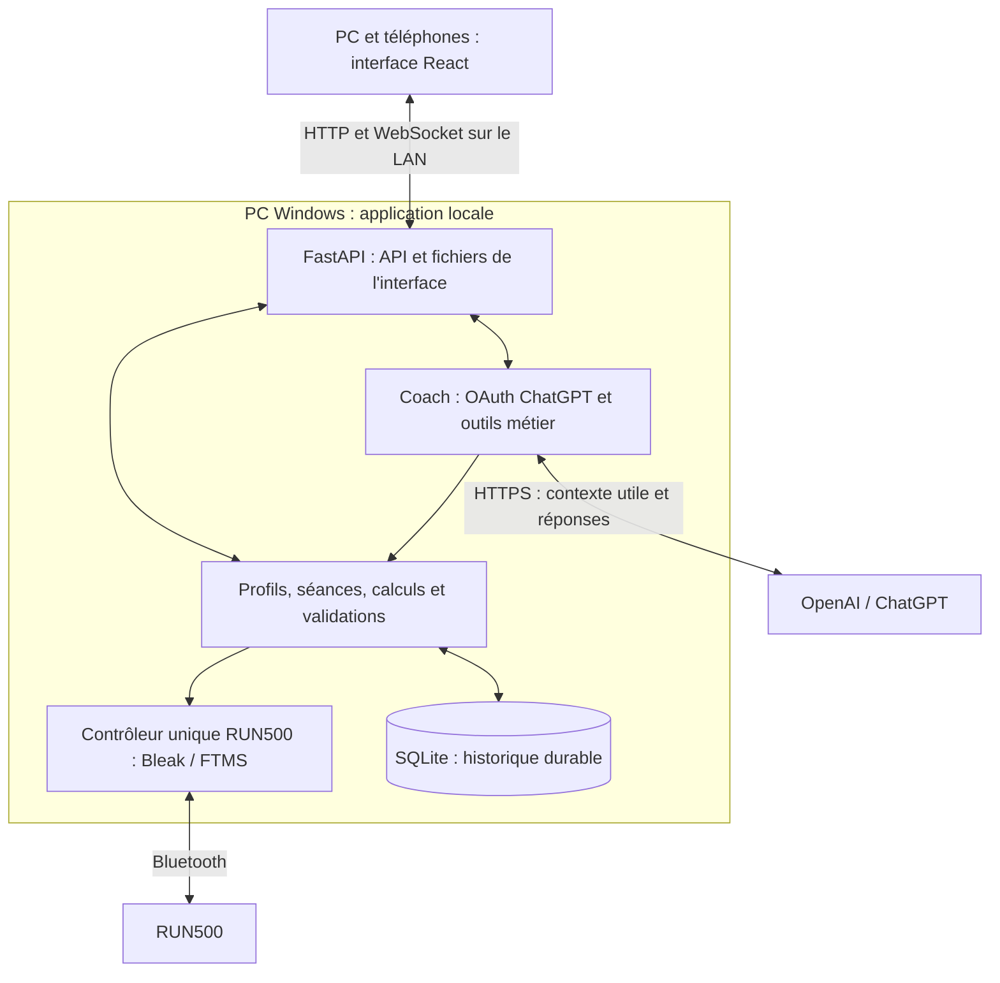

# Fitness App locale : plan de réalisation de la V1

## Suivi des étapes

Cocher chaque étape après sa réalisation et la vérification de ses critères de clôture.

- [ ] **Étape 00 — Cadrage :** établir l'état initial, les limites et les critères de réussite de la V1.
- [ ] **Étape 01 — Conception UI/UX :** définir les parcours, les maquettes et le design d'inspiration Apple.
- [ ] **Étape 02 — Socle local :** préparer React et FastAPI en réutilisant le contrôleur Bluetooth existant.
- [ ] **Étape 03 — Système de design :** construire les composants communs et les écrans de référence interactifs.
- [ ] **Étape 04 — Connexion ChatGPT :** vérifier l'autorisation du compte et un premier appel réel avec le forfait.
- [ ] **Étape 05 — Base de données :** créer SQLite, les contrats de données, les migrations et les sauvegardes.
- [ ] **Étape 06 — Collecte et tracking :** enregistrer toutes les données disponibles, leur provenance et les interruptions.
- [ ] **Étape 07 — Profils et ressentis :** gérer Arnaud et Ophélie, leurs objectifs et leurs retours avant/après séance.
- [ ] **Étape 08 — Bibliothèque et éditeur :** créer, modifier, répéter et planifier des programmes validés.
- [ ] **Étape 09 — Moteur de séances :** exécuter les séances longues sur le PC avec transitions, Pause et reprise encadrée.
- [ ] **Étape 10 — Vue en direct :** intégrer et polir les mesures, les courbes, la progression et les commandes.
- [ ] **Étape 11 — Réception du tapis :** vérifier réellement les séances longues, les arrêts et les scénarios de perte.
- [ ] **Étape 12 — Historique et bilans :** retrouver les séances, importer des fichiers locaux et exporter les données.
- [ ] **Étape 13 — Graphiques avancés :** livrer les 10 graphiques, les comparaisons et les calculs vérifiés.
- [ ] **Étape 14 — Coach informé :** donner à ChatGPT accès à tout l'historique sportif du profil actif.
- [ ] **Étape 15 — Création avec le coach :** proposer, valider, enregistrer et planifier des séances personnalisées.
- [ ] **Étape 16 — Distribution Windows :** préparer le lancement quotidien, les mises à jour, les sauvegardes et l'usage sans Internet.
- [ ] **Étape 17 — Réception finale :** vérifier le parcours complet, le design, les données et le fonctionnement de la V1.

Date : 4 octobre 2026. Statut : plan proposé, développement de la V1 non commencé.

Ce fichier organise la réalisation d'une application d'entraînement pour Arnaud et Ophélie, autour du RUN500 et du PC Windows existants. Il doit permettre de confier une étape précise à un développeur ou à Codex, avec un résultat et une réception identifiables.

**Ambition : une application qui donne envie de s'entraîner, avec un design d'inspiration Apple, une vue en direct soignée, des graphiques riches et un coach ChatGPT qui peut consulter toutes les données sportives disponibles du profil concerné.**

La demande actuelle autorise la rédaction de ce plan. Elle ne déclenche aucune implémentation, installation, connexion à un compte, modification du POC ni commande au tapis.

## 1. Résultat attendu de la première version

Le parcours de référence est le suivant :

1. Ouvrir l'application sur le PC ou le téléphone, sur le réseau domestique.
2. Choisir Arnaud ou Ophélie et retrouver son programme, ses objectifs et son historique.
3. Choisir une séance enregistrée, en composer une ou demander au coach de la préparer.
4. Voir le programme, comprendre son objectif et vérifier les vitesses, pentes et durées.
5. Confirmer sa présence auprès du tapis et démarrer explicitement.
6. Suivre la séance dans une vue en direct lisible pendant l'effort.
7. Arrêter ou terminer, retrouver ce qui a réellement été effectué et ajouter son ressenti.
8. Explorer les graphiques, comparer les séances et demander une analyse contextualisée à ChatGPT.
9. Retrouver les données après un redémarrage, les exporter et les sauvegarder.

### 1.1 Périmètre indispensable

| Domaine | Engagement pour la V1 |
|---|---|
| Usage local | Application et base sur Windows, interface PC/iPhone/Android sur le réseau local |
| Profils | Arnaud et Ophélie, objectifs et caractéristiques datés, sélection explicite |
| Séances | Bibliothèque, éditeur de blocs, répétitions, planification simple par date |
| Exécution | Programme piloté par le PC, démarrage humain, Pause, reprise encadrée et Arrêter |
| Vue en direct | Mesures principales, bloc courant, prochaine transition, courbes et commandes accessibles |
| Tracking | Conservation des notifications reçues, mesures décodées, consignes, événements, qualité et ressenti |
| Historique | Bilans, filtres, recherche, comparaisons, exports et import de données locales |
| Graphiques | Courbes liées, zoom, sélection de période, comparaisons, calendrier, distributions et tendances |
| Coach | Connexion ChatGPT, accès complet aux données sportives du profil, analyses et programmes proposés |
| Fiabilité | Données récupérables, erreurs visibles, inconnues conservées, sauvegarde et restauration vérifiées |
| Design | Référence visuelle définie tôt, composants cohérents, contrôle réel du rendu à chaque lot UI |

Les programmes de la V1 sont d'abord fondés sur des **durées**, avec vitesse et pente explicites. La cible proposée est une séance de 60 minutes au maximum et 120 segments exécutables au maximum après expansion des répétitions. Ces bornes de conception devront être validées par simulation, mesure de performance et réception matérielle ; elles ne sont pas des capacités actuelles du POC.

### 1.2 Fonctions conditionnées par des données supplémentaires

- Le cardio en direct et les zones cardio n'apparaissent comme fonction utilisable qu'après réception d'une vraie source non nulle.
- Les imports FIT/TCX permettent d'intégrer des activités exportées localement, y compris des montres si leurs fichiers sont disponibles. Ils ne constituent pas une synchronisation Garmin Connect.
- Les vitesses et pentes utilisables dépendent des capacités lues, des limites du profil et du périmètre matériel effectivement reçu.
- Une source absente ne bloque pas les fonctions qui n'en dépendent pas. L'interface explique ce qui manque.

La V1 n'engage pas de VO₂max, de score médical de récupération, de puissance de course, de cadence ou de nombre de pas sans source établie. L'accès depuis Internet, le plugin permettant d'agir depuis l'interface ChatGPT et les séances régulées automatiquement par le cardio sont des évolutions distinctes.

Une application locale n'implique pas une IA exécutée sur le PC : les données nécessaires aux analyses ChatGPT sont transmises à OpenAI. Les séances enregistrées, la consultation de l'historique et le contrôle local doivent fonctionner sans connexion Internet.

## 2. Point de départ à préserver

Sources canoniques du projet :

- [Base factuelle RUN500](docs/BASE_FACTUELLE_CAHIER_DES_CHARGES_RUN500.md).
- [Réception du POC](docs/RECEPTION_RUN500.md).
- [Faisabilité](docs/FAISABILITE_RUN500.md).
- [Contrôleur existant](poc/controller.py), [protocole FTMS](poc/ftms.py), [serveur](poc/server.py).
- [Inventaire factuel daté](docs/preuves/inventaire-factuel-2026-10-04.json).

| Sujet | État au moment de ce plan | Conséquence |
|---|---|---|
| Socle | Python, FastAPI, Uvicorn et Bleak natifs Windows | Réutiliser ce socle |
| Bluetooth | Connexion et commandes de base essayées sur le RUN500 | Conserver le contrôleur et ses protections |
| Matériel | Plages annoncées 1–16 km/h et 0–10 % | Une plage annoncée n'est pas une réception de toute la plage |
| Essais | Base factuelle avec observations complémentaires à 4 km/h et 3 % | Lire la portée exacte et les confirmations humaines des preuves |
| Limites logicielles | Manuel jusqu'à 16 km/h ; programmes jusqu'à 4 km/h et 3 % | Conserver cette distinction ; ne pas élargir les programmes implicitement |
| Programmes | 1–3 blocs de 5–60 s, au maximum 180 s hors transitions | Le moteur de séances longues reste à réaliser |
| Pause | Interrompt actuellement le programme | La reprise au même point reste à réaliser |
| Téléphone | Accès LAN direct sans clé accepté par l'utilisateur | Conserver ce parcours ; le sélecteur de profil n'est pas une authentification |
| Présence de l'écran | Contrôle lié aux lectures de l'écran propriétaire, expiration actuelle à 10 min | Une séance longue téléphone verrouillé reste à recevoir |
| Tracking | Journaux JSONL et diagnostics existants | Un journal technique ne constitue pas encore un historique sportif |
| Cardio | Champ reçu avec zéro uniquement | Zéro ne devient pas un pouls valide |
| Profils, SQLite, graphiques, IA | Absents du POC | Les considérer comme travail à faire |
| Tests | 20 tests critiques répertoriés dans les documents | Résultat historique ; ce plan ne les a pas relancés |
| Pertes matérielles | Clé physique, coupure BLE/PC et séance longue encore ouvertes | Réception dédiée avant usage quotidien |

Les captures existantes ont été examinées pour connaître le point de départ : [PC](docs/preuves/console-desktop-simulation.jpg), [mobile](docs/preuves/console-mobile-simulation.jpg). Elles illustrent une console de vérification, et portent des valeurs et limites de l'ancien état simulé. Leurs nombres ne remplacent pas la base factuelle actuelle.

Préserver les journaux, les preuves, les corrections du protocole et la console de diagnostic. Les essais anciens restent classés comme essais ; ne pas les transformer automatiquement en entraînements d'Arnaud ou d'Ophélie.

## 3. Architecture proposée



### 3.1 Choix techniques

| Élément | Choix | Utilité |
|---|---|---|
| Interface | React, TypeScript et Vite | Écrans interactifs, composants réutilisables, fichiers distribuables localement |
| Composants | CSS avec variables de design ; primitives accessibles reconnues si nécessaires | Identité visuelle propre, interactions standards fiables |
| Icônes | Une bibliothèque cohérente, par exemple Lucide | Éviter les jeux d'icônes disparates |
| Serveur | FastAPI et Uvicorn, un seul processus propriétaire du tapis | Réutiliser le chemin matériel existant |
| Métier | Services Python indépendants des routes HTTP | Partager validations et calculs entre UI, imports et coach |
| Stockage | SQLite, SQLAlchemy et migrations Alembic | Historique structuré et mises à jour de la base préservant les données |
| Accès disque | Travail hors de la boucle Bluetooth, avec un écrivain SQLite coordonné | Éviter qu'une écriture bloque les commandes |
| Direct | WebSocket local, état complet à la connexion puis événements séquencés | Actualisation et reconnexion cohérentes des écrans |
| Graphiques | Apache ECharts, avec un composant commun et un thème propre | Une seule bibliothèque pour zoom, sélection, séries et graphiques denses |
| ChatGPT | SDK Python OpenAI asynchrone, jeton OAuth autorisé pour le forfait | Requêtes du coach sans bloquer le contrôleur |
| Distribution | Runtime Python embarqué, interface compilée et lanceur Windows | Usage quotidien sans console de développement |

Les choix de dépendances sont des propositions pour l'implémentation. Inspecter les bibliothèques déjà présentes et leurs licences avant chaque ajout. N'introduire une abstraction que si elle sert réellement plusieurs fonctions.

Vite produit les fichiers de l'interface ; FastAPI les sert localement. Node est un outil de construction, pas un serveur supplémentaire à lancer pour utiliser la V1. Sources : [Vite](https://vite.dev/guide/build), [FastAPI](https://fastapi.tiangolo.com/tutorial/static-files/).

ECharts documente les interactions et le traitement de grands jeux de données. Son rendu Canvas sera le point de départ pour les courbes denses, à confirmer sur les téléphones visés. Les exports et les usages statiques pourront utiliser les possibilités de la même bibliothèque. Sources : [fonctions ECharts](https://echarts.apache.org/en/feature.html), [Canvas et SVG](https://echarts.apache.org/handbook/en/best-practices/canvas-vs-svg/).

### 3.2 Organisation cible du code

Organisation indicative, à adapter au dépôt sans dupliquer les implémentations existantes :

```text
backend/
  api/           routes, WebSocket et flux du coach
  training/      profils, programmes, séances réalisées et ressentis
  device/        contrôleur existant déplacé progressivement, FTMS et capacités
  recording/     acquisition, événements, durabilité et provenance
  analytics/     calculs versionnés, agrégations et comparaisons
  coach/         connexion ChatGPT, contexte, outils et propositions
  storage/       modèles, requêtes, migrations et sauvegardes
frontend/
  src/
    components/  composants communs, commandes et graphiques
    features/    Aujourd'hui, Séances, Direct, Historique, Coach, Réglages
    styles/      variables, typographie, couleurs et dispositions
docs/            décisions, contrat de données et preuves par étape
```

Le déplacement du POC doit préserver un chemin de diagnostic fonctionnel. Il ne justifie pas une réécriture du protocole. Un seul responsable possède le BLE du tapis, sur une boucle persistante compatible avec Bleak. [Documentation Bleak](https://bleak.readthedocs.io/en/latest/troubleshooting.html)

Les ressources de l'interface, icônes, styles et éventuelles polices sont distribuées localement. Aucun téléchargement depuis un CDN n'est requis pour ouvrir l'app ou consulter son historique.

Les bases réelles et simulées sont séparées. Les données utilisateur vivent dans un dossier Windows dédié, proposé sous `%LOCALAPPDATA%\FitnessApp`, hors du code et des répertoires de compilation. Le chemin doit être affiché dans les réglages et configurable si nécessaire.

## 4. Direction UI/UX et design

### 4.1 Intention visuelle

**Références : Apple Fitness pour l'énergie et la lecture pendant l'effort, Apple Santé pour l'exploration de l'historique, interfaces Apple pour la hiérarchie et la qualité des détails.** Il s'agit d'une inspiration, avec une identité propre à l'application.

Scène d'usage : à la maison, Arnaud ou Ophélie prépare une séance sur PC ou téléphone, puis consulte un écran posé près du tapis, avec peu de temps pour lire pendant l'effort.

Direction proposée à figer à l'étape 01 : thème clair lumineux pour préparer et analyser ; vue Focus immersive, proposée en graphite avec chiffres très lisibles, et variante claire disponible. La préférence de thème est persistée. Le passage en Focus est volontaire.

Le caractère premium vient de la typographie, des proportions, des alignements, des courbes et des transitions. Les grandes valeurs servent les mesures de course. Les panneaux ne sont utilisés que lorsqu'ils regroupent une tâche ou un contenu cohérent.

La référence de conception Apple insiste sur le soin et l'émotion recherchée dans le produit. Les dimensions ci-dessous sont des décisions proposées pour notre app, à vérifier sur les maquettes et appareils. [Principes de design Apple](https://developer.apple.com/videos/play/wwdc2026/250/)

### 4.2 Règles concrètes de conception

| Élément | Point de départ à figer dans `DESIGN.md` à l'étape 01 |
|---|---|
| Police | Police système native, une famille ; chiffres tabulaires pour éviter les sauts de largeur |
| Texte courant | 16 px ; légendes 13–14 px ; libellés compréhensibles et unités explicites |
| Titres | Échelle fixe cohérente, proposée 24 / 32 / 40 px selon le rôle |
| Direct | Mesure dominante 64–96 px sur PC, 48–64 px sur téléphone ; unités secondaires lisibles |
| Couleurs | Neutres légèrement teintés, accent bleu ; palette graphique stable par mesure |
| Sémantique | Vitesse bleu, pente violet, cardio corail si valide ; Arrêter et erreurs avec rouge réservé au rôle de contrôle |
| Palette technique | Variables OKLCH, thèmes complets, contrastes mesurés avant validation |
| Espacement | Rythme 4 / 8 / 12 / 16 / 24 / 32 / 48 px, avec densité adaptée à la tâche |
| Formes | Arrondis mesurés, proposés 12–20 px ; boutons et champs cohérents |
| Interaction tactile | Zones de 44 × 44 px minimum ; commandes pendant l'effort de 56 px de haut minimum |
| Mouvement | Transitions utiles de 150–220 ms ; respecter la réduction des animations |
| Commandes | Pause et Arrêter visibles, contrastées et stables ; aucun délai décoratif avant traitement |
| Graphiques | Axes sobres, légendes constantes, unités visibles, séries lisibles dans les deux thèmes |

Le design final doit être arrêté avec des captures de référence, pas seulement avec des adjectifs. Les tailles proposées ne constituent pas une mesure physique en millimètres.

### 4.3 Navigation et écrans

| Écran | Action principale | Structure proposée |
|---|---|---|
| Aujourd'hui | Comprendre et préparer la prochaine séance | Prochaine séance dominante, objectifs et progression récente en soutien |
| Séances | Choisir ou composer | Bibliothèque lisible, recherche, aperçu du profil de vitesse et pente |
| Éditeur | Construire un programme | Liste de blocs et aperçu temporel liés ; saisie directe et répétitions |
| Direct | Suivre et agir pendant l'effort | Mesure dominante, progression réelle, bloc courant, courbes et commandes fixes |
| Historique | Retrouver et comparer | Liste chronologique, filtres, calendrier et accès au détail |
| Détail de séance | Comprendre ce qui s'est passé | Bilan, prévu/réalisé, graphiques liés, événements, ressenti et analyse |
| Coach | Poser une question contextualisée | Conversation et proposition de programme structurée ; données utilisées consultables |
| Réglages | Gérer profils, matériel et données | Paramètres regroupés, connexion ChatGPT, dossier de données, export et sauvegarde |

Sur PC : navigation latérale compacte. Sur téléphone : navigation inférieure avec Aujourd'hui, Séances, Historique et Coach ; réglages accessibles par le profil. Pendant l'effort, la vue Direct prend la priorité et les commandes restent accessibles.

Le profil actif doit rester identifiable. Une séance en cours conserve son profil d'origine, même si un autre écran consulte le second profil.

### 4.4 Vue en direct, exigence centrale

- En haut : profil, nom de séance, connexion et état réel.
- Au centre : allure ou vitesse dominante, selon la préférence de l'utilisateur.
- À proximité : durée active, distance et pente ; cardio seulement s'il est disponible et valide.
- Une progression liée aux blocs réellement exécutés ; la phase de transition est visible.
- Bloc courant : ce qui est demandé, ce qui est mesuré et le temps restant.
- Prochain bloc : aperçu court et lisible, sans menu à ouvrir.
- Courbes : vitesse reçue et cible, pente, événements ; choix de fenêtre 1 / 5 minutes / séance entière.
- Commandes : Pause, reprise encadrée et Arrêter ; réglages manuels avec action Appliquer explicite.
- Fin : transition immédiate vers le bilan et la saisie du ressenti lorsque l'état le permet.

La motivation repose sur une progression vraie, des étapes compréhensibles et les progrès personnels. Les encouragements doivent dépendre de faits enregistrés et rester discrets. Les alertes d'état ont la priorité sur toute animation.

### 4.5 États à dessiner et à recevoir

Concevoir explicitement : première utilisation, aucun historique, chargement, tapis absent, connexion en cours, autre écran propriétaire, lecture seule, prêt, démarrage, transition, séance active, pause, reprise, fin, interruption, donnée ancienne, donnée manquante, résultat de commande inconnu, stockage en erreur, coach déconnecté, refus d'autorisation, limite d'usage et réponse IA interrompue.

Tous les composants interactifs ont des états normal, survol, focus clavier, actif, désactivé, chargement et erreur. Les boutons ont un nom accessible. Les graphiques ont une description et un équivalent numérique ; la couleur n'est pas leur seul moyen de communiquer. [Accessibilité ECharts](https://echarts.apache.org/handbook/en/best-practices/aria/)

## 5. Données : tout conserver, avec une provenance claire

### 5.1 Ce que signifie « toutes les données »

Conserver toutes les données sportives fournies par l'utilisateur, toutes les données disponibles dans les notifications reçues et tous les événements nécessaires pour comprendre l'exécution. Une donnée que le matériel n'envoie pas reste indisponible. Les secrets de connexion et les fichiers personnels extérieurs à l'application ne font pas partie du contexte sportif du coach.

| Famille | Données à conserver |
|---|---|
| Profil | Nom, objectifs, niveau déclaré, préférences, disponibilités et limites choisies ; poids et autres caractéristiques facultatifs et datés |
| Objectifs | Type, cible, période, date de création, modifications et résultats associés |
| Avant séance | Fatigue, motivation, sommeil déclaré et commentaire facultatifs ; aucune saisie longue obligatoire |
| Programme | Version, auteur humain/IA/import, blocs, répétitions, durée prévue, vitesse, pente et intention |
| Séance réalisée | Profil figé, programme figé, date, démarrage, pauses, reprise, fin, interruptions et statut |
| Mesures reçues | Vitesse, pente, angle, distance, temps, énergie, débit d'énergie et tout champ FTMS supplémentaire effectivement présent |
| Cardio et autres sources | Valeur, source, horodatage, validité et éventuel rapprochement avec une séance |
| Commandes | Demande, origine, identifiant, consigne, envoi, réponse, délai, mesure ultérieure et résultat connu/inconnu |
| Qualité | Trame invalide, absence de champ, perte de réception, compteur remis à zéro, période inconnue et taux de couverture par mesure |
| Ressenti | Effort perçu 1–10 facultatif, plaisir, fatigue après séance, difficulté, commentaire et modifications datées |
| Coach | Messages utiles, contexte fourni, outils consultés, analyses, versions de propositions et décisions humaines |
| Matériel | Appareil, capacités, plages, firmware si lisible, versions app/parseur et périmètre de réception |
| Imports | Fichier original, empreinte, format, source, contenu interprété, rapprochements et conflits |

Les champs facultatifs restent facultatifs. Les formulaires progressent du nécessaire vers le détail, pour ne pas transformer chaque entraînement en questionnaire.

### 5.2 Qualité, horodatage et durabilité

1. Conserver chaque notification brute reçue et sa version décodée, avec compteur de séquence et caractéristique source.
2. Utiliser UTC pour les dates persistées, Europe/Paris pour l'affichage et une horloge monotone pour les durées en cours.
3. Conserver l'âge et l'horodatage de chaque champ. Un champ absent n'est pas une nouvelle mesure de l'ancienne valeur.
4. Conserver la cadence native reçue. Réduire les données pour l'affichage sans supprimer les données originales.
5. Écrire les événements critiques durablement et enregistrer les mesures par lots bornés ; documenter le délai maximal non confirmé sur disque.
6. Cible initiale de persistance des mesures : au plus une seconde avant confirmation, à mesurer. Ne pas promettre une conservation au-delà du dernier lot réellement confirmé après un crash.
7. Une saturation ou une erreur de stockage produit une alerte et un événement explicite. Aucune perte de données silencieuse.
8. Les séances simulées, essais matériels et entraînements ont des catégories distinctes, persistées jusqu'aux exports et au coach.
9. Les valeurs brutes et déclarations utilisateur sont conservées ; les calculs dérivés sont versionnés et recalculables.
10. Une sauvegarde doit être cohérente avec SQLite et ses journaux. Une copie du seul fichier ouvert n'est pas une stratégie suffisante. [Sauvegarde SQLite](https://www.sqlite.org/backup.html)

Le POC a reçu un cardio à zéro uniquement et une distance évoluant par pas de 10 m dans les essais. Ces limites doivent apparaître dans les métadonnées et ne pas être remplacées par une fausse précision.

### 5.3 Calculs locaux à définir et vérifier

| Indicateur | Règle attendue |
|---|---|
| Durée totale | Temps du parcours entre début et fin, avec les interruptions identifiées |
| Durée active | Temps en mouvement, transitions incluses, selon observations valides et états du moteur ; pauses, plateaux et transitions également détaillés séparément |
| Allure instantanée | `60 / vitesse_kmh` lorsque la vitesse est positive et fraîche ; à l'arrêt ou sans donnée valide, valeur indisponible |
| Distance de séance | Deltas de compteur valides dans chaque segment de compteur ; remise à zéro explicitement traitée |
| Distance estimée | Intégration de vitesse si retenue, méthode et couverture affichées ; ne pas la confondre avec le compteur reçu |
| Vitesse moyenne | Pondération par le temps valide ; indiquer la durée couverte et l'exclusion des trous |
| Allure moyenne | Ratio durée/distance de périmètres compatibles ; ne pas moyenner les allures instantanées |
| Pente moyenne | Pondération par le temps valide, avec unité % et couverture |
| Dénivelé estimé | Calcul optionnel à partir de pente et distance fiables, hypothèse géométrique documentée et mention Estimation |
| Énergie | Valeur annoncée par le tapis ou source importée, explicitement présentée comme estimation de cette source |
| Temps par zone | Seuils de vitesse/allure choisis et versionnés ; zones cardio seulement avec source et définition validées |
| Repère d'effort ressenti | Minutes actives × effort déclaré 1–10, si les deux existent ; repère subjectif, pas un score physiologique |
| Respect du programme | Écarts cible/mesure, transitions, blocs sautés ou interrompus, et portions sans données |
| Records personnels | Périmètre, durée et méthode affichés ; période incomplète exclue ou signalée |

Aucune interpolation à travers une coupure ne devient une mesure reçue. Un zéro valide de vitesse reste un zéro ; un zéro de cardio invalide reste identifiable dans le brut et indisponible dans le bilan.

## 6. Graphiques avancés attendus

Les fonctions avancées servent des questions concrètes. Le premier écran reste simple ; le détail et les outils d'exploration sont accessibles progressivement.

| ID | Graphique V1 | Question traitée | Interactions indispensables |
|---|---|---|---|
| G01 | Vitesse/allure reçue et cible sur une séance | Ai-je suivi le programme ? | Zoom temporel, cible distincte, événements, curseur précis |
| G02 | Pente et cardio disponible liés à G01 | Que se passait-il pendant ce bloc ? | Curseur synchronisé, légendes stables, activation de séries |
| G03 | Chronologie des blocs et transitions | Comment s'est déroulée la séance ? | Sélection d'un bloc, prévu/réalisé, Pause et Arrêter repérés |
| G04 | Comparaison de 2 ou 3 séances | Qu'est-ce qui a changé ? | Alignement sur durée active ou distance valide, couleurs et étiquettes explicites |
| G05 | Volume hebdomadaire et mensuel | Suis-je régulier ? | Durée/distance/séances, objectifs, période et comparaison précédente |
| G06 | Calendrier de pratique | Quand me suis-je entraîné ? | Navigation mensuelle, intensité selon mesure choisie, accès aux séances |
| G07 | Distribution de vitesse/allure et pente | Où ai-je passé mon temps ? | Durées par plage, sélection et couverture des données |
| G08 | Évolution de l'effort déclaré et des performances | Une séance similaire me semble-t-elle plus facile ? | Filtre de séances comparables, ressenti manquant visible |
| G09 | Nuage allure moyenne / effort déclaré | Quelles séances sont comparables ? | Taille selon durée, sélection d'une activité, aucune conclusion causale automatique |
| G10 | Qualité et couverture de la séance | Sur quelles données repose le bilan ? | Trous, remises à zéro, sources et précision consultables |

Le cardio enrichit les graphiques lorsqu'il est disponible, sans conditionner la livraison des autres graphiques. Une carte indisponible explique la condition d'accès ; elle n'affiche pas une série de zéros.

Exigences communes :

- Zoom à la souris et tactile, sélection d'une plage et retour à la vue complète.
- Infobulles adaptées au toucher et accessibles autrement qu'au survol.
- Synchronisation des curseurs et des fenêtres entre graphiques d'une même séance.
- Sur une sélection : durée, distance compatible, moyennes, qualité et ressenti associé si disponible.
- Unités et sources accessibles, cible en trait distinct, trous de mesure visibles.
- Agrégations côté Python, adaptées à la résolution de l'écran. Préserver les pics et creux utiles, afficher le niveau d'agrégation et garder le détail consultable.
- Aucun lissage qui ferait croire à une vitesse ou à un arrêt jamais observés.
- Export PNG du graphique et CSV des données du périmètre choisi, avec unités et provenance.
- Même thème graphique dans Direct, Historique, Coach et exports.
- Les gestes des graphiques n'empiètent pas sur les boutons de contrôle du tapis.

## 7. Accès complet de ChatGPT aux données sportives

### 7.1 Contrat fonctionnel

**Le coach peut consulter toutes les données sportives du profil actif : toutes les séances, tous les ressentis, objectifs, mesures, imports, événements, évolutions du profil et analyses précédentes.** L'accès ne se limite pas aux dernières séances ni à une synthèse figée.

L'application détermine le profil et le périmètre. Le modèle ne peut pas changer de profil en inventant un identifiant. Consulter volontairement le second profil demande une action explicite dans l'interface, avec une nouvelle conversation ou un contexte clairement renouvelé.

Ce cloisonnement évite les mélanges métier ; l'accès LAN sans authentification ne constitue pas une protection de confidentialité entre les appareils du foyer.

### 7.2 Outils métier locaux proposés

| Outil | Contenu accessible |
|---|---|
| `get_profile_context` | Profil courant, historique des changements pertinents, objectifs, préférences et contraintes |
| `list_sessions` | Recherche sur tout l'historique, filtres, pagination et nombre total |
| `get_session` | Programme prévu/réalisé, bilan, événements, sources et qualité |
| `get_session_samples` | Mesures d'une période, colonnes disponibles, agrégation et accès au détail |
| `get_feedback` | Ressentis avant/après séance, commentaires et évolutions |
| `get_progress` | Calculs et tendances locales, avec méthode, période et couverture |
| `compare_sessions` | Comparaison produite par les mêmes calculs que les graphiques |
| `list_workouts` | Bibliothèque, versions et séances planifiées |
| `get_import_details` | Données importées, sources, conflits et rapprochement avec une séance |
| `get_coach_history` | Analyses et décisions antérieures du même profil |
| `validate_workout_proposal` | Vérification d'une proposition, erreurs localisées et aperçu exécutable |

Les fonctions réutilisent les services métier. Le modèle ne dispose pas d'un accès SQL libre, d'un accès aux fichiers Windows ou du canal de commande BLE.

Pour la route actuelle Sign in with ChatGPT, regrouper les fonctions dans un espace de noms métier, par exemple `fitness`, selon le contrat officiel vérifié à l'étape 04.

Pour les réponses volumineuses, renvoyer période, nombre total, pagination, source, couverture et indicateur de troncature. Le coach peut continuer à lire les pages. Le détail brut se consulte par tranches ; toutes les données sont accessibles sans injecter tout le disque dans chaque message.

### 7.3 Mémoire et propositions

- La mémoire durable est locale : conversations, faits validés, analyses et programmes sont persistés.
- Les résumés de conversation sont versionnés, avec liens vers les messages sources. Ils ne remplacent pas définitivement les originaux.
- Une correction du ressenti ou du profil rend obsolètes les analyses concernées ; le coach peut les recalculer.
- Une analyse renvoie aux séances et données utilisées, avec liens ouvrables dans l'application.
- Une demande de création renvoie une proposition structurée avec objectif, blocs et explication des choix.
- La proposition validée est enregistrée comme brouillon après une réponse complète. L'utilisateur peut l'accepter, l'éditer ou la refuser.
- L'adoption d'une proposition et sa planification passent par les mêmes services que l'éditeur manuel.
- La sauvegarde du brouillon et l'adoption sont identifiables et sûres à réessayer, pour éviter les doublons.
- Le démarrage d'une séance reste une action humaine auprès du tapis.

### 7.4 Contraintes de l'intégration officielle à respecter

La documentation officielle consultée le 4 octobre 2026 décrit une intégration pour les applications locales et les utilisateurs éligibles. La connexion du compte réel de l'utilisateur n'a pas été testée. La revérifier à l'étape 04. [Présentation officielle](https://developers.openai.com/siwc/token-sharing-open-source)

Cette connexion n'importe pas les anciennes conversations ni l'autre contexte du compte ChatGPT. L'application fournit son propre historique sportif et sa mémoire locale au coach.

- Première connexion dans le navigateur du PC, avec retour vers `127.0.0.1`, PKCE, vérification de l'identité et des permissions accordées.
- Identifiant d'installation stable ; conserver le client attribué au compte et les comptes séparément.
- L'identité seule ne donne pas l'autorisation d'utiliser le forfait. Vérifier la permission effectivement accordée.
- Jetons protégés sous Windows, exclus du navigateur, de Git, des diagnostics et des exports sportifs.
- Modèles découverts pour le compte connecté, sans figer une disponibilité supposée.
- Requêtes Responses avec `store: false` et `stream: true` ; reconstruire le contexte depuis le stockage local.
- Traiter la demande comme réussie uniquement après l'événement de réponse complète. Un flux partiel n'est pas un programme accepté.
- Utiliser les fonctions locales avec le contrat d'outils réellement supporté. Le MCP hébergé et la recherche de fichiers hébergée ne sont pas disponibles sur cette route actuelle.
- Limites d'usage, refus de consentement, révocation, expiration et erreurs réseau visibles ; aucune bascule silencieuse vers une facturation API différente.

Sources : [connexion](https://developers.openai.com/siwc/token-sharing-open-source/sign-in), [modèles et requêtes](https://developers.openai.com/siwc/token-sharing-open-source/models-and-inference), [limitations](https://developers.openai.com/siwc/token-sharing-open-source/preview-limitations), [comptes](https://developers.openai.com/siwc/token-sharing-open-source/profiles-and-sessions), [erreurs](https://developers.openai.com/siwc/token-sharing-open-source/errors-and-recovery).

## 8. Ordre de réalisation, étape par étape

Toutes les étapes ci-dessous sont **à faire**. La lecture préparatoire et la rédaction du présent fichier ne valent pas clôture d'un lot.

| Étape | Résultat | Dépendance principale |
|---|---|---|
| 00 | État initial et critères de V1 figés | Sources existantes |
| 01 | Parcours et références visuelles précis | 00 |
| 02 | Socle local réutilisant le POC | 00–01 |
| 03 | Système de design et écrans de référence interactifs | 01–02 |
| 04 | Connexion ChatGPT et premier appel réel vérifiés | 02 |
| 05 | Base locale, migrations et contrats de données | 00–02 |
| 06 | Acquisition complète, provenance et reprise après crash | 05 |
| 07 | Profils, objectifs et ressenti | 03–05 |
| 08 | Bibliothèque et éditeur de séances | 03, 05, 07 |
| 09 | Moteur de séances longues et politique d'interruption | 06, 08 |
| 10 | Vue en direct intégrée et reçue en simulation | 03, 06, 09 |
| 11 | Réception matérielle du parcours et des pertes | 09–10 |
| 12 | Bilans, historique, imports et exports | 06–08, 10 |
| 13 | Graphiques avancés et calculs vérifiés | 12 |
| 14 | Coach capable de consulter toutes les données | 04, 07, 12–13 |
| 15 | Création de séances et planification avec le coach | 08–09, 14 |
| 16 | Distribution Windows, sauvegarde, performances et offline | 05–15 |
| 17 | Réception complète et finition de la V1 | 11–16 |

L'ordre est le chemin par défaut. Un blocage matériel n'empêche pas de travailler les écrans et les données en simulation. Une incompatibilité ChatGPT doit être découverte tôt et reste une réserve explicite ; elle ne permet pas de déclarer la V1 complète avec un coach simulé.

### Étape 00 : établir la base et les limites de la V1

**But :** partir des preuves existantes et rendre mesurable le résultat attendu.

Travail :

1. Relire les sources du § 2 et distinguer logiciel, observation matérielle et confirmation humaine.
2. Vérifier versions, processus en cours, ports et dossier réellement utilisé, sans interrompre le POC actif.
3. Identifier les montres/capteurs possédés et les fichiers de séances éventuellement exportables ; aucune compatibilité supposée.
4. Figer le périmètre des séances par durée, la cible de 60 minutes et les fonctionnalités conditionnelles.
5. Définir les appareils et tailles d'écran de réception, les jeux de données et les critères visuels.
6. Créer un registre de décisions et un suivi des étapes ; préserver les preuves actuelles.

Livrables : état initial daté, liste des inconnues, liste des critères de V1 et procédure de travail isolé.

Vérification : chaque capacité annoncée renvoie à une preuve ou porte la mention À développer / À recevoir.

Clôture : aucune fonction inconnue n'est utilisée comme prérequis acquis ; le POC et ses données sont préservés.

### Étape 01 : concevoir les parcours et figer le design

**Suivi au 4 octobre 2026 : maquettes livrées, validation visuelle en attente.**
Références : [DESIGN.md](DESIGN.md), [parcours et états](docs/design/ETAPE_01_PARCOURS_UI_UX.md), [maquettes](docs/design/etape-01/index.html), [captures et vérifications](docs/preuves/v1/etape-01/2026-10-04/INDEX.md).
La case Étape 01 reste non cochée jusqu’à réception humaine de la direction visuelle. Aucune Étape 02 ou 03 engagée.

**But :** rendre la direction Apple concrète avant la construction des écrans.

Travail :

1. Décrire préparation → exécution → ressenti → analyse → prochaine séance pour les deux profils.
2. Concevoir PC et téléphone ensemble, avec les états du § 4.5.
3. Produire des maquettes de haute fidélité pour Aujourd'hui, Direct, détail de séance et Coach, plus l'éditeur.
4. Définir les dispositions des graphiques et leurs interactions avant de choisir leurs animations.
5. Comparer les maquettes aux références Apple choisies : proportions, densité, hiérarchie et lisibilité pendant l'effort.
6. Figer palette, typographie, espaces, composants, mouvements et règles de texte dans `DESIGN.md`.
7. Présenter les références visuelles à l'utilisateur pour réception de cette direction avant la généralisation des écrans.

Livrables : `DESIGN.md`, parcours, maquettes et captures de référence datées avec dimensions.

Vérification : parcours compréhensible sans explication technique ; Direct exploitable avec un regard bref ; Arrêter facilement identifiable ; contenus longs et données absentes prévus.

Clôture : direction visuelle reçue. Un simple fichier de tokens n'est pas une réception du design.

### Étape 02 : préparer le socle local sans réécrire le contrôleur

**But :** créer la structure de la V1 et un mode de développement sûr.

Travail :

1. Installer les dépendances nécessaires dans un environnement de projet isolé.
2. Créer React/TypeScript/Vite et relier le build à FastAPI.
3. Réutiliser le contrôleur et FTMS, avec une seule instance et sans connexion automatique au tapis.
4. Organiser services, routes et événements ; conserver le diagnostic du POC.
5. Créer un mode simulation utilisant une base et un port distincts du POC réel ; ne pas toucher au serveur déjà actif.
6. Préparer les scripts de lancement, typecheck et build, et l'identification de la version réellement servie.
7. Conserver l'accès LAN sans clé demandé, les validations d'origine et d'hôte, et une configuration limitée au réseau local.

Livrables : socle démarrable sur PC, interface accessible sur LAN, mode simulation clairement signalé.

Vérification : page et API de la même version, typecheck/build ciblés, ouverture Chrome, démarrage en lecture seule, absence de commande de mouvement.

Clôture : un seul runtime local à lancer pour l'utilisateur ; le POC initial reste utilisable pour diagnostiquer.

### Étape 03 : construire le système de design et les écrans de référence

**But :** disposer très tôt d'un rendu visuel convaincant et réutilisable.

Travail :

1. Implémenter navigation, typographie, boutons, champs, états, onglets, panneaux et icônes.
2. Construire un composant graphique ECharts commun : thème, unités, légendes, focus et infobulles.
3. Réaliser Aujourd'hui, Direct, détail de séance et Coach avec des données de démonstration identifiées.
4. Implémenter les interactions de référence et les états sans données, erreur et chargement.
5. Intégrer thèmes clair et Focus graphite, réduction des animations et préférences persistées.
6. Corriger les écarts aux maquettes dans Chrome, à partir de captures et mesures de géométrie.

Ces composants deviennent ceux de la V1. Le lot ne produit pas une deuxième interface jetable à reconstruire ensuite.

Livrables : écrans interactifs de référence et composants partagés.

Vérification : captures comparées aux références PC/mobile, focus clavier, contraste, cibles tactiles, textes longs, absence de débordement et erreurs console.

Clôture : base visuelle reçue sur les largeurs du § 9. La mention Données de démonstration est présente partout où nécessaire.

### Étape 04 : prouver la connexion et l'accès au forfait ChatGPT tôt

**But :** lever l'incertitude d'éligibilité avant d'investir dans le coach complet.

Travail :

1. Revérifier la documentation officielle et les permissions nécessaires à cette app locale.
2. Implémenter le module de connexion réutilisable, avec retour local sur le PC.
3. Valider état OAuth, PKCE, nonce, identité et permissions avec des bibliothèques adaptées.
4. Protéger les jetons dans le stockage Windows ; gérer renouvellement, révocation et changements de compte.
5. Découvrir les modèles accessibles et effectuer une première requête sans données sportives personnelles.
6. Recevoir une réponse complète, puis vérifier une erreur explicite ou un consentement refusé.
7. Afficher compte connecté, permission de forfait active/inactive et accès à la gestion de l'usage.

Livrables : module de connexion intégré au socle, preuve datée d'un appel complet et traitement des erreurs.

Vérification : aucun jeton dans les réponses LAN, captures, logs ou exports ; compte réel et permission réelle confirmés.

Clôture : appel réel réussi. Si le compte ou la route est inéligible, documenter la réserve ; ne pas acheter de crédits ni changer de mode de facturation automatiquement.

### Étape 05 : créer la base et les contrats de données

**But :** rendre le tracking durable avant les séances longues.

Travail :

1. Définir dictionnaire des champs, unités, sources, validité, timestamps et relations.
2. Créer profils et versions, objectifs, programmes et versions, séances, segments, mesures, événements et ressentis.
3. Ajouter imports, conversations, analyses, propositions et décisions avec liens vers leurs sources.
4. Mettre en place migrations, contraintes, transactions et index de recherche par profil/période/séance.
5. Préparer l'écrivain coordonné et les accès qui ne bloquent pas la boucle de contrôle.
6. Concevoir les sauvegardes cohérentes, la restauration et le contrôle d'intégrité.
7. Exposer les contrats API et formats d'export versionnés.

Livrables : schéma, migrations, dictionnaire de données et procédure de sauvegarde.

Vérification : créer une base, migrer une ancienne version, redémarrer et restaurer une sauvegarde dans un dossier isolé ; retrouver les liens et les valeurs.

Clôture : aucune perte de données lors d'une migration ou restauration vérifiée ; données utilisateur hors du code.

### Étape 06 : collecter les données et maîtriser les interruptions

**But :** enregistrer toutes les données disponibles avec des preuves de qualité.

Travail :

1. Enregistrer notifications brutes, décodage, champs présents et événements FTMS.
2. Rattacher chaque mesure à sa source, son appareil, sa séance et à la bonne époque de compteur.
3. Enregistrer demandes de commandes, réponses et observations ultérieures séparément.
4. Ajouter séquences, couverture, trous, remises à zéro, état disque et files bornées.
5. Conserver les journaux actuels ; déplacer leur écriture hors des callbacks bloquants si nécessaire.
6. Marquer une séance interrompue lors d'un redémarrage après arrêt brutal, sans redémarrer le moteur.
7. Exposer un état initial puis des événements pour les écrans ; définir la reprise après reconnexion.
8. Examiner en lecture seule les sources cardio possédées. Documenter compatible/non établi avant intégration.

Si la persistance échoue pendant un programme, désarmer et demander l'arrêt lorsque le canal permet encore une commande fiable ; afficher séparément l'arrêt demandé, observé ou inconnu. Le programme ne continue pas silencieusement sans tracking durable.

Livrables : acquisition durable, diagnostic de qualité et bilan de reprise après incident.

Vérification : trame tronquée, cardio zéro, champ absent, compteur remis à zéro, saturation simulée, erreur disque et arrêt brutal en simulation ; comparer l'acquisition et l'export après redémarrage.

Clôture : aucune fausse mesure ou perte silencieuse ; chaque incident a un statut explicite et les données confirmées sur disque restent retrouvables.

### Étape 07 : profils, objectifs et ressentis

**But :** personnaliser sans alourdir l'usage.

Travail :

1. Créer Arnaud et Ophélie, avec sélection rapide et indication persistante du profil actif.
2. Ajouter préférences d'allure/vitesse, objectifs, disponibilités et limites choisies.
3. Versionner les changements utiles du profil ; préserver le contexte historique des séances.
4. Concevoir une saisie avant séance courte et facultative.
5. Concevoir le ressenti de fin : effort 1–10, plaisir, fatigue et commentaire facultatifs.
6. Autoriser une saisie ou correction plus tard, avec date et invalidation des analyses dérivées.
7. Prévenir le mélange de profils lors d'un changement depuis un autre écran.

Livrables : parcours profils et ressentis, données datées persistées.

Vérification : deux profils avec séances et objectifs distincts ; correction retrouvée après redémarrage ; aucune valeur obligatoire inventée pour compléter un formulaire.

Clôture : le contexte du profil reste cohérent dans UI, historique et futures fonctions du coach.

### Étape 08 : bibliothèque et éditeur de programmes

**But :** préparer des séances riches et compréhensibles sans passer par du JSON.

Travail :

1. Définir le programme : nom, intention, échauffement, blocs, récupération, répétitions et retour au calme.
2. Écrire une validation commune aux programmes manuels, importés et IA.
3. Compiler les répétitions en segments bornés ; conserver le lien segment/bloc d'origine.
4. Construire la liste éditable et l'aperçu de vitesse/pente synchronisés.
5. Permettre ajout, duplication, réorganisation et saisie précise, avec alternative clavier au glisser-déposer.
6. Afficher durée des plateaux, transitions prévues et durée totale estimée avec leur distinction.
7. Enregistrer des versions et une planification simple par date ; ne pas altérer les séances déjà réalisées.
8. Construire quelques exemples de séances adaptables, marqués à vérifier contre le profil et le matériel.

Livrables : bibliothèque, éditeur, validation partagée et aperçu exécutable.

Vérification : programme long, répétitions, unités, champs invalides, limites, duplication et version historique ; aucune écriture BLE pendant l'édition.

Clôture : une séance valide peut être préparée et enregistrée sans connaissances techniques ; toutes les erreurs sont localisées.

### Étape 09 : moteur de séances longues et règles de Pause/reprise

**But :** transformer un programme validé en exécution locale reçue.

Travail :

1. Réutiliser la sérialisation et les validations FTMS ; préserver les protections existantes.
2. Définir une machine d'états : préparée, prête, démarrage, transition, active, pause, reprise, arrêt demandé, arrêt observé, terminée, interrompue et échec.
3. Séparer progression des plateaux et temps des transitions ; utiliser l'horloge monotone du PC.
4. Définir et caractériser les rampes compatibles, les plafonds et la surveillance des écarts cible/mesure.
5. Remplacer la dépendance au polling du téléphone par une autorisation de séance et une surveillance PC explicitement définies.
6. Préserver la fraîcheur des mesures et le contrôle du canal. Le verrouillage du téléphone seul ne doit pas devenir une preuve de perte Bluetooth.
7. Concevoir Pause : arrêter, mémoriser le point, puis permettre une reprise humaine après stabilisation, mesure zéro fraîche et validation des cibles.
8. Arrêter interrompt définitivement le programme ; aucune reconnexion ou ouverture d'écran ne redémarre le tapis.
9. Arbitrer commandes manuelles et programme ; enregistrer toute adaptation, sans commandes concurrentes.
10. Donner aux actions un identifiant et une réception relisible. Après un délai dépassé, relire l'état plutôt que répéter une commande incertaine.

Livrables : moteur reçu en simulation, états, règles écrites et protocole matériel préparé.

Vérification : 60 minutes simulées, 120 segments, transitions, Pause/reprise, dérive, STOP pendant commande, réponse tardive et perte de données ; tests ciblés des règles critiques.

Clôture : progression et données sont cohérentes ; le moteur ne dépend pas d'Internet ; aucune augmentation matérielle non reçue n'est présentée comme acquise.

### Étape 10 : intégrer et polir la vue en direct

**But :** livrer l'écran central du produit, utilisable pendant l'effort.

Travail :

1. Remplacer les données de référence par l'état et les mesures du serveur.
2. Afficher mesuré/cible, fraîcheur, bloc courant, prochaine transition et progression réelle.
3. Relier les courbes et la chronologie, avec données manquantes et sélection de fenêtre.
4. Fixer les commandes dans les zones accessibles ; gérer traitement en cours, refus et résultat inconnu.
5. Recevoir Focus, plein écran si supporté, thèmes, orientation et unités.
6. Ajouter annonces de blocs facultatives après une action utilisateur autorisant le son ; recevoir le cas du navigateur muet/verrouillé.
7. Prévoir les écrans spectateurs et le transfert explicite du propriétaire des commandes.
8. Lors d'une reconnexion, relire la séance courante et son propriétaire ; ne pas relancer ou dupliquer un programme.

Livrables : Direct intégré, captures de référence mises à jour et matrice des états.

Vérification : parcours complet dans Chrome avec simulation, téléphone portrait/paysage, clavier, plusieurs écrans, réseau interrompu et reprise d'affichage ; captures et erreurs console.

Clôture : le rendu respecte la référence visuelle et les commandes restent compréhensibles dans les états dégradés. Le reçu logiciel d'un STOP n'est pas appelé arrêt physique confirmé.

### Étape 11 : recevoir le matériel et les séances longues

**But :** vérifier le comportement réel avant l'entraînement quotidien.

Travail :

1. Lire le protocole, obtenir l'autorisation explicite des essais de mouvement et la présence humaine auprès du tapis.
2. Effectuer d'abord les essais à basse vitesse sur le périmètre déjà reçu.
3. Vérifier démarrage, transitions, Pause, reprise, Arrêter et immobilité observée.
4. Recevoir STOP physique et retrait/réinsertion de la clé pendant un programme.
5. Recevoir téléphone verrouillé, page en arrière-plan, perte Wi-Fi et accès depuis un autre écran.
6. Recevoir séparément les pertes BLE, crash/arrêt du serveur et veille Windows, avec observation du comportement du firmware.
7. Effectuer une séance longue supervisée, puis étendre le périmètre vitesse/pente uniquement dans un protocole autorisé.
8. Conserver date, version, appareil, consigne, réponse, mesure, observation humaine et réserves.

Livrables : compte rendu de réception et matrice des plages/scénarios effectivement reçus.

Vérification : logiciel, mesures et confirmation humaine recoupés ; aucun scénario de perte déduit d'un test simulé.

Clôture : le périmètre d'utilisation quotidienne est documenté. Si une perte ne permet pas un comportement acceptable, limiter ou revoir ce périmètre avant de déclarer la V1 reçue.

### Étape 12 : bilan, historique et imports locaux

**But :** rendre chaque entraînement exploitable après la séance.

Travail :

1. Construire le bilan terminé/interrompu/échoué avec durées, distance, programme réellement exécuté et qualité.
2. Intégrer ressenti et accès au détail depuis Aujourd'hui et Historique.
3. Ajouter filtres par période/type/statut, recherche, calendrier et sélection de séances à comparer.
4. Produire exports JSON et CSV versionnés, sans secrets de connexion.
5. Importer les exports propres à l'app ; valider format, taille, unités, dates et profil d'attribution.
6. Ajouter FIT/TCX avec bibliothèque reconnue adaptée, sur fichiers locaux réels de référence.
7. Préserver le fichier source et les champs supplémentaires disponibles ; signaler ceux non interprétés.
8. Identifier les doublons et proposer le rapprochement d'une activité montre/tapis, sans additionner deux fois la même séance.
9. Conserver les séries de sources distinctes et permettre de choisir une source de référence en cas de divergence.

Définir les formats, tailles et types de contenu autorisés par route d'import. Adapter les protections existantes à ces routes sans désactiver globalement les contrôles d'origine, d'hôte ou de taille.

Livrables : bilan, historique, exports, import guidé et provenance.

Vérification : séance interrompue, compteur remis à zéro, fichier invalide, doublon, désaccord de sources et aller-retour export/import ; retrouver tout après redémarrage.

Clôture : aucune perte des données reçues/fournies ; un import est attribué explicitement ; aucune synchronisation Cloud Garmin revendiquée.

### Étape 13 : graphiques avancés et exploration de la progression

**But :** livrer G01–G10 avec un rendu précis et des calculs fiables.

Travail :

1. Implémenter les calculs du § 5.3 dans un module commun versionné.
2. Préparer agrégations et requêtes selon période, profil, sélection et résolution d'affichage.
3. Relier G01–G03, puis comparaison G04 et progression G05–G09.
4. Ajouter G10 et la présentation des sources/couvertures au même niveau de qualité visuelle.
5. Recevoir zoom, infobulles tactiles, curseurs liés, sélection et résumé numérique.
6. Recevoir données vides, valeurs manquantes, gaps, séries importées et textes longs.
7. Polir axes, traits, opacités, annotations et espacement sur les deux thèmes.
8. Ajouter export de graphique et export de sa sélection, avec le même périmètre que l'écran.

Livrables : graphiques G01–G10, calculs documentés, preuves visuelles et mesures de performance.

Vérification : jeux de données aux résultats connus pour conversions, moyennes, distance/reset, couverture, comparaison et records ; exploration réelle dans Chrome et sur téléphone.

Clôture : une valeur du graphique correspond à la même valeur dans le bilan, l'export et les outils du coach. Le rendu ne fabrique pas de continuité à travers une coupure.

### Étape 14 : donner au coach accès à tout l'historique

**But :** disposer d'un coach informé de toutes les données disponibles, pas d'un chat générique.

Travail :

1. Relier les outils du § 7.2 aux services existants et au profil déterminé par l'application.
2. Donner accès aux périodes anciennes, mesures détaillées, ressentis, imports, événements et versions du profil.
3. Construire le contexte initial et la pagination explicite, avec budget de contexte et consultation complémentaire.
4. Ajouter mémoire locale, conversations et résumés avec liens vers les originaux.
5. Afficher les données utilisées et des liens vers les séances citées dans l'analyse.
6. Montrer les états de réflexion, consultation, réponse interrompue, quota et erreur sans masquer les causes.
7. Sur changement de profil ou modification pendant une réponse, isoler la réponse de son contexte d'origine.
8. Permettre de consulter les analyses précédentes hors Internet.

Livrables : coach connecté, outils de lecture complets, mémoire durable et preuves d'accès.

Vérification réelle : demander une comparaison sur une ancienne période non présente dans le contexte initial, faire retrouver un commentaire précis, une interruption et un changement de profil daté. Comparer les nombres à SQLite et aux graphiques.

Clôture : le coach peut retrouver une donnée de n'importe quelle séance du profil via pagination ; il indique les inconnues et distingue déclarations, mesures, calculs et estimations. Un autre profil et les jetons ne sont pas accessibles par manipulation d'arguments.

### Étape 15 : création de séances et planification avec ChatGPT

**But :** transformer le contexte sportif en propositions utilisables et explicables.

Travail :

1. Ajouter demandes de séance, adaptation et semaine d'entraînement depuis le même coach.
2. Produire objectif, justification et programme structuré dans le contrat du moteur.
3. Valider le programme complet, ses répétitions, limites, pas et transitions avant de l'afficher comme applicable.
4. Présenter la proposition avec les mêmes graphiques et composants que l'éditeur.
5. Permettre de modifier, enregistrer, planifier ou refuser ; conserver la décision et l'origine IA.
6. Utiliser une version de contexte pour détecter un profil, objectif ou matériel changé pendant la génération.
7. Après adoption, relire le programme sauvegardé ; ne pas faire dépendre son exécution d'une connexion ChatGPT.
8. Une réponse interrompue reste incomplète, sans programme implicitement accepté ni démarrage.

Livrables : génération intégrée, brouillons persistés et parcours d'adoption/planification.

Vérification : proposition valide et invalide, valeur excessive, transition impossible, profil changé, panne IA, double clic et réessai ; aucune commande moteur avant activation humaine.

Clôture : une séance IA et une séance manuelle utilisent la même validation et la même exécution. Les choix du coach sont lisibles et ses données sources consultables.

### Étape 16 : distribution Windows, sauvegarde et performances

**But :** rendre l'application agréable à utiliser tous les jours.

Travail :

1. Distribuer interface compilée et runtime Python dans une application/lanceur Windows, avec démarrage unique.
2. Ouvrir l'interface PC et afficher l'accès téléphone à partir de l'interface physique active.
3. Identifier clairement la version installée et servie ; empêcher deux instances de posséder le tapis.
4. Recevoir le lancement sans outils de développement, puis une mise à jour conservant base et réglages.
5. Ajouter sauvegarde automatique locale, export complet et restauration contrôlée dans un dossier de destination vérifié.
6. Recevoir lecture de l'historique et exécution d'un programme sauvegardé sans Internet, sur le PC et le LAN disponibles.
7. Mesurer les performances du § 9.4 et corriger les ralentissements sans perte de données.
8. Vérifier l'impact veille et verrouillage Windows ; tout changement de configuration système demande une action explicitement autorisée.
9. Présenter l'usage sur téléphone comme accès navigateur. Une PWA installable complète demande une stratégie HTTPS locale et une réception séparée ; ne pas la déduire de HTTP sur une IP LAN.

Recevoir le packaging et les migrations sur une copie isolée avant tout remplacement d'une installation utilisée. Le remplacement réel reste une action distincte à autoriser.

Livrables : distribution locale, instructions courtes, preuves de mise à jour, sauvegarde/restauration et performances.

Vérification : version réellement lancée, chemin des données, intégrité SQLite, deux lancements, redémarrage Windows, panne Internet et restauration d'une sauvegarde de test.

Clôture : utilisation quotidienne sans console de développement ; aucune donnée ni preuve existante écrasée par le packaging.

### Étape 17 : réception complète et finition de la V1

**But :** recevoir le produit entier, avec la même exigence pour le design et les données.

Travail :

1. Exécuter le parcours de référence pour les deux profils, dans la version réellement distribuée.
2. Recevoir une séance réelle sur le périmètre autorisé, retrouver son bilan et fournir le ressenti.
3. Comparer prévu/réalisé, courbes, sélection graphique, export et réponse du coach.
4. Vérifier une séance sans cardio, un import, une interruption et un usage sans Internet.
5. Comparer les captures finales aux références ; corriger alignements, densité, états et interactions.
6. Vérifier tous les écrans du § 4.3, les états du § 4.5 et les tailles du § 9.2.
7. Consigner tests ciblés, runtime, réception matérielle, vérification visuelle, IA et réserves séparément.
8. Mettre à jour le présent plan avec les preuves et versions, sans effacer les essais échoués.

Livrables : dossier de réception V1, captures finales, preuves de tracking et procédure d'usage.

Vérification : parcourir les critères du § 10 dans le runtime distribué, avec preuves visuelles, données relues et observations matérielles ; distinguer les scénarios réels des simulations.

Clôture : les critères du § 10 sont satisfaits. Une fonction simulée ou une réserve indispensable encore ouverte interdit la mention V1 complète.

## 9. Méthode de vérification et preuves attendues

### 9.1 Organisation des preuves

Chaque étape crée un dossier de preuves daté, par exemple `docs/preuves/v1/etape-10/AAAA-MM-JJ/`, avec version, commande, mode simulation/réel, résultat et limites. Les noms historiques ne sont pas réutilisés pour écraser des fichiers.

| Dimension | Preuve utile |
|---|---|
| Code | Typecheck/build ciblés, tests des règles concernées, absence de deuxième implémentation |
| Runtime | Processus, port, version servie, dossier de données et version du schéma |
| UI | Captures avant/après, comparaison à la référence, géométrie et parcours réellement exercés |
| Navigateur | Console, erreurs réseau, fonctionnement clavier/tactile et performance relevée |
| Tracking | Enregistrements avant/après incident, exports relus, cohérence des sources et intégrité |
| Matériel | Commande, réponse, mesure et observation humaine distinguées |
| IA | Compte autorisé, appel complet, outils consultés, données sources et adoption relue |
| Distribution | Exécutable/runtime réellement lancé et données conservées après mise à jour |

Un build réussi ne prouve pas le rendu du Direct, une réception matérielle, la compatibilité Safari ou l'accès réel au forfait ChatGPT.

### 9.2 Matrice visuelle minimale

Utiliser le MCP Chrome pour les parcours et captures lorsqu'il est disponible. Un contrôle effectué dans Chrome avec largeur mobile reste une preuve Chrome ; recevoir aussi Safari iPhone et Chrome Android sur des appareils réels.

| Format de référence | Usage |
|---|---|
| 390 × 844 | Téléphone portrait principal |
| 430 × 932 | Grand téléphone portrait |
| 844 × 390 | Téléphone paysage, particulièrement Direct |
| 1024 × 768 | Format intermédiaire |
| 1440 × 900 | PC principal |
| 1920 × 1080 | Grand écran PC |

Vérifier également zoom texte à 200 %, clavier, touch et zones sûres du téléphone. Relever débordement horizontal, rectangles des commandes, taille des textes et comportement des graphiques. Fixer les versions navigateur, le zoom et les dimensions pour comparer les captures.

Les captures doivent inclure les états normal, sans données, erreur et données anciennes, pas seulement un écran rempli de chiffres de démonstration.

### 9.3 Jeux de données et tests utiles

- Aucun historique, une première séance et plusieurs semaines réalistes.
- Deux profils dont les objectifs et préférences diffèrent.
- Programme à répétitions, transitions, Pause/reprise et interruption.
- Cardio absent/zéro, données périmées et compteurs remis à zéro.
- Séries partielles, cadence irrégulière, changement de source et activité importée en doublon.
- Erreurs de stockage, réponse BLE tardive, perte du téléphone et arrêt du processus en simulation.
- Refus ChatGPT, limite d'usage, flux interrompu et réponse de programme invalide.
- Jeu volumineux : 200 séances d'une heure à 1 Hz, soit environ 720 000 instants, puis cadence native supérieure simulée.

Tests automatisés à privilégier : conversions et calculs, distance/remises à zéro, couverture, expansion des répétitions, validations, transitions moteur, idempotence, migrations et cloisonnement des outils du coach.

Éviter une suite de tests unitaires pour chaque composant simple. La réception visuelle et les parcours réels restent nécessaires. Réutiliser les tests critiques existants au lieu de les recopier.

### 9.4 Budgets de performance à mesurer

Ces nombres sont des objectifs proposés pour les appareils de réception, pas des performances déjà mesurées.

| Sujet | Objectif initial |
|---|---|
| Réaction visuelle à une interaction | p95 inférieur à 100 ms sur le PC de référence |
| Nouveau relevé visible dans Direct | p95 inférieur à 500 ms après réception sur le PC, hors mesure qui n'arrive pas du matériel |
| Mise à jour des courbes | Rafraîchissement lisible 1–5 Hz selon écran, indépendamment de la conservation native |
| Chargement d'un détail de séance | p95 inférieur à 1 s sur le jeu volumineux local |
| Application d'un zoom / sélection | p95 inférieur à 300 ms après données déjà disponibles |
| Persistance des mesures | Délai maximal non confirmé mesuré ; cible initiale d'une seconde |
| Séance longue | Mémoire bornée, aucune file croissante, aucune donnée supprimée sans événement |
| Commandes | Aucun calcul graphique, appel IA ou travail disque bloquant sur la boucle BLE ; délais et réponses mesurés séparément |

Si un budget n'est pas atteint, conserver la preuve, expliquer l'impact et corriger la cause. Ne pas atteindre un budget en inventant des données, en masquant des erreurs ou en retirant la fonction demandée.

## 10. Conditions de clôture de la V1

- [ ] Les étapes 00–17 ont une preuve et un statut final explicite.
- [ ] La direction visuelle a été reçue et le rendu final correspond aux références.
- [ ] Les parcours PC, iPhone et Android ont été exercés, avec limites identifiées.
- [ ] Une séance longue réelle fonctionne dans le périmètre matériel effectivement reçu.
- [ ] Pause, reprise, Arrêter, clé et scénarios de perte ont une réception documentée.
- [ ] L'application ne redémarre jamais le tapis après un incident ou une simple reconnexion.
- [ ] Toutes les données réellement reçues et fournies sont conservées, avec provenance et qualité.
- [ ] Les trous de mesure et le cardio indisponible n'apparaissent pas comme des zéros valides.
- [ ] Profil, programme et contexte historiques ne changent pas lorsqu'un modèle actuel est édité.
- [ ] Bilan, graphique, export et outils ChatGPT donnent les mêmes chiffres sur le même périmètre.
- [ ] Les graphiques G01–G10 sont reçus visuellement et fonctionnellement.
- [ ] Le coach consulte des séances anciennes, ressentis, imports et détails via ses outils.
- [ ] La connexion ChatGPT et les analyses utilisent le compte réel autorisé, avec réponse complète vérifiée.
- [ ] Un programme IA passe la validation commune et son adoption est relue dans la base.
- [ ] Une panne Internet n'empêche pas la consultation locale et une séance déjà sauvegardée.
- [ ] Les sauvegardes, la restauration, les migrations et la mise à jour Windows préservent les données.
- [ ] Les budgets ont été mesurés dans le runtime distribué et les écarts sont résolus ou explicitement reçus.
- [ ] Le dossier de réception distingue implémentation, vérification locale, matériel, design, IA et distribution.

## 11. Règles de conduite pour les futurs lots

1. Travailler uniquement sur l'étape confiée ; ne pas enchaîner les étapes suivantes sans instruction.
2. Avant un lot de développement, expliquer brièvement le résultat, la méthode et les fichiers concernés.
3. Inspecter et réutiliser composants, fonctions et bibliothèques avant de créer du code.
4. Faire la modification minimale correcte ; préserver le POC, les données, preuves et travaux extérieurs au lot.
5. Démarrer le développement en simulation, avec données et port distincts du runtime matériel actif.
6. Les mouvements du tapis exigent un protocole autorisé et une présence humaine confirmée au moment des essais.
7. Ne pas modifier automatiquement pare-feu, veille, accès Internet ou installation active.
8. Ne pas considérer un résultat incertain comme une réussite ; le relire lorsque c'est possible.
9. Un lot UI inclut le contrôle visuel réel et la correction des écarts, dans les états concernés.
10. Rendre le résultat vérifiable : ce qui a changé, choix importants, méthode de vérification et réserves restantes.
11. Mettre à jour le statut avec preuves et version ; conserver l'historique des échecs.
12. À la fin du lot, arrêter au périmètre convenu. Aucun commit, publication, remplacement d'installation ou lot suivant implicite.

**Arrêt de la tâche actuelle : livrer ce plan Markdown. Ne pas construire l'application à partir de ce fichier tant qu'une étape de réalisation n'a pas été confiée.**
