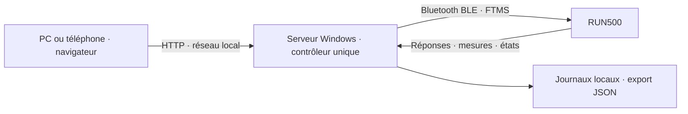

# RUN500 — base factuelle pour le cahier des charges de l’application

**État des connaissances au 4 octobre 2026.** Ce document rassemble les commandes découvertes, les fonctions du POC, les observations réelles et les possibilités de développement. Il décrit **un RUN500 effectivement essayé**, et non une garantie pour tous les tapis ou toutes les versions de firmware.

**Conclusion : le PC Windows peut lire et commander ce RUN500 en Bluetooth FTMS, et un téléphone peut utiliser la console par le Wi-Fi local, sans clé d’accès.** La prise de contrôle, le démarrage, la vitesse, la pente, Pause et STOP ont fonctionné. Un programme de trois blocs a été exécuté. La future application peut réutiliser ce contrôleur ; les profils, l’historique de séances et les intégrations externes restent à construire.

Cette consignation n’a envoyé aucune nouvelle commande au tapis. Elle s’appuie sur le code, les exports, les captures et les journaux existants. Un [inventaire JSON figé](preuves/inventaire-factuel-2026-10-04.json) contient les compteurs, les valeurs observées, les services, les événements supplémentaires à 4 km/h et 3 %, et les empreintes des fichiers sources. Les journaux ouverts peuvent continuer à grandir après cet inventaire.

## 1. Comment lire les niveaux de preuve

| Mention | Ce qu’elle signifie |
|---|---|
| **Confirmé physiquement** | L’utilisateur a confirmé les mouvements ou arrêts sur le tapis, en plus des réponses et mesures reçues. |
| **Observé sur le RUN500** | Une commande réelle a reçu une réponse et/ou une mesure a été enregistrée. Pas de mesure physique indépendante supplémentaire. |
| **Annoncé par le RUN500** | Un service, une propriété ou une plage a été lu sur l’appareil. Cela ne prouve pas le fonctionnement de toute la plage. |
| **Implémenté / vérifié en logiciel** | Présent dans le code, vérifié par simulation, test ciblé ou validation de navigateur. La portée matérielle est indiquée séparément. |
| **À développer** | Possibilité technique fondée sur les fonctions acquises ; absente du POC actuel. |
| **À vérifier / inconnu** | Aucune preuve suffisante. Ne doit pas devenir une promesse du cahier des charges. |

Une réponse Bluetooth positive signifie « procédure acceptée ». Une valeur reçue signifie « le firmware annonce cette valeur ». Aucune des deux ne constitue une calibration de la vitesse de bande ou de la pente réelle. Le [compte rendu de réception](RECEPTION_RUN500.md) conserve la confirmation humaine et la portée des campagnes.

## 2. Matériel, architecture et accès

### 2.1 Appareil effectivement découvert

| Élément | Constat |
|---|---|
| Nom Bluetooth | `Domyos-TC-1921` |
| Adresse BLE observée | `F6:E5:08:5C:4B:36` ; identifiant de cet essai, pas à coder en dur pour tous les appareils |
| Service de contrôle | FTMS, UUID court `1826` |
| Fonctions cibles annoncées | Vitesse et inclinaison : `target_bits = 0x00000003` |
| Capacités de mesure brutes | `machine_bits = 0x0000160d` |
| Plage de vitesse lue | **1 à 16 km/h**, pas **0,1 km/h** |
| Plage d’inclinaison lue | **0 à 10 %**, pas **0,5 %** |
| Version exacte du firmware | **Non lue**. Les caractéristiques correspondantes sont présentes, voir § 8. |

Les plages 16 km/h / 10 % concordent avec la [fiche officielle Decathlon RUN500](https://www.decathlon.fr/p/tapis-de-course-pliable-16km-h-run500/306855/c1m8542707). La découverte réelle et les plages utilisées par le logiciel sont conservées dans l’[inventaire](preuves/inventaire-factuel-2026-10-04.json), rubrique `latest_connection`.

### 2.2 Chemin des données et des commandes



Le téléphone ne dialogue pas directement avec le Bluetooth du tapis. Le PC possède la connexion BLE et exécute les programmes. Les écrans envoient des demandes au PC et consultent son état. Un seul processus serveur doit posséder cette connexion ; pas de workers multiples ni de rechargement automatique pendant un essai.

Le POC utilise Python natif Windows, Bleak, FastAPI et Uvicorn. Les versions consignées dans [requirements.txt](../requirements.txt) sont Bleak 3.0.2, FastAPI 0.142.2 et Uvicorn 0.54.0 ; Python 3.12.10 a été utilisé. Aucun compte Cloud n’est requis pour les fonctions locales actuelles. Sources : [contrôleur](../poc/controller.py), [serveur](../poc/server.py), [lanceur](../start-poc.ps1).

### 2.3 Réseau et choix déjà accepté

| Fonction | État réel |
|---|---|
| Console sur le PC | `http://127.0.0.1:4317` |
| Console sur le téléphone | Serveur lancé avec `-Reseau`, adresse Wi-Fi du PC ; accès confirmé par l’utilisateur |
| Adresse Wi-Fi essayée | `http://192.168.1.23:4317` ; peut changer avec le réseau |
| Clé / compte / mot de passe | **Aucun**, conformément au choix explicite de l’utilisateur |
| Plusieurs adresses Windows | La console privilégie les interfaces physiques actives avec passerelle ; les adresses WSL/Hyper-V/VPN ne sont plus proposées comme accès téléphone |
| Propriétaire des commandes | Identifiant technique d’écran, généré automatiquement ; aucune saisie de clé |
| Accès depuis Internet | Non configuré et non testé |
| HTTPS, nom `run500.local`, PWA/offline | Non configurés |
| Pare-feu, veille Windows | Aucune modification automatique de ces réglages |

Le serveur LAN écoute sur `0.0.0.0`. Tout appareil pouvant atteindre ce serveur peut accéder à la console selon la configuration réseau. Les contrôles d’origine et d’hôte de l’API ne constituent pas une authentification. L’identité d’écran organise les commandes concurrentes ; elle n’est pas un secret. Sources : [serveur](../poc/server.py), [interface](../poc/static/app.js), [console sans clé](preuves/console-sans-cle.jpg).

Le Wi-Fi **du tapis** n’est pas le chemin de commande découvert : Decathlon le décrit pour les mises à jour de la console. Le port USB est décrit pour maintenir la charge d’un téléphone/tablette. Aucune API HTTP du tapis ou commande USB n’a été trouvée dans ce travail. [Assistance officielle RUN500](https://support.decathlon.fr/run500-notice-reparation).

## 3. Toutes les commandes réellement utilisées et fonctionnelles

Six actions sont implémentées et présentes dans les journaux BLE réels. Pause et STOP partagent l’opcode `08`, avec des paramètres différents. Les octets ci-dessous sont des références de protocole, pas un script à lancer.

| Action dans le code | Fonction | Paquet FTMS | Réponse positive observée | Niveau de preuve |
|---|---|---|---|---|
| `request_control` | Demander au tapis l’autorisation de commande | `00` | `80 00 01` | Observé sur le RUN500 ; exécuté à l’activation du contrôle |
| `speed` | Fixer la vitesse cible | `02` + vitesse sur 2 octets | `80 02 01` | 1, 2, 2,5 et 4 km/h présents dans les commandes et mesures réelles |
| `incline` | Fixer l’inclinaison cible | `03` + pente sur 2 octets | `80 03 01` | 0, 1 et 3 % présents dans les commandes et mesures réelles |
| `start` | Démarrer / procédure standard Start-Resume | `07` | `80 07 01` | Mouvement observé ; démarrage au minimum puis cible choisie à 2 vérifiés |
| `stop` | Arrêter | `08 01` | `80 08 01` | Vitesse nulle reçue ; premiers arrêts confirmés physiquement |
| `pause` | Mettre en pause | `08 02` | `80 08 01` | Vitesse nulle reçue ; première Pause confirmée physiquement |

Les trois niveaux doivent rester distincts : écriture GATT réussie, réponse FTMS positive, puis effet constaté. Sources : [encodage et réponses](../poc/ftms.py), [procédures](../poc/controller.py), [réception](RECEPTION_RUN500.md).

### 3.1 Encodage complet des consignes connues

Les nombres sont transmis avec l’octet de poids faible en premier, dit « little-endian ». La vitesse est un entier non signé en **centièmes de km/h**. La pente est un entier signé en **dixièmes de pour cent**. La résolution de transport ne remplace pas le pas annoncé par le tapis.

| Consigne | Nombre transmis | Paquet complet | Essai matériel |
|---|---:|---|---|
| Vitesse 1 km/h | 100 | `02 64 00` | Oui |
| Vitesse 2 km/h | 200 | `02 c8 00` | Oui |
| Vitesse 2,5 km/h | 250 | `02 fa 00` | Oui |
| Vitesse 4 km/h | 400 | `02 90 01` | Oui, journal initial ; détail § 4 |
| Vitesse 8 km/h | 800 | `02 20 03` | **Non** ; encodage / simulation et saisie seulement |
| Vitesse 16 km/h | 1600 | `02 40 06` | **Non** ; encodage / simulation et saisie seulement |
| Pente 0 % | 0 | `03 00 00` | Oui |
| Pente 1 % | 10 | `03 0a 00` | Oui |
| Pente 3 % | 30 | `03 1e 00` | Oui, journal initial ; détail § 4 |
| Pente 10 % | 100 | `03 64 00` | **Non** ; exemple d’encodage uniquement, refusé par le plafond actuel du POC |

Ces paquets ont été recalculés depuis `encode_command()` pour l’[inventaire](preuves/inventaire-factuel-2026-10-04.json). Le réglage courant est validé avant écriture : valeur finie, capacité annoncée, plage connue, minimum, maximum et pas respectés. Une vitesse 0 n’est pas une consigne de vitesse autorisée sur ce RUN500 ; l’arrêt utilise STOP ou Pause.

### 3.2 Réponses possibles et traitement actuel

Le parseur attend exactement trois octets : `80`, opcode de la commande, code de résultat. Seule une réponse correspondant à la procédure en cours peut la terminer.

| Code | Interprétation dans le POC | Réception matérielle |
|---|---|---|
| `01` | Acceptée | Oui, pour toutes les actions ci-dessus |
| `02` | Commande non prise en charge | Non observée ; traitement implémenté |
| `03` | Paramètre refusé | Non observée ; traitement implémenté |
| `04` | Échec côté tapis | Non observée ; traitement implémenté |
| `05` | Contrôle refusé ou perdu | Non observée ; traitement implémenté et désarmement |

Les refus de consigne testés dans l’application sont principalement des refus **avant toute écriture BLE**. Ils ne prouvent pas que le firmware aurait refusé ces mêmes paquets. Source : [parseur](../poc/ftms.py), [échange de commande](../poc/controller.py).

## 4. Ce que les essais ont réellement établi

### 4.1 Campagnes et observations complémentaires

| Essai / constat | Résultat | Preuve / portée |
|---|---|---|
| Connexion et lecture passive | 30 relevés connectés ; âge maximal vitesse/pente 0,4 s ; réponse HTTP maximale 47 ms | [lecture-passive.json](preuves/lecture-passive.json) ; échantillon local, pas un engagement de performance |
| Démarrage initial au minimum | 1 km/h reçu après Start | [démarrage](preuves/reception-demarrage.json) ; mouvement confirmé par l’utilisateur |
| Vitesse 2 km/h | Consigne acceptée et mesure stable à 2 | [vitesse](preuves/reception-vitesse-2.json) ; changement physique confirmé |
| Pente 1 %, retour à 0 % | Mesures correspondantes reçues | [pente](preuves/reception-pente-1.json), [retour à plat](preuves/reception-retour-plat.json) ; mouvements confirmés |
| Pause | Réponse positive, contrôle désarmé, vitesse nulle | [Pause](preuves/reception-pause.json) ; arrêt confirmé |
| Trois blocs | 2/0 → 2,5/1 → 2/0, dix secondes chacun après observation des cibles, STOP final | [campagne automatique](preuves/reception-automatique.json) ; deux passages, premier confirmé physiquement |
| STOP pendant une commande de programme | Réponse de la commande en cours consommée, puis STOP, puis vitesse nulle ; programme interrompu | Même campagne ; événement réellement en cours, sans désynchronisation |
| Reprise après arrêt | Réactivation prématurée refusée ; reprise possible après stabilisation | [diagnostic de reprise](preuves/reception-redemarrage-diagnostic.json), campagne corrigée |
| Silence de l’écran propriétaire | STOP et première vitesse nulle vers 12,8 s ; vérification de stabilité terminée vers 14,94 s | Campagne automatique ; Bluetooth et observateur distinct toujours actifs |
| Déconnexion / reconnexion à l’arrêt | Reconnexion en lecture seule, arrêté et à plat | [déconnexion](preuves/reception-deconnexion.json), [reconnexion](preuves/reception-reconnexion-corrigee.json) |
| Export navigateur | JSON téléchargé et relu avec état, commandes et mesures | [export Chrome](preuves/reception-export-chrome.json) |
| Démarrage corrigé à la cible 2 | Cible choisie 2, mesure stable 2, STOP puis zéro | [observation](preuves/reception-vitesse-choisie-demarrage-2.json), [arrêt](preuves/reception-vitesse-stop-final.json), [capture](preuves/vitesse-cible-2-mesuree-2.jpg) |
| Saisie 4 / 8 / 16, refus de 17 | Validité du champ navigateur et limites correctes | [saisie Chrome](preuves/vitesse-saisie-chrome.json) ; ces saisies ne sont pas des essais moteur à 8 ou 16 |

Le silence d’écran a été reproduit en arrêtant ses lectures API. Il ne constitue ni une coupure réelle de Wi-Fi, ni une coupure Bluetooth, ni un téléphone effectivement verrouillé. La confirmation utilisateur « Oui, les mouvements et les arrêts correspondent » porte sur les premiers changements de vitesse, la pente à 1 %, le retour à plat, Pause et le premier programme complet.

### 4.2 Observations à 4 km/h et 3 % retrouvées dans les journaux

La campagne de réception formelle est volontairement limitée à 2,5 km/h et 1 %. L’inventaire de **tous** les journaux révèle également ces événements antérieurs :

| Action | Commande, UTC | Réponse positive, UTC | Première mesure correspondante, UTC |
|---|---|---|---|
| Pente 3 % | 09:56:45.690471, `03 1e 00` | 09:56:45.815690, `80 03 01` | 09:56:56.616063 : pente 3 %, vitesse 1 km/h |
| Vitesse 4 km/h | 09:57:21.632260, `02 90 01` | 09:57:21.696505, `80 02 01` | 09:57:21.936045 : vitesse 4 km/h, pente 3 % |

Source : [journal BLE initial](../data/ble-20261004T095348034938.jsonl), lignes 410/411/478 pour la pente et 604/605/609 pour la vitesse ; événements complets copiés dans `additional_observations` de l’[inventaire figé](preuves/inventaire-factuel-2026-10-04.json). Une deuxième demande de pente à 3 % intervient avant la première mesure à 3 % : on ne peut pas utiliser ce passage comme mesure fiable du temps de montée.

**4 km/h et 3 % sont donc observés dans le protocole réel.** Il n’existe pas de confirmation physique séparée pour ces deux valeurs, ni de preuve de calibration. Aucun essai matériel à plus de 4 km/h ou plus de 3 % n’a été trouvé dans les journaux inventoriés.

### 4.3 Comptage figé des procédures réelles

Les sept fichiers `ble-*.jsonl` inventoriés contiennent **110 demandes** : 20 prises de contrôle, 36 vitesses, 12 pentes, 17 Start, 19 STOP et 6 Pause. Les 110 indications de réponse portent le code `01`. Aucun événement `error` n’est présent dans ces fichiers à l’instant de l’inventaire.

Cela ne signifie pas que tous les scénarios ont réussi : une première reprise après arrêt a échoué au niveau du comportement attendu, malgré des réponses positives. Cet échec est conservé dans [l’essai initial](preuves/reception-automatique-essai-1-echec.json) et son [diagnostic](preuves/reception-diagnostic-essai-1-echec.json). Les logs de simulation sont exclus de ce comptage.

## 5. Démarrage, Pause, STOP et reprise : comportement à conserver

### 5.1 Démarrer à la vitesse choisie

La correction du problème « je saisis 2, le tapis démarre à 1 » a établi que l’ancien bouton remettait la cible au minimum avant Start. **Ce n’était pas une erreur d’unité.** Le [journal avant correction](preuves/vitesse-avant-correction.json) est conservé.

Le comportement actuel est :

1. Vérifier la valeur choisie, les mesures fraîches, l’écran propriétaire et la possibilité de reprise, avant toute écriture.
2. Fixer la vitesse au minimum annoncé : 1 km/h sur cet appareil.
3. Envoyer Start et attendre sa réponse.
4. Attendre une nouvelle mesure positive de vitesse, reçue après le début de Start, pendant au plus cinq secondes.
5. Si le contrôle reste valable, appliquer la cible explicitement choisie ; ne pas réappliquer une ancienne cible mémorisée.

Sans nouvelle mesure de mouvement, le POC demande STOP et n’applique pas la cible choisie. Un STOP ou une perte du contrôle entre ces étapes bloque également cette cible. Une demande API `start` **sans `value`** conserve le démarrage au minimum. Le bouton de la console transmet la valeur affichée, par exemple « Démarrer à 2 km/h ».

Preuve réelle : [journal corrigé](preuves/vitesse-corrigee-diagnostic.json), séquence `00` → `02 64 00` → `07` → `02 c8 00` → `08 01`. Tests correspondants dans [test_critical.py](../tests/test_critical.py).

### 5.2 Réglage manuel pendant le mouvement

En mouvement, « Appliquer » règle la vitesse choisie. À l’arrêt, ce bouton vitesse est désactivé ; on choisit la cible puis on utilise Démarrer. L’API bas niveau `speed` n’impose pas elle-même ce verrou d’interface à l’arrêt : cette distinction doit être conservée dans une évolution de l’API.

Le réglage de pente est implémenté dès que le contrôle est actif et les préconditions valides. La réception détaillée de pente a été effectuée pendant le mouvement ; le comportement d’un réglage à l’arrêt n’a pas été reçu séparément. Les réglages manuels sont refusés pendant un programme.

### 5.3 Pause et STOP

Pause et STOP interrompent le programme logiciel et désarment le contrôle. Ils sont accessibles depuis les autres écrans si le canal de contrôle est disponible. Ils ne nécessitent pas que l’écran demandeur soit propriétaire.

**Pause ne suspend pas le programme pour une reprise au bloc et à la seconde courante.** Une reprise actuelle nécessite une nouvelle activation, puis un démarrage ; le moteur logiciel n’a pas de sauvegarde du point de reprise. La présence de l’opcode standard Start/Resume n’ajoute pas cette fonctionnalité à l’application.

Les compteurs firmware ne doivent pas servir d’historique durable : des retours à zéro apparaissent après les séquences d’arrêt/reprise. La conservation exacte de distance, temps et calories après chaque combinaison de Pause, STOP et arrêt physique reste à caractériser.

### 5.4 Stabilisation avant reprise

Ce RUN500 peut annoncer zéro, puis envoyer une autre notification d’arrêt environ trois secondes plus tard. Une reprise trop rapide a été arrêtée par la protection du POC. Le logiciel exige désormais **quatre secondes sans nouvel événement d’arrêt**, ainsi qu’une mesure de vitesse nulle reçue après le dernier événement. Tout nouvel événement renouvelle l’attente.

La console affiche cette attente et désactive la réactivation. L’API refuse une reprise prématurée sans nouvelle écriture FTMS. Cette règle est issue des observations sur cet appareil ; ce n’est pas une durée universelle exigée par FTMS. Sources : [réception, § 3](RECEPTION_RUN500.md), [contrôleur](../poc/controller.py).

## 6. Toutes les autres commandes FTMS repérées : statut exact

Le catalogue ci-dessous complète les cinq opcodes de contrôle déjà utilisés (`00`, `02`, `03`, `07`, `08`). Il couvre les autres procédures répertoriées dans la table 4.13 des [tests officiels Bluetooth SIG FTMS, pages 53–55](https://files.bluetooth.com/wp-content/uploads/dlm_uploads/2024/10/FTMS.TS_.p6.pdf). `80` est un opcode de **réponse**, pas une commande à envoyer.

**N = capacité cible non annoncée, commande non implémentée et jamais envoyée par le POC.** Le bitmap cible lu ne contient que les bits 0 et 1. N ne signifie pas « refus matériel constaté » : aucun essai exploratoire n’a été effectué. Reset a un statut distinct.

| Opcode | Fonction du standard | Bit cible | Statut |
|---|---|---:|---|
| `01` | Réinitialisation / Reset | Sans bit cible dédié | Non implémentée, non essayée ; comportement inconnu |
| `04` | Résistance cible | 2 | N |
| `05` | Puissance cible | 3 | N |
| `06` | Fréquence cardiaque cible | 4 | N |
| `09` | Objectif énergétique | 5 | N |
| `0A` | Nombre de pas cible | 6 | N |
| `0B` | Nombre de foulées cible | 7 | N |
| `0C` | Distance cible | 8 | N |
| `0D` | Durée cible | 9 | N |
| `0E` | Durées dans deux zones cardiaques | 10 | N |
| `0F` | Durées dans trois zones cardiaques | 11 | N |
| `10` | Durées dans cinq zones cardiaques | 12 | N |
| `11` | Paramètres de simulation de vélo | 13 | N |
| `12` | Circonférence de roue | 14 | N |
| `13` | Étalonnage Spin Down | 15 | N |
| `14` | Cadence cible | 16 | N |

**Conséquence pour le cahier des charges :** les programmes par temps, distance, allure ou zones devront être orchestrés par l’application, avec les commandes vitesse/pente déjà acquises et les données disponibles. Aucune commande « charger un entraînement complet dans la mémoire du tapis » ni « lancer un des programmes intégrés par son numéro » n’a été trouvée ou utilisée. Le catalogue de programmes intégré annoncé par Decathlon ne prouve pas son accès à distance.

Une fonction cardio automatisée reste conditionnée à une source cardiaque réellement reçue et validée. Une fonction par distance devra tenir compte de la granularité réelle des compteurs, voir § 7. Les commandes de vélo ne constituent pas des fonctionnalités promises pour ce tapis.

## 7. Toutes les données décodées, et celles réellement reçues

### 7.1 Mesures reçues sur cet appareil

Toutes les trames de mesure du corpus inventorié utilisent les flags `0x058c`. Elles transportent les champs suivants :

| Champ API / journal | Unité | Valeurs dans les logs réels inventoriés | Exploitation actuelle |
|---|---|---|---|
| `speed_kmh` | km/h | 0, 1, 2, 2,5, 4 | Affichée, préconditions et confirmation des cibles de blocs |
| `incline_pct` | % | 0, 1, 3 | Affichée, préconditions et confirmation des cibles de blocs |
| `distance_m` | m | 0, 10, 20, 30, 40, 50, 60 | Affichée |
| `ramp_angle_deg` | degrés | 0, 0,5, 1,7 | Décodée et exportée ; pas de métrique dédiée dans la console |
| `energy_kcal` | kcal | Entiers de 0 à 9 | Décodée et exportée ; estimation firmware, non calibrée |
| `energy_per_hour_kcal` | kcal/h | 0, 166, 177, 247, 255, 297, 454 | Décodée et exportée |
| `energy_per_minute_kcal` | kcal/min | 0, 2, 4, 7 | Décodée et exportée |
| `heart_rate_bpm` | battements/min | **0 uniquement** | Aucun cardio réel établi ; ne pas afficher ce zéro comme une mesure humaine valide |
| `elapsed_s` | secondes | Entiers de 0 à 161 | Affiché ; compteur firmware, distinct du chronomètre d’un bloc |
| `flags` | Bitmap de format | `0x058c` | Diagnostic |

Source intégrale : rubrique `telemetry` de l’[inventaire](preuves/inventaire-factuel-2026-10-04.json), [parseur](../poc/ftms.py).

La distance est encodée en mètres, mais les valeurs observées avancent par **10 mètres** dans ces essais. Une résolution de décodage de 1 m n’est pas une preuve de précision à 1 m. La fréquence de notification et les latences ne sont pas garanties par l’échantillon de lecture passive.

Les capacités de mesure annoncent notamment vitesse moyenne, distance, inclinaison, énergie, cardio et temps écoulé, d’après les bits 0, 2, 3, 9, 10 et 12 du bitmap machine. La **vitesse moyenne n’a pas été reçue** dans les trames inventoriées ; le cardio annoncé n’a donné que zéro. La déclaration de capacité ne suffit donc pas à remplir une interface avec des valeurs inventées. Correspondance des fonctions : [déclaration officielle FTMS, table 3](https://files.bluetooth.com/wp-content/uploads/dlm_uploads/2024/10/FTMS.ICS.p5.pdf).

### 7.2 Champs supplémentaires déjà prévus par le parseur

| Champ | Décodage implémenté | Constat sur ce RUN500 |
|---|---|---|
| `average_speed_kmh` | Entier 16 bits / 100 | Non reçu |
| `positive_elevation_m`, `negative_elevation_m` | Deux entiers 16 bits / 10 | Non reçus |
| `pace_min_km`, `average_pace_min_km` | Entier 8 bits / 10 | Non reçus |
| `metabolic_equivalent` | Entier 8 bits / 10 | Non reçu |
| `remaining_s` | Entier 16 bits | Non reçu |
| `force_n`, `power_w` | Deux entiers signés 16 bits | Non reçus |

La vitesse instantanée utilise 16 bits / 100 ; distance 24 bits ; pente et angle des entiers signés 16 bits / 10 ; énergie deux entiers 16 bits et un entier 8 bits ; cardio 8 bits ; temps écoulé 16 bits. Le parseur convertit les sentinelles d’énergie `FFFF`/`FF` en valeur inconnue. Cela décrit [l’implémentation](../poc/ftms.py), pas de nouvelles mesures matérielles.

Les enregistrements partiels n’inventent pas de vitesse. Un champ absent conserve éventuellement sa dernière valeur, avec **son propre âge**. Une trame tronquée, des flags réservés ou des octets supplémentaires sont refusés et ne rafraîchissent pas les mesures. Les valeurs absentes restent inconnues ; les anciennes valeurs restent signalées comme anciennes.

### 7.3 Indicateurs calculables dans la future application

L’allure peut être calculée à partir de la vitesse : `allure en min/km = 60 / vitesse en km/h`, pour une vitesse strictement positive. Exemples : 2 km/h → 30 min/km ; 16 km/h → 3 min 45 s/km. À zéro ou avec une vitesse absente/périmée, l’allure courante doit être inconnue.

Courbes vitesse/pente, durée active, temps par bloc, allure moyenne et distance de séance sont réalisables **à développer**, à partir de mesures horodatées. Il faut gérer les remises à zéro du firmware et les trous de réception avant de promettre une distance ou moyenne fiable. Calories et dénivelé calculés restent des estimations à distinguer des champs reçus.

Cadence, puissance de course, VO₂max, récupération, charge d’entraînement et nombre de pas ne sont pas établis par ce POC. Les champs optionnels du standard ne doivent pas être transformés en fonctionnalités matérielles acquises.

## 8. Inventaire complet des services Bluetooth découverts

Pour les UUID courts standards, la forme complète est `0000xxxx-0000-1000-8000-00805f9b34fb`. « Lecture » et « écriture » ci-dessous désignent les propriétés annoncées ; une écriture possible n’est pas une commande métier dont le sens serait connu.

### 8.1 Service FTMS `1826`

| Caractéristique | Fonction | Propriétés découvertes | Usage dans le POC |
|---|---|---|---|
| `2ACC` | Capacités | Lecture | Lue |
| `2ACD` | Mesures du tapis | Notification | Écoutée et décodée |
| `2AD4` | Plage de vitesse | Lecture | Lue |
| `2AD5` | Plage de pente | Lecture | Lue |
| `2ADA` | États machine | Notification | Écoutée ; traitement décrit § 9 |
| `2AD3` | Training Status | Lecture, notification | **Découverte seulement**, non lue et non écoutée |
| `2AD9` | Control Point | Écriture, écriture sans réponse, indication | Écriture avec réponse GATT, puis attente de l’indication FTMS |

`Training Status` constitue une piste de lecture supplémentaire. Aucun texte d’état d’entraînement ni valeur de cette caractéristique n’a été établi. Le POC n’utilise pas les écritures sans réponse pour commander le moteur.

### 8.2 Autres services standards

| Service | Caractéristiques découvertes | Statut factuel |
|---|---|---|
| `1800` | `2A00` lecture/écriture ; `2A01`, `2A04`, `2AA6` lecture | Découverts ; aucune commande de renommage ou de configuration implémentée |
| `1801` | Aucune caractéristique retournée dans cette découverte | Constat de ce relevé uniquement |
| `180A` | `2A29`, `2A24`, `2A25`, `2A27`, `2A26`, `2A28` en lecture | Informations appareil : fabricant, modèle, série, matériel, firmware, logiciel ; valeurs **non lues** |
| `181C` | `2A80`, `2A8C`, `2A98`, `2A8E`, `2A99` lecture/écriture ; `2A9A` lecture ; `2A9F` écriture/indication | Service User Data découvert ; valeurs et procédures non explorées |

La présence de `181C` ne prouve pas que l’on puisse stocker Arnaud/Ophélie, leur poids ou des séances dans le tapis. Les profils locaux de la future application n’ont pas besoin de dépendre de ce service. Lire `180A` permettrait de compléter le diagnostic de firmware, avec un développement supplémentaire.

### 8.3 Services propriétaires, sans commande connue

| Service complet | Caractéristiques et propriétés retournées |
|---|---|
| `e2840001-b992-e303-e0a9-ff0e24dccb35` | `e2840002-b992-e303-e0a9-ff0e24dccb35` : lecture, écriture, écriture sans réponse, notification |
| `9ea840b0-1262-4136-95f0-35c8e2e6a11c` | Même suffixe : `9ea840b1` lecture/notification ; `9ea840b2` écriture sans réponse/indication ; `9ea840b3` lecture/écriture sans réponse ; `9ea840b4` écriture sans réponse ; `9ea840b5` notification |
| `ad050afa-5b7b-11ed-9b6a-0242ac120002` | `ad05159a-5b7b-11ed-9b6a-0242ac120002` : lecture, écriture, notification |

Le sens de ces services est inconnu dans ce travail. Aucun paquet propriétaire n’a été envoyé. Il n’est pas établi qu’ils commandent le moteur, un programme, une mise à jour ou un réglage particulier.

Le code contient aussi un UUID Domyos de détection, `49535343-fe7d-4ae5-8fa9-9fafd205e455` : **il n’a pas été trouvé dans les services capturés de ce RUN500**. Sa présence dans une constante ne doit pas devenir une preuve matérielle. Aucun service autonome `180D` ou `180F` n’apparaît dans cette capture ; cela ne prouve pas l’absence de compatibilité avec un capteur externe.

Source exhaustive, UUID non abrégés et propriétés : `latest_connection.event.services` de l’[inventaire](preuves/inventaire-factuel-2026-10-04.json).

## 9. Notifications d’état et événements de console

Les notifications machine ne sont pas des commandes. Le tapis les émet pour informer le PC. La signification standard des états est décrite dans les [tests FTMS, notifications Fitness Machine Status](https://files.bluetooth.com/wp-content/uploads/dlm_uploads/2024/10/FTMS.TS_.p6.pdf) ; les valeurs réellement reçues figurent dans l’inventaire.

| Octets / opcode | Signification | Réception réelle | Réaction actuelle |
|---|---|---|---|
| `04` | Démarrage / reprise | Oui | Journalisation ; ne donne pas automatiquement le contrôle à un écran |
| `02 01` | Arrêt | Oui | Désarmement, attente avant reprise |
| `02 02` | Pause | Oui | Désarmement, attente avant reprise |
| `05` + valeur | Changement de vitesse cible | Oui : 0, 1, 2, 2,5 et 4 | Trame brute journalisée ; les mesures restent la source de vitesse courante |
| `06` + valeur | Changement de pente cible | Oui : 0, 1 et 3 | Trame brute journalisée ; les mesures restent la source de pente courante |
| `01` | Réinitialisation | Non trouvée | Désarmement et attente implémentés |
| `03` | Arrêt par clé de sécurité | Non trouvée | Désarmement et attente implémentés ; scénario couvert avec faux événement, pas par retrait réel de la clé |
| `FF` | Autorisation de contrôle retirée | Non trouvée | Perte du contrôle et désarmement implémentés |

Un changement effectué avec les boutons physiques n’a pas fait l’objet d’une campagne séparée permettant d’attribuer chaque événement à sa cause. Les notifications de vitesse/pente ne mettent pas aujourd’hui à jour une consigne métier détaillée de l’application ; elles sont conservées pour diagnostic.

Les phases de connexion sont `disconnected`, `scanning`, `connecting`, `connected`. Les phases de programme sont `idle`, `running`, `completed`, `interrupted`, `failed`. Une connexion ne signifie pas que le contrôle soit activé. Une autorisation FTMS conservée ne signifie pas qu’un écran soit encore armé.

## 10. Toutes les fonctionnalités actuelles de la console

| ID | Fonction disponible | Preuve / limite |
|---|---|---|
| F01 | Recherche Bluetooth Windows, nom, adresse, signal RSSI et candidat FTMS/Domyos | Découverte réelle ; aucun choix automatique du tapis |
| F02 | Liste des candidats et affichage optionnel de tous les appareils | Interface existante ; le RSSI n’est pas une distance mesurée |
| F03 | Connexion à un appareil effectivement trouvé dans le scan | Réelle, en lecture seule au départ |
| F04 | Déconnexion et reconnexion | Réelles à l’arrêt ; aucune reconnexion automatique en mouvement |
| F05 | Lecture des capacités et des plages ; liste des services | Réelle ; fonctions inconnues affichées sans présumer leur disponibilité |
| F06 | Vitesse, pente, distance et temps reçus, rafraîchissement HTTP nominal d’une seconde | Chrome vérifié ; périodicité réelle dépend aussi du temps de requête |
| F07 | Signalement des mesures absentes ou âgées de plus de cinq secondes | Implémenté ; âge individuel exporté |
| F08 | Activation avec confirmation de présence auprès du tapis | Réelle ; demande FTMS `00` |
| F09 | Un écran propriétaire des changements moteur | Refus d’un autre écran vérifiés ; autres écrans observateurs possibles |
| F10 | Démarrage à la vitesse saisie | Réel à 2 km/h après correction ; départ initial au minimum |
| F11 | Vitesse manuelle jusqu’à 16 selon plage et pas lus | Logiciel et saisie vérifiés ; matériel observé jusqu’à 4 |
| F12 | Pente manuelle jusqu’à 3 %, par pas de 0,5 sur cet appareil | Matériel observé à 0, 1 et 3 ; pas de 0,5/1,5/2/2,5 reçu séparément |
| F13 | Pause et STOP, accessibles aux autres écrans | Reçus ; interrompent et désarment |
| F14 | Attente de stabilisation affichée avant reprise | Réelle après correction des états tardifs |
| F15 | Programme prédéfini de trois blocs | Réel ; 2/0 → 2,5/1 → 2/0 |
| F16 | Collage d’un programme JSON personnalisé | Implémenté ; même validation que le programme prédéfini |
| F17 | Indication du bloc courant, secondes restantes, fin/interruption/erreur | Interface existante ; aucun éditeur graphique d’entraînement |
| F18 | Validation du programme complet avant son exécution | Refus sans commandes BLE vérifiés |
| F19 | Arrêt demandé après silence de l’écran propriétaire | Réel par silence API ; maintien Bluetooth |
| F20 | Arrêt demandé en cas de mesures anciennes, délai expiré ou canal incertain | Implémenté / tests ciblés ; pertes radio réelles ouvertes |
| F21 | Journal des commandes, réponses et événements visible | Interface existante ; dernières entrées seulement |
| F22 | Journal JSONL durable sur disque et export diagnostic JSON | Export Chrome réellement relu ; pas encore un historique métier de séances |
| F23 | Console téléphone directe sans clé, via le réseau du PC | Fonctionnement confirmé par l’utilisateur |
| F24 | Simulation séparée, bannière permanente et journaux distincts | Vérifiée ; aucune preuve matérielle à en déduire |
| F25 | Messages de refus, panne serveur et résultat incertain ; boutons désactivés selon état | Vérifications Chrome et validation API ; pas d’erreur silencieuse volontaire |
| F26 | Outil de lecture seule pour observer une cible stable | [observe_reception.py](../scripts/observe_reception.py) ; aucun démarrage ni commande moteur |
| F27 | Campagne automatisée supervisée avec export des résultats | [run_reception.py](../scripts/run_reception.py) ; présence humaine explicite et plafonds bas |

L’interface reste celle du POC, en français, avec présentation mobile. [Console de réception](preuves/console-reception-finale.jpg), [console mobile en simulation](preuves/console-mobile-simulation.jpg), [démarrage réel à 2](preuves/vitesse-cible-2-mesuree-2.jpg). La capture mobile de simulation ne constitue pas un test moteur depuis un téléphone. Sources d’interface : [HTML](../poc/static/index.html), [JavaScript](../poc/static/app.js).

## 11. Programmes : moteur actuel et limites précises

Le PC transforme chaque bloc en commandes de pente puis de vitesse. Aucun programme complet n’est téléchargé dans le tapis. Les chronomètres sont exécutés sur le PC, mais le programme actuel exige aussi les lectures périodiques de l’écran propriétaire : laisser le téléphone se suspendre peut donc provoquer un arrêt.

| Règle actuelle | Valeur / comportement |
|---|---|
| Nombre de blocs | 1 à 3 |
| Durée d’un bloc | Entier de 5 à 60 secondes |
| Somme des durées programmées | 5 à 180 secondes ; la durée totale réelle ajoute les transitions et l’arrêt |
| Vitesse dans les blocs | 1 à 4 km/h sur ce RUN500, pas 0,1 |
| Pente dans les blocs | 0 à 3 %, pas 0,5 |
| Transition entre deux blocs | Au plus 0,5 km/h et 1 point de pente |
| Entrée dans le premier bloc | Tapis déjà en mouvement, cible à au plus 0,5 km/h et 1 point de la mesure courante |
| Démarrage automatique par programme | Aucun : démarrer manuellement avant les blocs |
| Confirmation de cible | Écart au plus 0,05 km/h et 0,1 point, mesures encore fraîches |
| Attente de cible | Au plus 15 s après les procédures de réglage |
| Début du chronomètre | Quand les valeurs de cible sont retrouvées dans les mesures |
| Pendant le bloc | Contrôle et fraîcheur vérifiés ; zéro de vitesse interrompt le programme |
| Fin normale | Demande STOP et désarmement ; phase `completed` après traitement logiciel |
| Pause / STOP / erreur | Interruption ; aucune reprise automatique au point courant |
| Réglage manuel en parallèle | Refusé pendant le programme |

Ces plafonds sont les règles du POC, pas une prescription sportive ni les limites mécaniques du RUN500. L’API vérifie d’abord une vitesse de bloc ≥ 0,5 ; le contrôleur impose ensuite le minimum réel de 1. Le plafond de vitesse **manuel 16** et le plafond de programme **4** sont volontairement distincts.

Le chronomètre n’ajoute pas actuellement une obligation de rester exactement à la cible durant tout le bloc : après l’observation initiale, la boucle vérifie présence, fraîcheur, limites générales et mouvement positif. Une dérive de vitesse à l’intérieur des limites n’est pas un suivi continu de la cible. Le cahier des charges devra préciser la surveillance souhaitée.

La phase `completed` n’est pas une vérification automatique d’immobilité physique : la campagne de réception utilise un observateur supplémentaire pour constater zéro et sa stabilité. Sources : [contrôleur](../poc/controller.py), [campagne](../scripts/run_reception.py).

### Format JSON réellement accepté

```json
{
  "blocks": [
    {"duration_s": 10, "speed_kmh": 2, "incline_pct": 0},
    {"duration_s": 10, "speed_kmh": 2.5, "incline_pct": 1},
    {"duration_s": 10, "speed_kmh": 2, "incline_pct": 0}
  ]
}
```

Aucune boucle, répétition, cible par distance, nom de séance, profil utilisateur, objectif cardio ou champ libre n’est admis dans ce format actuel. Les champs inconnus sont refusés. Le collage JSON peut servir à importer une proposition produite ailleurs ; il n’implique aucun appel IA dans le POC.

## 12. API locale : toutes les routes et données utiles

Les neuf routes API suivantes existent. Elles sont internes au POC ; ce n’est pas encore un contrat versionné pour des applications tierces. La page `/` et les fichiers `/static/...` servent l’interface. Les pages Swagger/OpenAPI sont désactivées.

Pour les routes marquées « écran », fournir l’en-tête `X-Poc-Client`, de 16 à 80 caractères alphanumériques, `-` ou `_`. La console le génère automatiquement et le garde dans `sessionStorage`. Il ne s’agit pas d’une clé d’accès. Les POST attendent `Content-Type: application/json`.

| Méthode et route | Corps / en-tête spécifique | Fonction / résultat |
|---|---|---|
| GET `/api/bootstrap` | Aucun | Adresses téléphone, note réseau, activation LAN et mode BLE/simulation |
| GET `/api/state` | Écran | État complet ; renouvelle le contact **si cet écran est propriétaire** |
| POST `/api/scan` | `{}` | Retourne `devices` après recherche ; tapis déconnecté requis |
| POST `/api/connect` | `{"address":"adresse issue du scan"}` | Connecte en lecture seule ; retourne `ok` |
| POST `/api/disconnect` | `{}` | Demande arrêt si possible puis ferme la connexion ; retourne `ok` |
| POST `/api/arm` | Écran ; `{"present_at_machine":true}` | Demande contrôle FTMS et attribue l’écran propriétaire |
| POST `/api/command` | Écran ; `{"action":"speed","value":2}` | Actions `speed`, `incline`, `start`, `pause`, `stop` ; retour de traitement, pas preuve physique |
| POST `/api/workout` | Écran ; objet `blocks` du § 11 | Valide puis lance la tâche de programme ; `ok` ne signifie pas programme déjà terminé |
| GET `/api/report` | Aucun | État, journal complet en chaîne JSONL, note de portée physique |

`request_control` est une procédure interne de `/api/arm` ; ce n’est pas une action exposée directement par `/api/command`. Pour `start`, `value` est facultatif. `speed` et `incline` exigent une valeur numérique. Pause et STOP n’ont pas besoin de valeur et échappent à l’obligation d’être propriétaire, mais l’identifiant d’écran reste requis sur leur route.

Les routes scan/connexion/déconnexion ne sont pas réservées au propriétaire. Dans un futur fonctionnement multiécran, une déconnexion demandée par un autre écran doit faire partie des comportements explicitement décidés.

### 12.1 État exposé

`/api/state` retourne les groupes suivants, tous réutilisables pour la future interface :

- Identité et connexion : `mode`, `phase`, `device_name`, `devices`.
- Découverte matérielle : `capabilities`, `services`.
- Valeurs reçues et âges individuels : `telemetry`, `ages`.
- Autorisations distinctes : `armed`, `owned_by_me`, `control_acquired`.
- Procédure et incertitude : `command_pending`, `desynchronized`, `audit_error`.
- Dernières consignes envoyées : `targets` ; elles ne sont pas une mesure et peuvent conserver une ancienne cible après arrêt.
- Possibilité de reprise : `restart_ready`, `restart_delay_s`.
- Programme : `workout`, avec phase, blocs et progression selon l’état.
- Limites et diagnostic : `limits`, `events` ; au plus 40 derniers événements non métriques dans la réponse.

L’export `/api/report` et les observateurs d’un autre écran ne prolongent pas la présence du propriétaire. Le champ `hardware_verified` du rapport reste **false** par conception : le logiciel ne certifie pas automatiquement une réception humaine. Les preuves matérielles sont documentées séparément.

### 12.2 Erreurs et refus

| Code HTTP | Cas actuel | Niveau de vérification |
|---|---|---|
| 400 | Présence non confirmée, identifiant d’écran invalide ; hôte refusé par middleware | Présence réellement testée ; autres contrôles présents dans le code |
| 409 | Mauvais état, autre propriétaire, plage/pas refusés, reprise trop tôt, mesures périmées, résultat BLE incertain | Plusieurs cas testés avant écritures ; cas de panne selon tests logiciels |
| 422 | JSON invalide, booléen à la place d’un nombre, type/champ inconnu, contraintes du format | Cas API réellement vérifiés |
| 413 | Corps annoncé > 16 000 octets ou transfert chunked | Taille excessive testée ; transfert chunked contrôlé dans le code |
| 415 | POST sans type JSON | Contrôle implémenté ; pas de preuve matérielle spécifique nécessaire |
| 403 | Origine explicite différente de l’hôte | Contrôle implémenté |

Sources : [serveur](../poc/server.py), [refus API](preuves/reception-refus-api.json), [refus format](preuves/reception-refus-format.json), neuf refus sans écriture dans la campagne automatique.

Un HTTP `ok` ne doit jamais être traduit en « bande physiquement arrêtée ». Si le tapis n’est pas connecté ou n’a pas accordé le contrôle, la procédure d’arrêt peut seulement désarmer et journaliser que l’arrêt n’est pas confirmé. Un canal désynchronisé produit un refus explicite. Le navigateur signale aussi qu’un délai HTTP dépassé laisse le résultat inconnu.

## 13. Fiabilité actuelle : mécanismes et limites

| Mécanisme | Règle implémentée | Preuve / limite |
|---|---|---|
| Connexion unique | Un client BLE et une boucle asynchrone | Réel ; pas de plusieurs tapis simultanés |
| Scan borné | Scan 8 s, attente globale au plus 15 s | Code ; Bluetooth Windows nécessaire |
| Connexion bornée | Connexion BLE au plus 25 s ; lectures/abonnements chacun au plus 6 s | Code ; pas un délai total de connexion garanti |
| Réponse de commande | Attente bornée à 4 s, opcode correspondant obligatoire | Réel + tests faux clients |
| Sérialisation | Une procédure en cours ; refus des nouvelles commandes concurrentes de mouvement | Code et réception STOP pendant programme |
| STOP pendant procédure | Désarmement immédiat ; consommation de la réponse bornée de la procédure en cours avant STOP | Réel ; STOP logiciel peut être retardé, pas un arrêt d’urgence instantané |
| Absence / erreur d’écriture | Résultat inconnu, verrouillage et reconnexion requise | Tests ciblés ; aucune répétition automatique |
| Fraîcheur | Vitesse et pente âgées d’au plus 5 s pour commander | Tests sur valeurs absentes, anciennes ou invalides |
| Contact écran | Au plus 12 s depuis la dernière lecture propriétaire | Silence API testé sur le tapis réel |
| Durée d’activation | 10 minutes maximum | Code ; aucune prolongation automatique par les lectures |
| Surveillance | Boucle de contrôle toutes les 0,5 s | Demande STOP si écran absent, activation expirée, mesures anciennes, désynchronisation ou panne de journal |
| État de console | Arrêt, Pause, reset ou clé désarment ; perte de permission retire le contrôle | Arrêt/Pause réels ; reset/clé/perte permission non reçus physiquement |
| Échec du journal | Erreur visible, désarmement et blocage des nouvelles commandes de mouvement | Implémenté ; défaut disque non reproduit sur le matériel |
| Fermeture normale | Demande STOP puis fermeture du client | Implémenté ; ne couvre pas crash, coupure électrique ou arrêt forcé |

La réception établit un arrêt après **perte de contact avec l’écran lorsque le PC et le Bluetooth continuent à fonctionner**. Elle n’établit pas d’arrêt automatique si le Bluetooth est réellement perdu, si Windows se met en veille ou si le PC s’éteint. Le code peut constater la perte de BLE et désarmer ; il ne peut plus transmettre STOP par une liaison perdue.

La présence déclarée dans la console est une confirmation humaine, pas un capteur de présence. Le STOP physique et la clé du tapis restent les moyens matériels d’arrêt. La future application ne doit pas qualifier ces protections logicielles de dispositif de sécurité certifié.

Pour une séance longue, deux décisions sont nécessaires : recevoir les pertes matérielles et définir le comportement avec écran de téléphone suspendu. Les minuterie PC et la présence de l’écran sont deux sujets distincts. Sources : [contrôleur](../poc/controller.py), [réception, § 3–4](RECEPTION_RUN500.md).

## 14. Données, journal et export : ce qui existe réellement

Chaque lancement crée un fichier horodaté UTC dans `data/`, avec préfixe `ble-` ou `simulation-`. Le journal JSONL contient les demandes (`command`), réponses brutes (`response`), acceptations (`accepted`), trames et valeurs (`data`), états (`status`), cibles de bloc observées (`observed`) et événements d’information/avertissement/erreur.

Les champs incluent horodatage, mode, action, valeur, octets bruts et détails suivant l’événement. L’interface présente les 25 derniers événements utiles ; le contrôleur en conserve 150 en mémoire et l’API en retourne 40. **Le journal sur disque est distinct et plus complet.** L’export JSON contient l’état courant et le texte complet du journal du processus.

Cela permet diagnostic, relecture et constitution de preuves. Cela ne fournit pas encore :

- Une séance métier avec identifiant, utilisateur, début/fin et bilan durable.
- Une base SQLite, une liste d’historique ou une reprise de programme après redémarrage.
- Des statistiques par Arnaud/Ophélie, des graphiques, un export CSV/GPX/TCX/FIT.
- Une rotation/rétention des journaux, une sauvegarde organisée ou une migration de données.
- Une synchronisation Cloud, Garmin ou santé.

Les noms/adresses BLE et les appareils voisins peuvent apparaître dans les diagnostics. Pour les futurs exports partageables, il faudra prévoir leur anonymisation. Les fichiers de réception automatique à nom fixe sont remplacés par le script lors d’une nouvelle campagne : les conserver avant de relancer. Sources : [journalisation](../poc/controller.py), [export](../poc/server.py), [scripts](../scripts/run_reception.py).

## 15. Fonctions possibles pour l’application : base du périmètre à choisir

Les lignes « à développer » sont des possibilités fondées sur les briques existantes, **pas des fonctionnalités livrées**. Les limites actuelles du POC ne doivent pas être confondues avec les exigences de la future application.

| Fonction souhaitable | Base factuelle | Travail / condition restant |
|---|---|---|
| Pilotage depuis PC et téléphone à domicile | Déjà fonctionnel par PC BLE + web LAN | Consolider l’exploitation et recevoir les navigateurs mobiles en séance longue |
| Écran de séance : vitesse, pente, temps, distance, état | Mesures effectivement reçues | Construire l’interface métier ; garder la fraîcheur et les inconnues visibles |
| Allure en min/km | Calcul depuis vitesse acquise | Développer affichage / saisie et validation des conversions |
| Vitesse jusqu’à 16 km/h | Plage annoncée, saisie et logiciel validés | Essais matériels progressifs et supervisés ; aucun essai 8/16 acquis |
| Inclinaison jusqu’à 10 % | Plage annoncée | Lever le plafond logiciel 3 seulement après réception adaptée ; pas encore disponible |
| Séances structurées / fractionné / échauffement / retour au calme | Enchaînement de cibles déjà démontré | Étendre blocs, durée et transitions ; règles explicites de progression |
| Répétitions et boucles de blocs | Orchestration PC possible | Modèle et éditeur absents ; validation complète avant moteur |
| Séances par durée | Chronomètre PC déjà utilisé | Généraliser au-delà de 3 min ; activation actuelle limitée à 10 min |
| Séances par distance | Compteur reçu | Développer seuils, remises à zéro et gestion des pas observés de 10 m |
| Pause / reprise au même endroit | Arrêt Pause disponible | Sauvegarder point de reprise et décider la nouvelle phase de démarrage ; absent actuellement |
| Modification d’un programme pendant séance | Commandes vitesse/pente disponibles | Arbitrage et validation à définir ; actuellement refusée |
| Bibliothèque de séances réutilisables | JSON de blocs déjà accepté | Stockage, noms, recherche, version et duplication à développer |
| Deux profils Arnaud / Ophélie | Besoin identifié dans l’analyse initiale | Profils locaux, sélection et rattachement des séances ; aucun compte nécessairement requis |
| Historique, progression, bilan et graphiques | Mesures horodatées disponibles | Stockage métier durable, calculs, qualité des données et UI à développer |
| Courbes en direct | Vitesse/pente/temps reçus | Développer échantillonnage et affichage ; ne pas interpoler une panne comme une mesure réelle |
| Export de séance | Diagnostic JSON disponible | Définir et produire un format métier ; CSV/FIT/TCX non implémentés |
| Cardio sur l’écran | Champ FTMS annoncé, mais seulement zéro reçu | Tester avec un capteur réellement connecté ; qualité et source nécessaires |
| Zones cardio et adaptation automatique | Vitesse/pente commandables | Source cardio valide, règles et limites à recevoir ; aucune régulation cardio actuelle |
| Montres Garmin existantes | Aucun lien établi avec le POC | Modèles, diffusion cardio, formats et accès aux données à vérifier ; aucune synchronisation livrée |
| Programme proposé dans ChatGPT puis collé | Collage JSON disponible | Programme soumis aux validations locales ; pas d’accès automatique au compte/conversation |
| IA intégrée dans l’application | Aucune intégration actuelle | Choix fournisseur, accès, coûts et validation séparés ; aucune commande moteur libre par un texte IA |
| Sons / annonces de changement de bloc | Événements de bloc disponibles | Interface audio à développer et à recevoir sur les navigateurs mobiles |
| Diagnostic firmware | Caractéristiques `180A` présentes | Ajouter les lectures et leur export ; aucune mise à jour firmware implémentée |
| Installation / lancement simplifiés sur Windows | Lanceur PowerShell existant | Packaging, démarrage et gestion d’un seul processus à définir |
| Plusieurs écrans observateurs | État consultable, propriétaire unique | Expérience multiécran à consolider ; transfert de propriété non implémenté |
| Usage hors réseau domestique | Aucun accès Internet configuré | Hors acquis actuel ; architecture et autorisation spécifiques à définir si ce besoin est retenu |

Les programmes autonomes embarqués dans le tapis, commandes Wi-Fi directes du RUN500, mise à jour par l’application, synchronisation Garmin, puissance/cadence de course et fonctionnement malgré perte du PC sont **non établis**. Ne pas les inscrire comme acquis.

Les priorités d’origine — deux utilisateurs, programmes, historique, graphiques, montres existantes et coût récurrent minimal — figurent dans [FAISABILITE_RUN500.md](FAISABILITE_RUN500.md). Ce document ne choisit pas encore un fournisseur IA ni une intégration Garmin.

## 16. Exigences factuelles à reprendre dans le cahier des charges

Ces exigences découlent des défauts et comportements observés ; elles peuvent devenir des critères de réception de l’application.

| ID | Exigence proposée | Vérification attendue |
|---|---|---|
| E01 | Découvrir capacités et plages avant de proposer une commande | Appareil sans capacité/plage : contrôle indisponible avec explication |
| E02 | Utiliser explicitement km/h, %, secondes et mètres | Encodage connu ; 2 choisi doit produire 2 reçu, sans confusion avec le minimum de départ |
| E03 | Conserver une seule connexion BLE et un seul responsable des commandes | Deux écrans : refus du second pour changer les cibles, STOP accessible |
| E04 | Distinguer cible saisie, commande acceptée, mesure courante et confirmation humaine | Écran et historique avec états accepté/observé/refusé/inconnu distincts |
| E05 | Valider toute séance avant la première écriture | Programme invalide : zéro commande de mouvement |
| E06 | Respecter minimum, maximum et pas du matériel et les plafonds choisis | Tests de bord ; aucune correction silencieuse d’une consigne invalide |
| E07 | Ne pas redémarrer automatiquement après STOP, clé, panne ou interruption | Essais physiques et traces ; activation humaine requise |
| E08 | Conserver la stabilisation et une nouvelle mesure zéro avant reprise | Rejouer le cas de notification tardive qui a fait échouer le premier essai |
| E09 | Borne de réponse et absence de répétition d’un résultat incertain | Réponse absente/tardive/mauvais opcode : aucune fausse réussite |
| E10 | Ne pas annuler le canal BLE avant de traiter STOP pendant un programme | Réponse de la procédure en cours, puis STOP ; aucun autre mouvement programmé |
| E11 | Mesures avec âge et gestion explicite des données absentes/périmées | Panne de réception visible ; pas de zéro artificiel ni de rafraîchissement par trame invalide |
| E12 | Choisir une politique reçue pour perte téléphone/BLE/PC | Chaque perte effectivement reproduite, résultat matériel documenté |
| E13 | Accès LAN direct sans clé conformément au choix utilisateur | Ouverture téléphone sans compte ni code à saisir |
| E14 | Historique local durable par utilisateur | Séance retrouvée après redémarrage, compteurs firmware remis à zéro sans perdre le bilan |
| E15 | Export avec sources de mesure, interruptions et version du programme | Bilan relisible ; diagnostic brut et séance métier distingués |
| E16 | Conserver les limites et résultats de réception par firmware/appareil | Version lue, preuve datée, plages réellement reçues séparées des plages annoncées |
| E17 | IA et import soumis à un format et aux mêmes validations moteur | Proposition invalide refusée avant écriture ; aucun texte directement exécuté |

Ces critères ne signifient pas que toutes les lignes sont déjà satisfaites en production. E01 à E11 ont des briques et tests existants ; les pertes physiques, l’historique, les profils et l’intégration IA demandent encore du travail et de la réception.

## 17. Vérifications acquises et essais encore nécessaires

### 17.1 Vérifications logicielles déjà réalisées

Le dernier compte rendu de correction consigne **20 tests ciblés réussis**, compilation Python et syntaxe JavaScript valides. Leur inventaire exact est figé dans `critical_test_names` de l’[inventaire](preuves/inventaire-factuel-2026-10-04.json). Ils couvrent :

- Unités vitesse/pente, données signées et optionnelles, enregistrements partiels, trames tronquées/réservées.
- Plages/pas/plafonds, capacités et format des réponses.
- Absence d’activation, propriétaire unique, valeurs absentes ou périmées.
- Démarrage au minimum, cible explicite, valeurs 4/8/16 en simulation, cible excessive refusée avant écriture.
- STOP entre Start et la cible ; absence de mouvement sans application de la cible.
- Silence de l’écran, validation de tous les blocs, désarmement par événement console simulé.
- Attente après événement tardif, STOP pendant procédure, réponse tardive après expiration et mauvais opcode.

Ces tests utilisent simulation/faux clients pour les défauts de canal et certains états. Ils complètent les essais réels ; ils ne remplacent ni la clé physique, ni une coupure radio. La présente consignation a vérifié son inventaire et ses références, sans relancer de campagne moteur.

### 17.2 Réception matérielle ouverte

| Sujet | Statut |
|---|---|
| Retrait/réinsertion de la clé, STOP physique pendant un programme, absence de reprise | Non exécuté comme campagne matérielle dédiée |
| Coupure Bluetooth pendant le mouvement | Non exécutée ; comportement autonome du firmware inconnu |
| Coupure/arrêt forcé du serveur, veille/extinction Windows | Non exécutés pendant le mouvement |
| Téléphone verrouillé, onglet en arrière-plan, perte Wi-Fi réelle | Non reçus sur une séance longue ; seul silence API reproduit |
| Navigateurs Safari/iPhone et Android sur parcours complet | Accès téléphone confirmé ; pas de matrice complète de navigateurs consignée |
| Vitesses au-delà de 4 et pente au-delà de 3 | Non essayées sur matériel ; 16/10 restent des capacités annoncées |
| Tous les pas intermédiaires, durée/temps de montée et décélération | Non caractérisés complètement |
| Séance longue, activation > 10 min, nombreuses répétitions | Non disponibles/reçues avec les limites actuelles |
| Cardio non nul, capteur externe, montre Garmin | Non établis |
| Exactitude physique vitesse, distance, pente, énergie | Aucune calibration externe réalisée |
| Conservation exacte des compteurs selon Pause/STOP/clé | À caractériser ; remises à zéro observées |
| Training Status, valeurs Device Information, User Data, services propriétaires | Découverts, fonctions non explorées |
| Fiabilité de l’arrêt matériel sans PC/BLE | **Non garantie par les preuves actuelles** |

Pour ces essais, définir un protocole supervisé et conserver commande, réponse, mesure et observation physique séparément. Il n’est pas nécessaire d’envoyer des commandes propriétaires inconnues pour construire le premier périmètre vitesse/pente/programmes.

## 18. Commandes de lancement et outils existants

Les commandes suivantes documentent les outils déjà présents. **Le script de réception commande réellement le tapis** ; cette consignation ne l’a pas exécuté.

```powershell
# Depuis C:\GitHub\Fitness App : console sur le PC
.\start-poc.ps1

# Même console accessible sur le réseau local
.\start-poc.ps1 -Reseau

# Simulation distincte, sans accès au tapis
.\start-poc.ps1 -Simulation -Port 4318

# Observation de lecture seule : arrêté, à plat et désarmé
.\.venv\Scripts\python.exe scripts\observe_reception.py observation --speed 0 --incline 0 --disarmed

# Tests critiques logiciels, avec simulation/faux clients
.\.venv\Scripts\python.exe -m unittest discover -s tests -p test_critical.py

# CAMPAGNE MOTEUR : présence humaine confirmée auprès du tapis obligatoire
# Tapis connecté, arrêté, à plat ; lire RECEPTION_RUN500.md avant exécution
.\.venv\Scripts\python.exe scripts\run_reception.py --confirm-presence
```

Le lanceur accepte `-Simulation`, `-Reseau` et `-Port` ; il prépare `.venv` si nécessaire. L’observateur accepte un nom de preuve puis `--speed`, `--incline`, `--phase`, `--workout`, `--disarmed`, `--timeout` et `--hold`. Le nom de preuve choisit le fichier `docs/preuves/reception-<nom>.json`, qui est remplacé si le même nom est réutilisé. La campagne automatique plafonne ses essais à 2,5 km/h et 1 % et s’arrête au premier échec.

## 19. Références et règle de mise à jour

La chaîne de preuve de cette base est :

| Référence | Rôle |
|---|---|
| [Inventaire factuel JSON](preuves/inventaire-factuel-2026-10-04.json) | Sept logs BLE, empreintes à l’instant de lecture, compteurs, mesures, services, événements 4/3, exemples d’encodage, noms des tests |
| [Réception RUN500](RECEPTION_RUN500.md) | Campagnes, confirmation humaine, échecs conservés et corrections ; § 6 pour la vitesse choisie |
| [Faisabilité](FAISABILITE_RUN500.md) | Besoins initiaux et architecture ; certaines descriptions correspondent aux premières limites du POC |
| [ftms.py](../poc/ftms.py) | UUID, six actions, unités, format des mesures, validations et réponses |
| [controller.py](../poc/controller.py) | Connexion, présence, limites, sérialisation, arrêt, programme et journal |
| [server.py](../poc/server.py) | Routes, formats, erreurs et accès LAN |
| [app.js](../poc/static/app.js) | Saisie, boutons, propriétaire d’écran, polling, export et messages |
| [Tests critiques](../tests/test_critical.py) | Vingt scénarios logiciels critiques |
| [README](../README.md) | Lancement et utilisation courante |

Les liens vers les sources Bluetooth et Decathlon figurent près des faits qu’ils justifient. Le standard consulté est FTMS 1.0.1 ; cela ne prouve pas une version précise de conformité du firmware essayé.

Lors d’un nouvel essai ou d’un changement, ajouter **date, version, appareil, consigne, réponse, mesure, résultat humain et limites de preuve**. Ne pas supprimer un échec historique et ne pas remplacer « annoncé » par « fonctionne » sur la seule base d’un test logiciel. Cette base prépare le cahier des charges ; la décision finale de périmètre et la réception de l’application restent des étapes distinctes.

## 20. Évolution logicielle de l’application — 5 octobre 2026

La brique 8 ajoute le moteur de séance réel/simulé et son Direct, sans nouvel essai physique. Son périmètre réel est **1–2,5 km/h et 0–1 %**, avec validation des plages/pas lus ; les annonces 16/10 restent distinctes de la réception. Le transport partagé prépare réellement les indications du Control Point avant d’acquérir le contrôle et suit minimum → Start → mouvement observé → consigne. Les programmes de l’application acceptent 60 min et 120 segments ; leur échéance absolue inclut les transitions et un budget cumulé de pause de 15 min. L’autorisation et les plafonds du diagnostic restent inchangés.

Un faux transport Bleak vérifie commandes, réponses et mesures du chemin réel, y compris STOP pendant l’échange, refus, résultat inconnu et STOP accepté sans effet. Il ne prouve aucun mouvement physique. Les parcours Chrome et la séance longue sont simulés ; la fermeture/suspension du propriétaire déclenche une demande STOP après son silence, sans garantie d’arrêt matériel si le PC/BLE est perdu. Résultats détaillés dans [la brique 8 du plan](../PLAN_V1_FITNESS_APP.md) et [le contrat d’exécution](EXECUTION_SEANCE.md).

Les inventaires et essais des sections précédentes décrivent le POC au 4 octobre ; ils restent historiques. La brique 10 doit recevoir le nouveau parcours sur RUN500 et élargir ses limites palier par palier. Aucun nouveau protocole propriétaire ni commande Coach n’a été ajouté.
