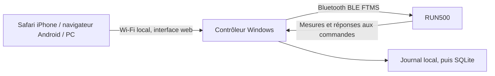

# Faisabilité — application locale pour le Domyos RUN500

Analyse du 4 octobre 2026. Périmètre issu de la conversation « Applications running avancées », consultée via le lien partagé fourni : deux utilisateurs, Arnaud et Ophélie ; programmes d'entraînement ; commande du RUN500 depuis iPhone/Android/PC ; historique et graphiques ; usage des montres Garmin existantes ; coût récurrent minimal. Les propositions de cette conversation sont des hypothèses de conception, pas des preuves de compatibilité.

## 1. Avis et décision

**Le projet est faisable et l'architecture PC Bluetooth + interface web locale est adaptée. Le contrôle de base de ce RUN500 est maintenant établi sur l'appareil, en essais supervisés à 1–2,5 km/h et 0–1 %.** Les séances longues, pertes matérielles et fonctions d'entraînement restent des étapes distinctes. Le [compte rendu de réception](RECEPTION_RUN500.md) précise les essais, deux corrections et les limites.

La documentation officielle Decathlon annonce FTMS et HRM pour le RUN500. Cela donne une base solide. Cela ne garantit cependant ni toutes les fonctions optionnelles du standard, ni leur comportement avec chaque firmware. La prise de contrôle, le réglage de la vitesse/pente, la pause et l'arrêt doivent recevoir une réponse positive et produire un effet observable. [Fiche RUN500 Decathlon](https://www.decathlon.fr/p/tapis-de-course-pliable-16km-h-run500/306855/c1m8542707), [standard Bluetooth FTMS](https://www.bluetooth.com/specifications/specs/fitness-machine-service-1-0-1/).

Le POC est construit et fonctionne aussi avec un simulateur explicitement identifié. Après le premier essai sans tapis disponible, le RUN500 a été connecté et commandé réellement. Les vitesses, la pente, Pause, STOP et trois blocs ont été reçus ; l'utilisateur confirme leurs effets physiques. La reprise après arrêt et le silence de l'écran ont aussi été testés après correction. La réception des pertes Bluetooth/PC et de la clé de sécurité reste ouverte.

## 2. Ce que la conversation proposait correctement

Le PC peut devenir l'unique interlocuteur Bluetooth du tapis. Le téléphone envoie des actions à ce PC par le réseau local. L'exécution du programme reste sur le PC : les minuteries ne dépendent pas de la précision d'une page Safari ou d'un téléphone verrouillé.

Python avec Bleak est pertinent : Bleak fournit un backend Windows utilisant WinRT. Une seule connexion et une seule boucle asynchrone simplifient la maîtrise de l'état. Pour le POC, FastAPI sert aussi l'interface ; Next.js, React, Docker et SQLite ne sont pas nécessaires pour répondre à la question matérielle. Ce choix évite de construire deux serveurs avant d'avoir reçu les commandes. [Backend Windows de Bleak](https://bleak.readthedocs.io/en/latest/backends/windows.html), [recommandations Bleak](https://bleak.readthedocs.io/en/stable/troubleshooting.html).

Pour une application durable, SQLite est un bon stockage local et une interface React peut devenir utile. On pourra conserver et renforcer le contrôleur actuel. Docker n'est pas retenu pour le lien Bluetooth du POC : un backend WinRT natif ne devient pas automatiquement disponible dans un conteneur Linux. C'est un choix d'intégration, pas une affirmation que toute virtualisation Bluetooth serait impossible.

## 3. Corrections importantes

**Le Wi-Fi intégré du tapis n'est pas une API de pilotage documentée.** La page d'assistance explique son usage pour les mises à jour. Le Bluetooth est le chemin documenté pour les applications compatibles. Le port USB sert à la recharge. Aucun contrôle HTTP du tapis n'est supposé ici. [Assistance officielle RUN500](https://support.decathlon.fr/run500-notice-reparation).

**FTMS ne signifie pas “toutes les commandes marchent”.** Les capacités cibles, les plages et le Control Point doivent être découverts. Le protocole distingue l'écriture GATT de la réponse à la procédure : un transport réussi peut précéder un refus du tapis. Le POC exige une réponse FTMS correspondant à l'opcode envoyé et distingue acceptation et effet observé. [Déclaration de conformité FTMS](https://files.bluetooth.com/wp-content/uploads/dlm_uploads/2024/10/FTMS.ICS.p5.pdf), [tests de conformité FTMS](https://files.bluetooth.com/wp-content/uploads/dlm_uploads/2024/10/FTMS.TS_.p6.pdf).

**Un cas Domyos peut demander un protocole propriétaire.** Le code public de QZ prévoit une voie Domyos native même lorsque FTMS est annoncé, selon le périphérique et les services détectés. Cette observation ne prouve pas que ton RUN500 est concerné. Si le standard échoue, le POC conserve les services et les réponses ; il n'envoie aucun paquet propriétaire exploratoire. Une deuxième investigation pourra comparer ces données au support QZ, sans copier aveuglément ses commandes. [Code QZ du contrôleur FTMS](https://github.com/cagnulein/qdomyos-zwift/blob/master/src/devices/horizontreadmill/horizontreadmill.cpp), [contrôleur Domyos QZ](https://github.com/cagnulein/qdomyos-zwift/blob/master/src/devices/domyostreadmill/domyostreadmill.cpp).

**iPhone peut utiliser la console sans accéder au Bluetooth du navigateur.** Le Bluetooth reste sur Windows. C'est une différence importante : Web Bluetooth n'est pas une base universelle pour Safari. Le téléphone a uniquement besoin d'atteindre le serveur du PC. [Fonctionnalités WebKit](https://webkit.org/tracking-prevention/), [Web Bluetooth dans Chrome](https://developer.chrome.com/docs/capabilities/bluetooth).

**`run500.local` et une PWA installable ne sont pas automatiques.** Un nom `.local` suppose une résolution mDNS mise en place. Le POC utilise une adresse IP. Un serveur HTTP sur une IP du LAN n'offre pas les conditions HTTPS habituelles pour les service workers ; l'exception `localhost` du PC ne s'étend pas au téléphone. L'interface mobile fonctionne en page web ; l'installation PWA/offline exige un travail supplémentaire. Aucun compte développeur Apple n'est requis pour cette console web. [Service workers et contexte sécurisé](https://developer.mozilla.org/en-US/docs/Web/API/Service_Worker_API/Using_Service_Workers).

**“100 % gratuit avec ChatGPT intégré” est conditionnel.** L'API OpenAI classique a une facturation propre. La documentation actuelle décrit aussi « Sign in with ChatGPT » pour des applications locales/personnelles éligibles, avec usage du forfait Plus/Pro et de ses limites. Cette option mérite une validation séparée de l'éligibilité et des autorisations ; ce n'est ni un accès illimité gratuit, ni un accès automatique aux conversations. Le chemin immédiatement simple reste : générer un programme dans ChatGPT, coller son JSON, le valider localement et le faire approuver par l'utilisateur. Le POC permet déjà de coller des blocs JSON, sans appeler une IA. [Sign in with ChatGPT](https://developers.openai.com/cookbook/articles/sign-in-with-chatgpt), [guide d'intégration](https://developers.openai.com/siwc/quickstart), [tarification API](https://developers.openai.com/api/docs/pricing).

Les montres Garmin peuvent continuer à enregistrer les séances indépendamment. Aucune synchronisation Garmin, aucun accès à Garmin Connect et aucune réception cardiaque des montres ne sont établis dans ce POC. Il ne faut pas les présenter comme déjà intégrés ni nécessaires au contrôle du tapis.

## 4. Ce que le POC fait réellement

La console recherche les périphériques BLE, identifie les candidats par FTMS/nom, se connecte à l'appareil choisi, lit les services/capacités/plages et écoute les mesures. La connexion démarre en lecture seule. L'activation explicite demande l'autorisation FTMS ; chaque commande est sérialisée et horodatée avec sa réponse.

| Fonction | Implémentation du POC | Point de réception |
|---|---|---|
| Découverte | Scan Windows Bleak et liste des candidats | Le tapis doit apparaître et être identifié |
| Lecture | Vitesse, pente, distance, temps selon les champs reçus | Présence, unités, fréquence et concordance console |
| Vitesse/pente | Capacités et plages obligatoires, validation avant écriture | Réponse positive et effet réel |
| Démarrage | Consigne vitesse remise au minimum annoncé avant Start | Comportement console/clé de sécurité à tester |
| Pause/STOP | Interruption du programme, désarmement, réponse FTMS | Bande arrêtée et conditions de reprise |
| Programme | Jusqu'à trois blocs, exécutés sur le PC | Enchaînement réel et réaction à l'arrêt console |
| Téléphone | Même interface par LAN, accès direct sans clé | Safari/Android, réseau et pare-feu réels |
| Journal | JSONL persistant et export JSON, simulation séparée | Corrélation avec observations physiques |

Les mesures absentes restent inconnues. Les mesures périmées restent visibles avec signalement. Une notification invalide ne rafraîchit pas leur âge. Le chronomètre d'un bloc commence lorsque les cibles sont retrouvées dans les mesures, après réponses aux commandes ; cela reste une observation fournie par le firmware, pas une mesure physique indépendante.

Les programmes de réception gardent des plafonds de 4 km/h et 3 %, avec petites transitions. Le réglage manuel de vitesse accepte maintenant la plage annoncée par le tapis, jusqu'à 16 km/h ; les essais physiques restent limités à 2,5 km/h. « Démarrer à la vitesse choisie » part au minimum puis applique la valeur explicitement saisie après une nouvelle mesure de mouvement. Un programme entier est validé avant toute écriture. Le logiciel ne démarre pas automatiquement à la connexion, ne redémarre pas un tapis arrêté pendant un programme et ne répète pas automatiquement une commande dont le résultat est incertain.

## 5. Gestion des pertes et limites

Le contrôle appartient à un seul écran. Il expire après 10 minutes, ou après 12 secondes sans lecture d'état par cet écran. La vitesse et la pente doivent rester récentes, à moins de 5 secondes. Le PC peut tenter un STOP après une perte de communication avec le téléphone, tant que son Bluetooth fonctionne. Le POC préfère interrompre un essai lorsque le navigateur est suspendu ; ce fonctionnement devra évoluer si une séance complète doit continuer téléphone verrouillé.

Une réponse manquante après 4 secondes rend le résultat incertain : le tapis a peut-être exécuté la commande. Le contrôleur verrouille alors les nouvelles actions et exige une reconnexion. Un STOP sur un canal désynchronisé ne peut pas être présenté comme reçu avec certitude, notamment quand une réponse tardive pourrait correspondre à une ancienne commande.

**Aucun programme Windows ne garantit un arrêt après perte Bluetooth, arrêt brutal du PC ou veille.** La réaction du firmware à ces situations doit être observée lors d'essais supervisés à basse vitesse. La console physique et la clé de sécurité restent nécessaires. Ce POC n'est pas une fonction d'arrêt d'urgence certifiée ni une validation de production.

L'utilisateur a demandé un accès direct sans clé : l'authentification LAN et son formulaire ont été supprimés. Les appareils pouvant atteindre le serveur peuvent utiliser la console. L'origine et l'hôte restent contrôlés, les entrées sont validées et les règles de présence/commande du tapis restent actives. HTTP sur le LAN n'est pas chiffré. Pour un usage quotidien, la rotation des journaux, l'état récupérable après redémarrage et la réception des pertes réelles restent à réaliser. Aucun pilotage depuis Internet n'est exposé ni envisagé dans ce lot.

## 6. Vérification réalisée

| Vérification | Résultat | Portée de la preuve |
|---|---|---|
| Adaptateur Windows | Intel Wireless Bluetooth présent, état OK | Le PC possède un adaptateur fonctionnel |
| Scan BLE réel | Domyos-TC-1921 détecté et connecté ; dernier signal −70 dBm | Appareil réel identifié ; premier scan sans candidat conservé comme essai initial |
| Protocole et règles critiques | 20 tests ciblés réussis, dont STOP pendant une commande, reprise après notification tardive, vitesse choisie au démarrage et réglage manuel jusqu'à 16 | Logique logicielle, avec faux périphériques/simulateur ; aucune réception physique à 16 km/h |
| Chrome, programme complet | Trois blocs exécutés, télémétrie simulée et arrêt accepté | Parcours de la console et moteur simulé |
| Chrome, format mobile | Largeur 390 px, pas de débordement horizontal ; commandes de 44 px de haut | Disposition responsive, sans essai Safari natif |
| Accès réseau du PC | Console sans clé à l'IP Wi-Fi 192.168.1.23, utilisateur confirmant l'accès téléphone | Écoute réseau et accès depuis le téléphone établis |
| API de la version sans clé | Lecture d'état sans clé : 200 ; origine étrangère : 403 ; Start déconnecté : 409 ; valeur booléenne : 422 | Accès direct et maintien des validations techniques |
| Export dans Chrome | JSON téléchargé et relu ; programme terminé, trois blocs observés, dernière réponse `800801` | Diagnostic simulé conservé dans `docs/preuves/diagnostic-simulation.json` |
| Commandes RUN500 | Start au minimum, 2 km/h, pente 1 %, retour à plat, Pause et STOP ; trois blocs 2/0 → 2,5/1 → 2/0 | Réponses positives, mesures fraîches ; mouvements et premiers arrêts confirmés par l'utilisateur |
| Réception après correction | Reprise après programme, STOP pendant commande, neuf refus sans écriture FTMS, arrêt après silence du propriétaire vers 13 s | Campagne réelle réussie ; connexion BLE maintenue pendant l'essai de silence |
| Chrome après correction | Start, Pause, reprise, STOP ; attente de stabilisation affichée ; export réel téléchargé et relu | Console et commandes réellement servies ; aucun avertissement/erreur console au relevé final |
| Téléphone réel | L'utilisateur confirme que l'accès sans clé fonctionne parfaitement | Pas encore d'essai de verrouillage/Safari prolongé ou de perte Wi-Fi radio |

Les captures conservées dans `docs/preuves/` illustrent la console. Les journaux réels et simulés sont distincts dans `data/`. Une vérification responsive dans Chrome ne vaut pas un essai Safari ou une mesure radio. Le [compte rendu de réception](RECEPTION_RUN500.md) relie chaque résultat à sa preuve et conserve aussi le passage échoué avant correction.

## 7. Critères pour décider de la suite

La compatibilité FTMS de base est établie : bon appareil détecté, mesures fraîches, autorisation accordée, vitesse/pente essayées à basse vitesse, Start/Pause/STOP et trois blocs exécutés. Le STOP d'un autre écran, la reprise protégée et l'arrêt après silence du client passent. Avant une V1 pour les séances courantes, il reste à recevoir le STOP physique et la clé pendant un programme, les pertes Bluetooth/PC, le verrouillage réel du téléphone et une séance longue.

Si seules les mesures fonctionnent, on conserve la console en lecture et on examine le contrôle Domyos/QZ à partir du diagnostic. Si les réponses sont positives mais les mouvements incorrects, on reste en investigation firmware/protocole. Si le contrôle fonctionne mais que les modes de perte ne sont pas satisfaisants, on limite le produit à un usage supervisé ou on revoit son fonctionnement avant toute séance autonome.

Après réception matérielle, la V1 pourra ajouter deux profils, une bibliothèque de programmes, un historique SQLite des mesures et des consignes effectivement réalisées, puis les graphiques. La génération ChatGPT vient ensuite et produit uniquement des programmes à valider : elle ne possède jamais le canal de commande directe du moteur.

Le matériel déjà possédé et les bibliothèques retenues permettent un fonctionnement local sans abonnement logiciel ajouté. L'IA automatique, l'hébergement éventuel et une synchronisation externe doivent faire l'objet de choix séparés. Promettre dès maintenant une application supérieure à tous les produits existants ou une sécurité parfaite n'est pas étayé ; promettre une réception matérielle courte, traçable et utile pour décider l'est.

## 8. Correction de l'accès téléphone

Le premier affichage présentait les adresses retournées pour le nom du PC, ce qui incluait WSL (`172.25.144.1`) et Hyper-V (`172.27.64.1`). Ces interfaces virtuelles ne sont pas l'adresse Wi-Fi accessible au téléphone. La détection affiche désormais uniquement les interfaces physiques actives possédant une passerelle ; sur cette machine, elle retourne `192.168.1.23`. Le serveur de la version corrigée écoute effectivement sur `0.0.0.0:4317`, et Chrome affiche ce seul lien.

L'utilisateur a précisé que le téléphone ouvrait la page demandant une clé, ce qui établit la connectivité réseau. Il a ensuite demandé de supprimer cette saisie : la version actuelle ouvre directement la console, sans générer ni demander de clé. L'accès via l'adresse Wi-Fi a été vérifié dans Chrome, et les instructions ont été mises à jour. Aucune règle de pare-feu ni catégorie réseau n'a été modifiée.

Après cette modification, un autre écran a connecté le tapis et activé ses commandes. L'observation en lecture dans Chrome a montré des réponses FTMS positives à Request Control, Set Target Speed et Start, puis une vitesse reçue de 1 km/h. Aucun mouvement n'a été déclenché par l'agent pendant cette vérification. Le diagnostic réel a été conservé dans `docs/preuves/diagnostic-ble-reel.json` ; il ne constitue pas à lui seul une réception physique complète.

L'utilisateur a ensuite autorisé les essais et confirmé sa présence physique. La campagne détaillée dans [RECEPTION_RUN500.md](RECEPTION_RUN500.md) a alors commandé le tapis à 1–2,5 km/h et 0–1 %, avec observation des mesures et confirmation utilisateur des mouvements et premiers arrêts. L'état final est connecté en lecture, contrôle désarmé, vitesse et pente nulles.
